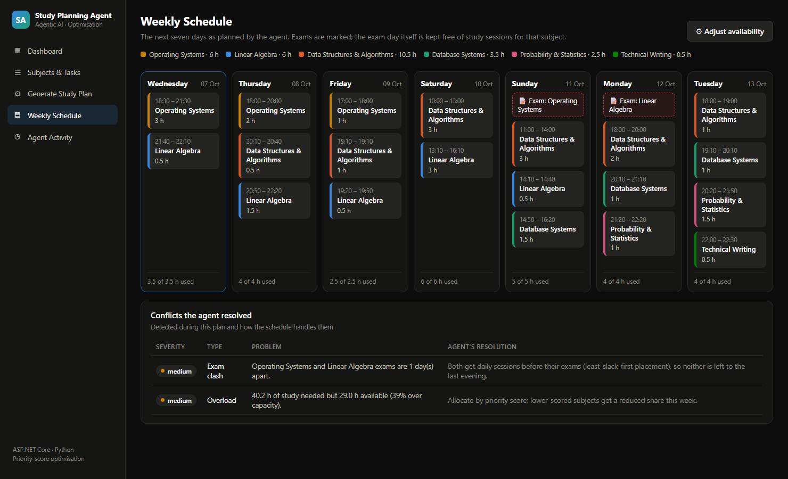
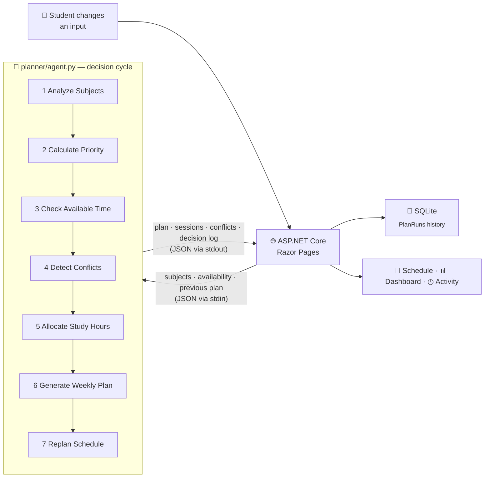
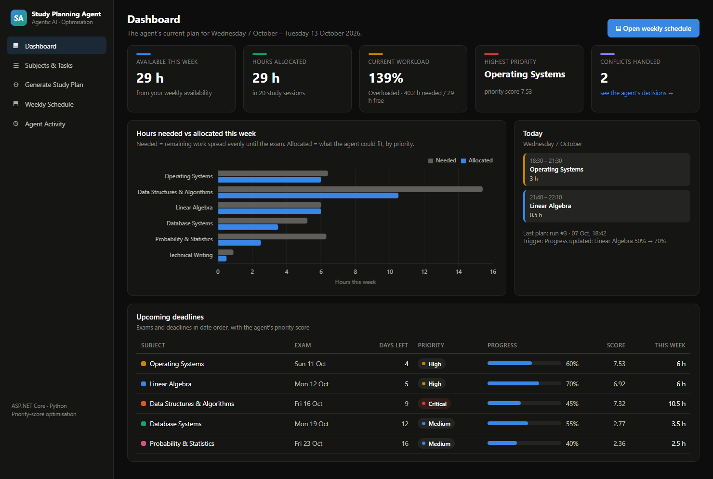
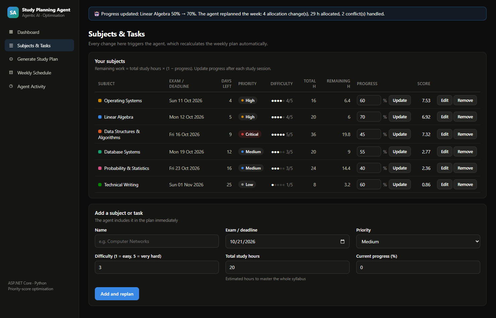
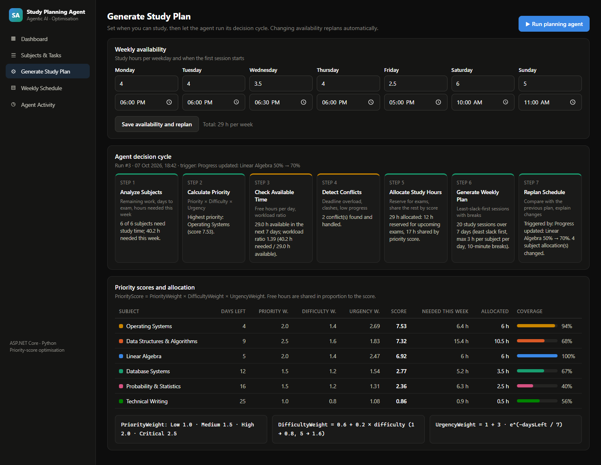
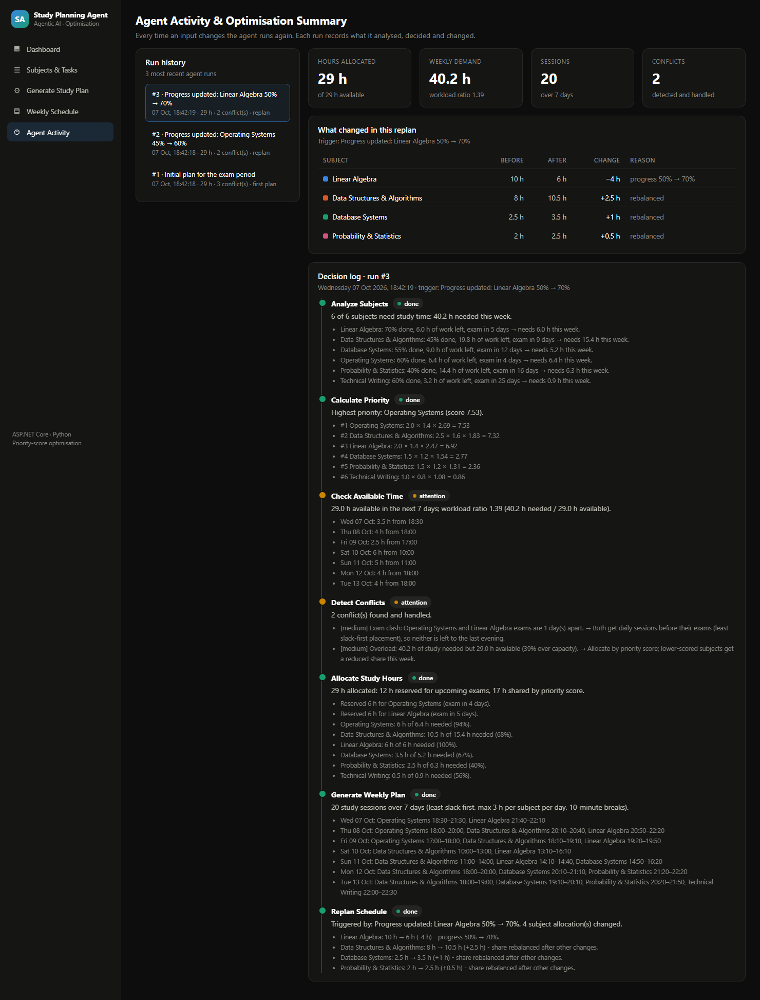

<div align="center">

# 🤖 Agentic Study Planner
## Agentic AI Study Planning & Optimisation Agent

### Analyse workload · Prioritise · Detect conflicts · Allocate hours · Replan automatically

<p>
  
  
  
  
  
</p>

<p>
  
  
  
  
</p>

<br/>

**Six subjects, four exams in two weeks and only 29 free hours. What should a student study tonight?**<br/>
**This agent analyses the workload, scores every subject, detects conflicts, builds an hour-by-hour weekly plan,
and replans on its own whenever progress, deadlines or availability change, explaining each decision.**

<br/>

<a href="#-screenshots"><b>Screenshots</b></a> ·
<a href="#-the-agent"><b>The Agent</b></a> ·
<a href="#-optimisation-logic"><b>Optimisation</b></a> ·
<a href="#-how-to-run-locally"><b>Run It</b></a>

</div>

<br/>

<p align="center">
  
</p>

---

# 🏆 Demo Scenario at a Glance

<table>
<tr>
<td align="center" width="25%">

### 40.2 h → 29 h
**Workload vs free time**<br/>
<sub>139 % workload, the agent must choose</sub>

</td>
<td align="center" width="25%">

### 100 %
**Placed before each exam**<br/>
<sub>every allocated hour lands before its exam day</sub>

</td>
<td align="center" width="25%">

### 20 sessions
**Generated for 7 days**<br/>
<sub>≤ 3 h per subject per day, 10-min breaks</sub>

</td>
<td align="center" width="25%">

### 3 runs
**Plan → replan → replan**<br/>
<sub>triggered by progress updates</sub>

</td>
</tr>
</table>

> Values from the seeded demo: six computer-science subjects and the weekly availability created on first start, followed by two progress updates. The exam dates are set relative to the day you first start the app, so the demo always looks current.

---

# 📌 Overview

A student enters their **subjects** with difficulty, priority, exam date, estimated total study hours and current progress, plus the **hours they can study on each weekday**. The application turns this into an optimised **weekly study plan** with concrete sessions, such as *"Thursday 18:00–20:00 Operating Systems"*.

What makes it *agentic* is that the plan is not a one-off calculation. A Python agent runs a fixed **decision cycle**. It analyses, decides and acts, then **recalculates the plan by itself every time an input changes**: a progress update, a new subject, a moved exam, different availability, or simply a new day. Every run is stored with a readable log of what the agent saw, what it decided and what changed compared with the previous plan.

---

# ❓ Problem Statement

During exam periods students juggle several subjects with different deadlines and difficulty, and there are never enough hours. Common failures:

- studying the *favourite* subject instead of the *urgent* one,
- leaving an early exam until the last evening,
- not noticing that two exams are one day apart,
- making a plan once and never adjusting it as progress changes.

The goal is a small, explainable system that makes these trade-offs automatically and shows its reasoning, instead of a black-box timetable.

---

# ✨ Key Features

| Feature | Description |
|---|---|
| 📊 **Dashboard** | Available and allocated hours, current workload %, highest-priority subject, conflicts handled, needed-vs-allocated chart, today's sessions, upcoming deadlines |
| ☰ **Subjects & tasks** | Add, edit, remove subjects and update progress inline. **Every change triggers an automatic replan** |
| ⚙ **Generate study plan** | Weekly availability editor (hours + start time per day), manual "Run planning agent", the 7-step decision cycle and the priority-score table |
| ▤ **Weekly schedule** | 7-day calendar with timed, colour-coded sessions, exam markers, hours used per day and the conflicts the agent resolved |
| ◷ **Agent activity** | History of every agent run with its trigger, a before/after table of allocation changes, and the full step-by-step decision log |
| 🔁 **Self-replanning** | Replans on subject or availability changes, and automatically when the planning window moves to a new day |

---

# 🔄 System Workflow



---

# 🏗️ Architecture Overview

```text
┌────────────────────────────── ASP.NET Core (C#) ──────────────────────────────┐
│  Razor Pages              Dashboard · Subjects · Plan · Schedule · Activity    │
│  PlanningAgentService     builds the request, runs the agent, stores the run   │
│                           replans on every input change and on a new day       │
│  AppDbContext (EF Core)   Subjects · Availability · PlanRuns                   │
│                           ──►  App_Data/studyplanner.db                        │
└───────────────────────────────────────┬───────────────────────────────────────┘
                                        │ one short-lived process per agent run
┌───────────────────────────────────────▼───────────────────────────────────────┐
│  Python  planner/agent.py  StudyPlanningAgent (standard library only)          │
│          analyse → prioritise → check time → detect conflicts →                │
│          allocate → schedule → compare with previous plan                      │
└────────────────────────────────────────────────────────────────────────────────┘
```

- **One web app, one script.** .NET owns the UI, validation and storage. Python owns the decision logic. They exchange plain JSON over stdin/stdout, so there is no second server to start.
- **The agent is stateless.** .NET sends the previous plan's allocations and inputs with each request, which is how the agent can explain *what changed and why*.
- **Every run is persisted** (`PlanRun`: trigger, summary numbers and the full JSON result), which powers the activity history.

---

# 🛠️ Technologies Used

<div align="center">


</div>

<br/>

| Layer | Technology |
|---|---|
| Web application | ASP.NET Core Razor Pages, C# |
| Persistence | Entity Framework Core + SQLite |
| Planning agent | Python (standard library only, no packages to install) |
| Charts | Chart.js (served locally from `wwwroot/lib`) |
| Styling | Hand-written CSS, dark dashboard theme shared with the other portfolio projects |
| Screenshots | Python Playwright driving Chrome against the running app |

---

# 🧠 The Agent

The agent is deliberately simple. It has no framework and no language model, just a transparent **perceive → decide → act → re-evaluate** loop. Each step writes a log entry with a status (`done` / `attention`), a one-line summary and the details behind it.

| # | Action | What the agent does |
|---|---|---|
| 1 | **Analyze Subjects** | Remaining work = total hours × (1 − progress). Days to the exam. Hours needed *this week* = remaining × min(1, 7 / days left). Subjects whose exam has passed, or that are complete, are excluded. |
| 2 | **Calculate Priority** | PriorityScore = PriorityWeight × DifficultyWeight × UrgencyWeight, then subjects are ranked. |
| 3 | **Check Available Time** | Hours per day for the next 7 days and the **workload ratio** = hours needed / hours available. |
| 4 | **Detect Conflicts** | *Deadline overload* (exams up to date X need more hours than exist before X), *exam clash* (exams ≤ 1 day apart), *low progress* (< 50 % with ≤ 4 days left), *overload* (ratio > 1), *no study time* before an exam, *unplaced hours*. Each conflict gets a resolution. |
| 5 | **Allocate Study Hours** | Reserve hours for exams inside the week (earliest first), then share the remaining hours **in proportion to the priority score**. |
| 6 | **Generate Weekly Plan** | Place 30-minute blocks day by day using **least slack first**, with at most 3 h per subject per day and none on the subject's exam day, then merge them into timed sessions with 10-minute breaks. |
| 7 | **Replan Schedule** | Compare with the previous plan, report each subject's hours before → after and the reason (progress changed, exam moved, priority changed, new or removed subject, or rebalanced). |

### When does the agent run?

| Trigger | Example log entry |
|---|---|
| First start | `Initial plan for the exam period` |
| Progress update | `Progress updated: Linear Algebra 50% → 70%` |
| Subject added / removed | `Subject added: Computer Networks` |
| Subject edited | `Subject updated: Database Systems (exam 19 Oct → 10 Oct)` |
| Availability changed | `Availability changed: Sat 6 h → 8 h` |
| New day | `New day: planning window moved from 07 Oct to 08 Oct` |
| Manual | `Manual run requested from the planner` |

---

# 📐 Optimisation Logic

### Priority score

```text
PriorityScore = PriorityWeight × DifficultyWeight × UrgencyWeight

PriorityWeight   = Low 1.0 · Medium 1.5 · High 2.0 · Critical 2.5
DifficultyWeight = 0.6 + 0.2 × difficulty            (1 → 0.8 … 5 → 1.6)
UrgencyWeight    = 1 + 3 · e^(−daysLeft / 7)          (exam today 4.0 · one week 2.1 · two weeks 1.4 · far away → 1.0)
```

Urgency decays exponentially, so it matters a lot in the last week and very little a month away.

Scores from the demo scenario:

| Subject | Days left | Priority | Difficulty | Urgency | **Score** |
|---|---:|---:|---:|---:|---:|
| Operating Systems | 4 | 2.0 | 1.4 | 2.69 | **7.53** |
| Data Structures & Algorithms | 9 | 2.5 | 1.6 | 1.83 | **7.32** |
| Linear Algebra | 5 | 2.0 | 1.4 | 2.47 | **6.92** |
| Database Systems | 12 | 1.5 | 1.2 | 1.54 | **2.77** |
| Probability & Statistics | 16 | 1.5 | 1.2 | 1.31 | **2.36** |
| Technical Writing | 25 | 1.0 | 0.8 | 1.08 | **0.86** |

### Hour allocation (two phases)

1. **Reserve.** For exams inside the 7-day window, in date order, reserve `min(hours needed, free hours before that exam)`. Without this step a high-scoring subject with a later exam could take time an earlier exam needs.
2. **Share by score (water-filling).** Split the remaining hours in proportion to each subject's score:
   ```text
   shareᵢ = pool × scoreᵢ / Σ score
   ```
   No subject receives more than it needs this week. Any surplus flows back into the pool and is shared again among the subjects that still need time.

In the demo, 29 h are available: **12 h are reserved** for the two exams inside the week and **17 h are shared by score**.

### Scheduling: least slack first

For each day, the agent repeatedly gives the next 30-minute block to the subject with the **least slack**:

```text
slack = (hours it could still get on later days before its exam) − (hours it still needs)
```

A subject with negative slack *must* be studied today or it will run out of time, so it goes first. Spreading hours evenly across the days was tried first: it could not fit two exams one day apart. Least slack first places both in full.

### Workload ratio

```text
workload ratio = Σ hours needed this week / hours available
≤ 0.8 Light · ≤ 1.0 Balanced · ≤ 1.3 Heavy · > 1.3 Overloaded
```

---

# 📁 Project Structure

```text
Agentic-Study-Planning-Agent/
├── planner/
│   └── agent.py                     # the planning agent (decision cycle, allocation, scheduling, replan)
├── src/StudyPlanner.Web/
│   ├── Data/                        # AppDbContext, DataSeeder (demo scenario)
│   ├── Models/                      # entities, agent JSON contracts, subject colours
│   ├── Services/
│   │   └── PlanningAgentService.cs  # runs the agent, stores runs, replans on change / new day
│   ├── Pages/
│   │   ├── Index                    # Dashboard
│   │   ├── Subjects/                # list, add, edit, progress, remove
│   │   ├── Plan                     # availability + decision cycle + priority scores
│   │   ├── Schedule                 # weekly calendar
│   │   └── Activity                 # agent run history and decision log
│   ├── wwwroot/                     # CSS, Chart.js, chart defaults
│   └── Program.cs
├── scripts/capture_screenshots.py   # README screenshots via Playwright
├── docs/screenshots/
└── README.md
```

---

# 🚀 How to Run Locally

### Prerequisites

- .NET SDK
- Python, available on the PATH as `python` (no extra packages are needed)

### 1. Clone

```bash
git clone https://github.com/AbuHurairaPhenologix/AbuHuraira.git
cd AbuHuraira/Agentic-Study-Planning-Agent
```

### 2. Start the web application

```bash
dotnet run --project src/StudyPlanner.Web
```

Open **http://localhost:5220**.

On first start the app creates `src/StudyPlanner.Web/App_Data/studyplanner.db`, seeds six subjects and a weekly availability, runs the agent for the initial plan and then replans once after a sample progress update. Delete the `App_Data` folder to reset the demo.

> If Python is installed under another name (for example `py` or `python3`), change `Agent:PythonExecutable` in `src/StudyPlanner.Web/appsettings.json`.

### Run the agent on its own

The agent reads JSON from stdin, so it can be tested without the web app:

```bash
echo '{"today":"2026-10-07","trigger":"CLI test",
  "availability":[{"dayOfWeek":2,"hours":3,"startTime":"18:00"},{"dayOfWeek":3,"hours":3,"startTime":"18:00"}],
  "subjects":[{"id":1,"name":"Linear Algebra","difficulty":4,"priority":"High","examDate":"2026-10-10","progress":40,"totalHours":12}]}' \
  | python planner/agent.py
```

### Re-capture the README screenshots

```bash
python scripts/capture_screenshots.py   # app must be running; uses Playwright + Chrome
```

---

# 🎮 Sample Usage

1. Open the **Dashboard**. The agent has already planned the week: 29 h available, 40.2 h needed (**139 %, Overloaded**), *Operating Systems* is the top priority.
2. Go to **Subjects & Tasks** and change *Linear Algebra* progress from 50 % to **70 %**, then click **Update**.
3. The agent replans immediately: *"The agent replanned the week: 4 allocation change(s), 29 h allocated, 2 conflict(s) handled."*
4. Open **Agent Activity**. The replan table shows Linear Algebra **10 h → 6 h (−4 h, progress 50 % → 70 %)**, and the freed time goes to Data Structures & Algorithms (+2.5 h), Database Systems (+1 h) and Probability & Statistics (+0.5 h).
5. Open **Weekly Schedule** to see the new timed sessions. No subject is studied on its own exam day, and the conflicts table explains the *exam clash* between Operating Systems and Linear Algebra and how the plan handles it.
6. On **Generate Study Plan**, give Saturday 8 h instead of 6 h and save. The agent replans again with the extra time.

---

# 📸 Screenshots

All screenshots are real captures of the running application ([`scripts/capture_screenshots.py`](scripts/capture_screenshots.py)). During capture the script updates *Linear Algebra* progress through the UI, so the agent genuinely replans before the pages are captured.

## 📊 Dashboard

<p align="center"></p>

## ☰ Subjects & Tasks

The banner at the top is the agent's response to the progress update that was just submitted.

<p align="center"></p>

## ⚙ Generate Study Plan

Weekly availability, the seven steps of the agent's last run, and the priority-score table showing how each score was built.

<p align="center"></p>

## ▤ Weekly Schedule

<p align="center"></p>

## ◷ Agent Activity / Optimisation Summary

Run history on the left. On the right: what changed in the latest replan, and the complete decision log.

<p align="center"></p>

---

# ⚠️ Limitations

- **Heuristic, not a proven optimum.** Weighted shares plus least-slack-first scheduling give good, explainable plans, but not a mathematically optimal one. A solver such as OR-Tools could optimise the same objective exactly.
- **Estimated hours are user input.** The plan is only as good as the "total study hours" estimate for each subject.
- **Fixed 7-day horizon.** Work for exams beyond the week is paced (`remaining × 7 / days left`), not planned day by day.
- **One student, no accounts.** The demo stores a single student's plan in a local SQLite file.
- **Conflict list can repeat.** When several exams are overloaded, each cumulative deadline check is reported separately.

# 🔮 Future Improvements

- 🧮 Optional OR-Tools linear-programming mode next to the heuristic, compared on the activity page
- 📅 Export the schedule to iCalendar (.ics) and import timetable clashes (lectures, work shifts)
- ✅ Mark sessions as done and let the agent update progress automatically
- 📈 Learn each student's real hours-per-topic from completed sessions to improve estimates
- 🔔 Daily reminder of today's sessions

---

# 👨‍💻 Author

<div align="center">

## Abu Huraira

**Software Engineer**

.NET • C# • Python • Agentic AI • Optimisation

<a href="https://github.com/AbuHurairaPhenologix">

</a>

</div>

---

<div align="center">

## ⭐ Analyse → Prioritise → Detect Conflicts → Allocate → Schedule → Replan

### Built with C#, ASP.NET Core & Python

</div>
