# AutoSphere

### Software-Defined Vehicle Platform for Real-Time Telemetry, Diagnostics & Secure OTA Updates

<p align="center">
  <a href="https://github.com/AbuHurairaPhenologix/autosphere-sdv-platform/actions/workflows/ci.yml">
    
  </a>
  
  
  
  
  
</p>

<p align="center">
  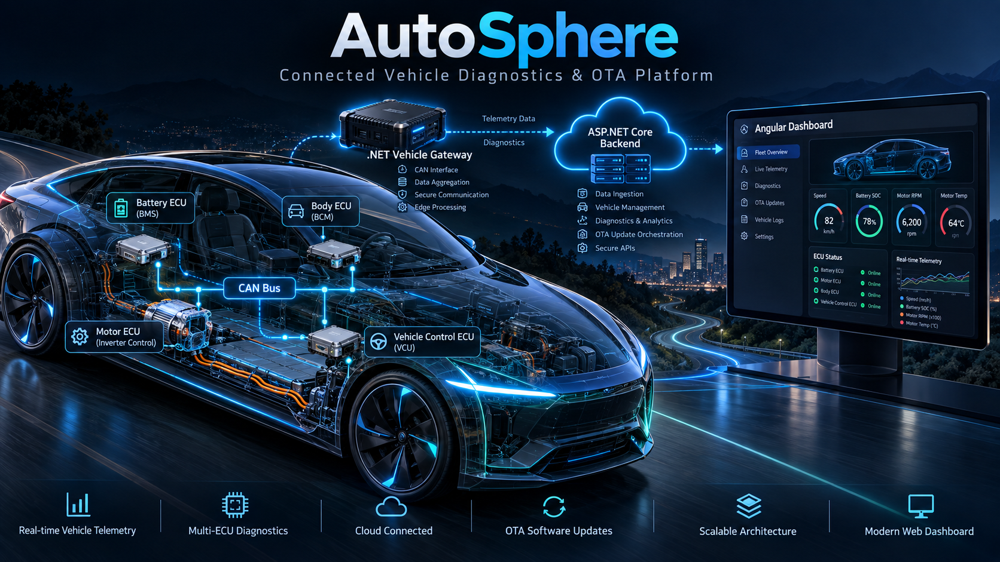
</p>

---

## Overview

**AutoSphere** is an end-to-end software-defined vehicle platform that connects simulated vehicle ECUs over CAN to a .NET edge gateway, streams normalized vehicle telemetry through MQTT, processes vehicle state through an ASP.NET Core backend, and presents the vehicle as a live digital twin in an Angular dashboard.

The platform goes beyond basic vehicle monitoring. It includes remote ECU diagnostics, Diagnostic Trouble Code management, vehicle-health evaluation, communication supervision, fault injection, secure software package verification, OTA deployment, A/B firmware installation, post-update health checks, and automatic rollback.

The complete system can operate without physical vehicle hardware while still supporting Linux SocketCAN for integration with virtual or physical CAN interfaces.

<p align="center">
  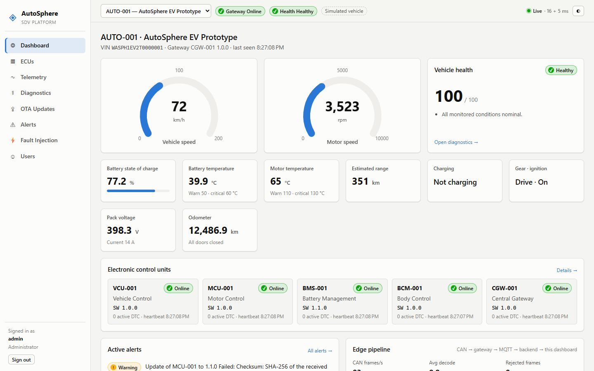
</p>

---

## Contents

- [Key Features](#key-features)
- [System Architecture](#system-architecture)
- [Technology Stack](#technology-stack)
- [Project Structure](#project-structure)
- [Vehicle Simulation](#vehicle-simulation)
- [System Workflow](#system-workflow)
- [CAN Communication](#can-communication)
- [Real-Time Digital Twin](#real-time-digital-twin)
- [Vehicle Diagnostics](#vehicle-diagnostics)
- [Vehicle Health](#vehicle-health)
- [Fault Injection](#fault-injection)
- [Secure OTA Updates](#secure-ota-updates)
- [Screenshots](#screenshots)
- [Security](#security)
- [Getting Started](#getting-started)
- [API](#api)
- [Testing](#testing)
- [Performance & Observability](#performance--observability)
- [Current Scope](#current-scope)
- [Future Enhancements](#future-enhancements)
- [Documentation](#documentation)
- [Author](#author)
- [License](#license)

---

# Key Features

| Area | Highlights |
|---|---|
| **ECU Simulation** | VCU, MCU, BMS and BCM simulators with physically related vehicle signals |
| **CAN Communication** | In-memory, UDP bridge and Linux SocketCAN transports |
| **Vehicle Signals** | Central CAN signal database, decoding, validation and VSS-inspired normalization |
| **Edge Gateway** | .NET Worker for CAN decoding, ECU supervision, telemetry publishing and diagnostics |
| **Messaging** | MQTT-based telemetry, status, alerts, diagnostics and OTA commands |
| **Backend** | Clean Architecture, REST APIs, SignalR, persistence, caching and background processing |
| **Diagnostics** | DTC read/clear, ECU reset, session control, data identifiers and diagnostic scans |
| **Health Monitoring** | Rule-based vehicle health using DTCs, connectivity, temperatures and telemetry freshness |
| **OTA** | Signed packages, integrity verification, inactive-bank installation, health checks and rollback |
| **Fault Injection** | ECU crash, overheating, invalid signals, CAN loss, communication failures and corrupt updates |
| **Digital Twin** | Real-time dashboard with gauges, telemetry charts, ECU status and vehicle health |
| **Security** | Authentication, RBAC, cryptographic OTA verification and input validation |
| **Quality** | Unit, architecture, integration, end-to-end and benchmark testing |

---

# System Architecture

<p align="center">
  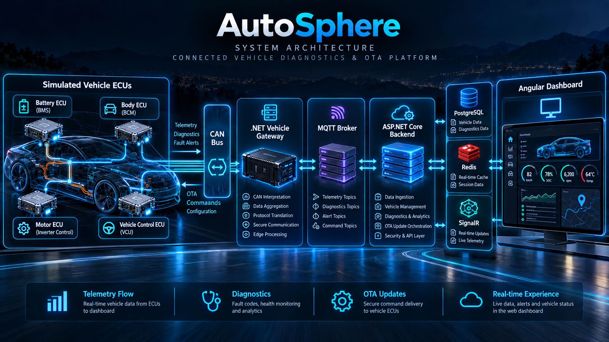
</p>

AutoSphere separates the vehicle network, edge processing, messaging, backend services and user interface into independent components.

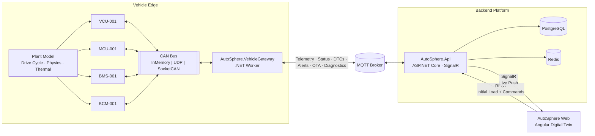

---

## Backend Architecture

The backend follows a layered dependency model with domain and application logic isolated from infrastructure concerns.

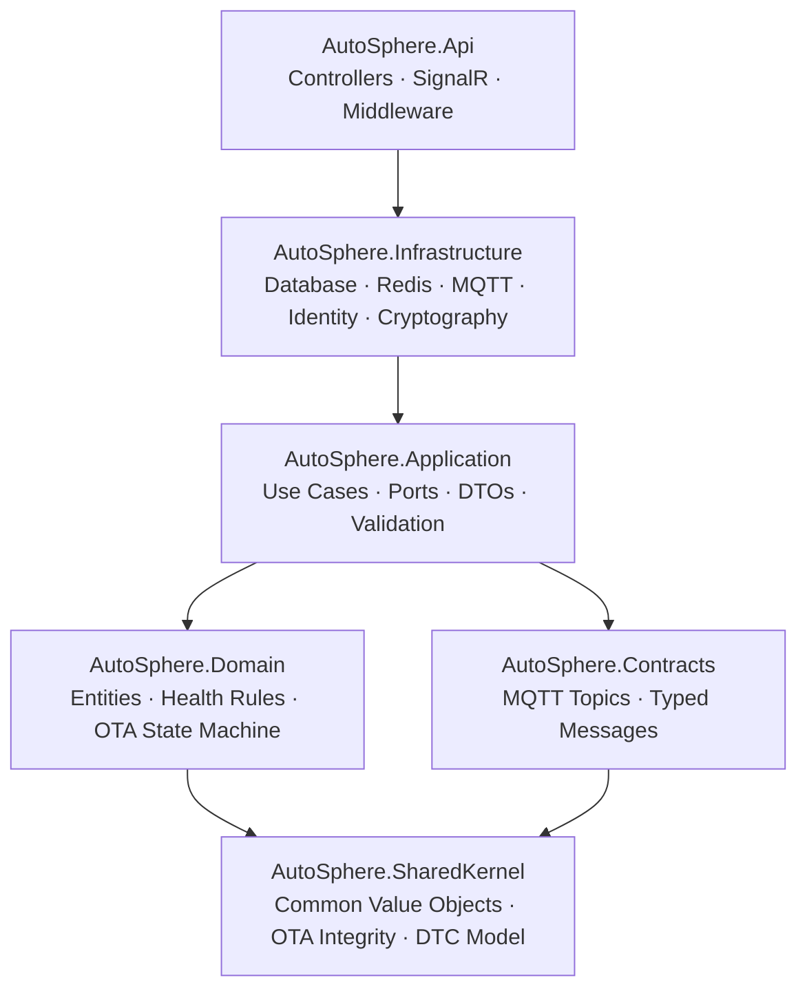

---

# Technology Stack

| Layer | Technologies |
|---|---|
| **Backend** | .NET, ASP.NET Core Web API, SignalR |
| **Architecture** | Clean Architecture |
| **Persistence** | Entity Framework Core |
| **Database** | PostgreSQL |
| **Cache** | Redis |
| **Messaging** | MQTT, MQTTnet, Mosquitto |
| **Automotive Edge** | .NET Worker Services |
| **Vehicle Network** | CAN, SocketCAN, virtual CAN, UDP CAN bridge |
| **Diagnostics** | UDS-inspired services, ISO-TP-style transport |
| **Signal Model** | VSS-inspired signal normalization |
| **Frontend** | Angular, TypeScript, SignalR client, Chart.js |
| **Authentication** | ASP.NET Core Identity, JWT, RBAC |
| **OTA Security** | SHA-256, ECDSA signatures |
| **Logging** | Serilog |
| **Testing** | xUnit, NSubstitute, integration tests |
| **Benchmarking** | BenchmarkDotNet |
| **Containerization** | Docker, Docker Compose |
| **CI/CD** | GitHub Actions |

---

# Project Structure

```text
autosphere-sdv-platform/
│
├── src/
│   │
│   ├── shared/
│   │   ├── AutoSphere.SharedKernel/
│   │   └── AutoSphere.Contracts/
│   │
│   ├── backend/
│   │   ├── AutoSphere.Domain/
│   │   ├── AutoSphere.Application/
│   │   ├── AutoSphere.Infrastructure/
│   │   └── AutoSphere.Api/
│   │
│   ├── gateway/
│   │   ├── AutoSphere.CanBus/
│   │   ├── AutoSphere.VehicleSignals/
│   │   ├── AutoSphere.Diagnostics/
│   │   └── AutoSphere.VehicleGateway/
│   │
│   ├── simulator/
│   │   ├── AutoSphere.EcuSimulation/
│   │   └── AutoSphere.VehicleSimulator/
│   │
│   └── frontend/
│       └── autosphere-web/
│
├── tests/
│   ├── AutoSphere.UnitTests/
│   ├── AutoSphere.IntegrationTests/
│   ├── AutoSphere.ArchitectureTests/
│   └── AutoSphere.Benchmarks/
│
├── docs/
│   ├── api/
│   ├── architecture/
│   ├── automotive/
│   ├── diagrams/
│   └── images/
│
├── assets/
│   ├── 1.png
│   ├── 2.png
│   ├── 3.png
│   ├── 4.png
│   └── 5.png
│
├── docker/
├── scripts/
├── .github/
│
├── AutoSphere.sln
├── docker-compose.yml
├── .env.example
├── README.md
├── CONTRIBUTING.md
├── SECURITY.md
└── LICENSE
```

---

# Vehicle Simulation

AutoSphere contains four main simulated vehicle ECUs.

| ECU | Description |
|---|---|
| **VCU — Vehicle Control Unit** | Vehicle speed, acceleration, braking, gear and overall vehicle state |
| **MCU — Motor Control Unit** | Motor speed, torque and motor temperature |
| **BMS — Battery Management System** | Battery SOC, temperature, voltage, current and charging status |
| **BCM — Body Control Module** | Door and body-related vehicle signals |

The ECUs obtain data from a shared vehicle plant model so values remain logically related instead of being generated as completely independent random numbers.

Examples include:

```text
Vehicle Speed
Motor RPM
Motor Torque
Battery State of Charge
Battery Voltage
Battery Current
Battery Temperature
Motor Temperature
Vehicle Range
Accelerator Position
Brake Status
Gear Position
Ignition Status
Charging Status
Odometer
Door Status
Trunk Status
```

---

# System Workflow

The main telemetry and command workflow is:

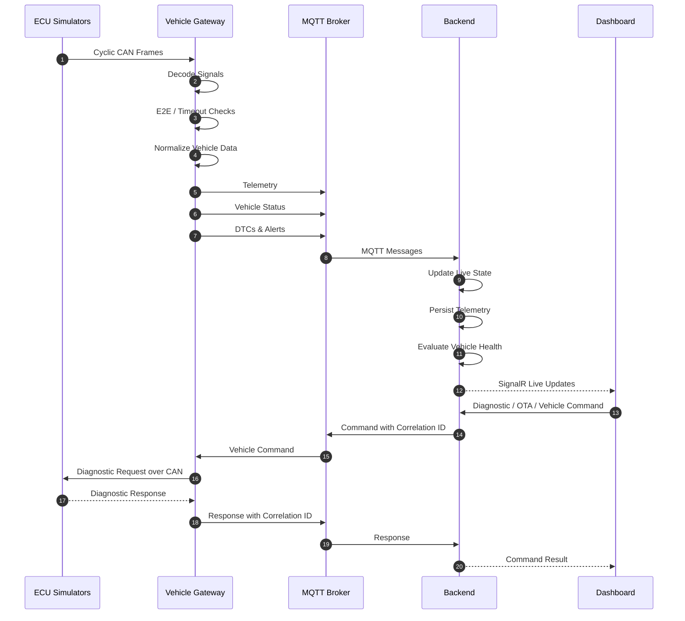

This allows vehicle telemetry and backend commands to use the same connected platform without tightly coupling the browser directly to vehicle ECUs.

---

# CAN Communication

The simulated vehicle produces several cyclic CAN messages.

| CAN ID | Message | ECU | Main Signals |
|---|---|---|---|
| `0x100` | VCU Status | VCU | Speed, accelerator, brake, gear, ignition |
| `0x101` | VCU Trip | VCU | Odometer, estimated range |
| `0x200` | MCU Status | MCU | Motor RPM, torque, motor temperature |
| `0x300` | BMS Status | BMS | Battery SOC, temperature, charging status |
| `0x301` | BMS Pack | BMS | Battery voltage, current |
| `0x400` | BCM Status | BCM | Door and trunk states |

The CAN layer is abstracted from the rest of the application.

```text
ICanBus
   │
   ├── InMemory CAN
   │
   ├── UDP CAN Bridge
   │
   └── SocketCAN
```

This enables development on a normal workstation and later migration to Linux CAN hardware without rewriting the application.

---

# Real-Time Digital Twin

<p align="center">
  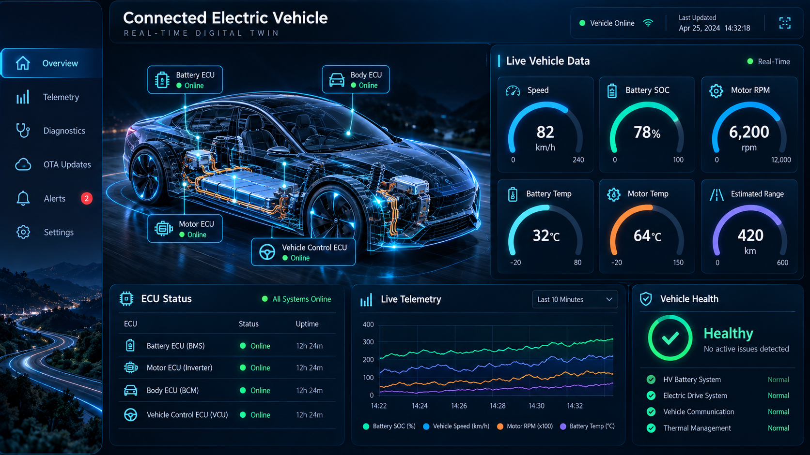
</p>

The Angular dashboard displays a continuously updated digital representation of the vehicle.

### Live information includes

- Vehicle speed
- Motor RPM
- Battery SOC
- Battery voltage
- Battery current
- Battery temperature
- Motor temperature
- Estimated range
- Vehicle health
- ECU connectivity
- Active alerts
- Diagnostic Trouble Codes
- Software versions
- OTA deployment status

The live data path is:

```text
ECU
 │
 ▼
CAN
 │
 ▼
.NET Vehicle Gateway
 │
 ▼
MQTT
 │
 ▼
ASP.NET Core
 │
 ▼
SignalR
 │
 ▼
Angular Digital Twin
```

REST APIs provide initial state and user commands while SignalR is responsible for live push updates.

---

# Vehicle Diagnostics

<p align="center">
  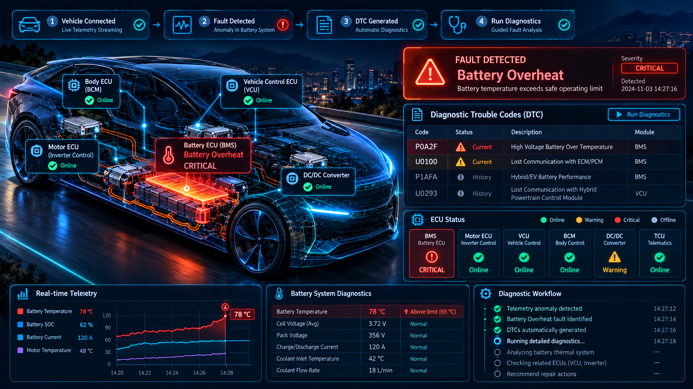
</p>

The vehicle gateway acts as the diagnostic tester for the simulated ECUs.

Supported diagnostic operations include:

- Diagnostic Session Control
- ECU Reset
- Read DTC Information
- Clear Diagnostic Information
- Read Data By Identifier
- Security Access
- Routine Control
- Tester Present
- Request Download
- Transfer Data
- Transfer Exit

The project uses a focused **UDS-inspired diagnostic implementation** transported through an **ISO-TP-style layer**.

---

## Diagnostic Flow

```text
Angular Dashboard
        │
        ▼
ASP.NET Core API
        │
        ▼
MQTT Diagnostic Request
        │
        ▼
Vehicle Gateway
        │
        ▼
ISO-TP-style Transport
        │
        ▼
UDS-inspired Request
        │
        ▼
ECU
        │
        ▼
Diagnostic Response
        │
        ▼
Vehicle Gateway
        │
        ▼
MQTT Response
        │
        ▼
Backend
        │
        ▼
Dashboard
```

Each request includes a correlation identifier so asynchronous vehicle responses can be mapped back to the correct operation.

---

# Diagnostic Trouble Codes

Each DTC contains:

```text
Code
ECU
Severity
Status
Detected Time
Resolved Time
Occurrence Count
Freeze Frame Data
```

DTC states follow:

```text
Active
   │
   ▼
Resolved
   │
   ▼
Cleared
```

Example faults include:

| Code | Description | Source |
|---|---|---|
| `P0A7E` | Battery Pack Over Temperature | BMS |
| `P0A9C` | Battery Temperature Sensor Implausible | BMS |
| `P0A2F` | Drive Motor Temperature Too High | MCU |
| `P0A2C` | Motor Temperature Sensor Implausible | MCU |
| `P0606` | Control Module Self-Test Fault | ECU |
| `U0100` | Lost Communication With Motor Controller | Gateway |
| `U0111` | Lost Communication With Battery Controller | Gateway |
| `U0140` | Lost Communication With Body Controller | Gateway |
| `U0293` | Lost Communication With Vehicle Controller | Gateway |

---

# Vehicle Health

AutoSphere continuously calculates vehicle health based on the current vehicle state.

Possible states are:

```text
Healthy
Warning
Critical
Offline
```

Health evaluation considers:

- gateway connectivity
- ECU communication
- critical DTCs
- warning DTCs
- battery temperature
- motor temperature
- stale telemetry
- CAN communication errors

Example logic:

```text
Gateway Offline
        ↓
Vehicle Offline
```

```text
Battery Overheat
        +
Critical DTC
        ↓
Vehicle Critical
```

```text
No Faults
+
All ECUs Online
+
Fresh Telemetry
        ↓
Vehicle Healthy
```

A numerical health score is also calculated to provide a quick summary of the overall vehicle state.

---

# Fault Injection

AutoSphere contains a dedicated simulation mode for reproducing vehicle and communication failures.

Available fault scenarios include:

| Fault | Observable Effect |
|---|---|
| **ECU Crash** | ECU stops CAN communication and diagnostics |
| **Battery Overheat** | Battery temperature rises and critical DTC is generated |
| **Motor Overheat** | Motor thermal threshold is exceeded |
| **Invalid Sensor Value** | Signal validation detects an implausible value |
| **CAN Message Loss** | Communication timeout or network fault |
| **CAN Message Delay** | Late-message supervision detects degradation |
| **Gateway Disconnect** | Vehicle becomes disconnected from the backend |
| **MQTT Disconnect** | Store-and-forward and stale telemetry behavior can be tested |
| **Corrupted OTA Package** | Integrity verification rejects the update |

Example:

```text
Inject Battery Overheat
          │
          ▼
Battery Temperature Rises
          │
          ▼
Threshold Exceeded
          │
          ▼
DTC Generated
          │
          ▼
Alert Published
          │
          ▼
Vehicle Health = Critical
          │
          ▼
Dashboard Updates
```

---

# Secure OTA Updates

<p align="center">
  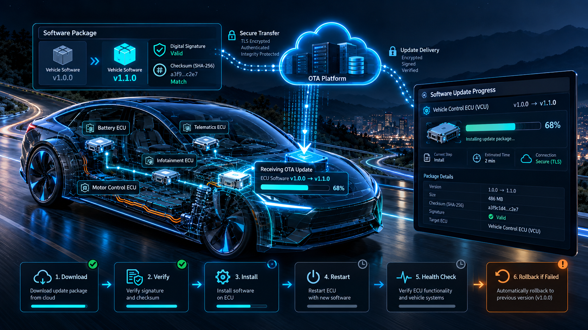
</p>

AutoSphere provides an end-to-end vehicle software update workflow.

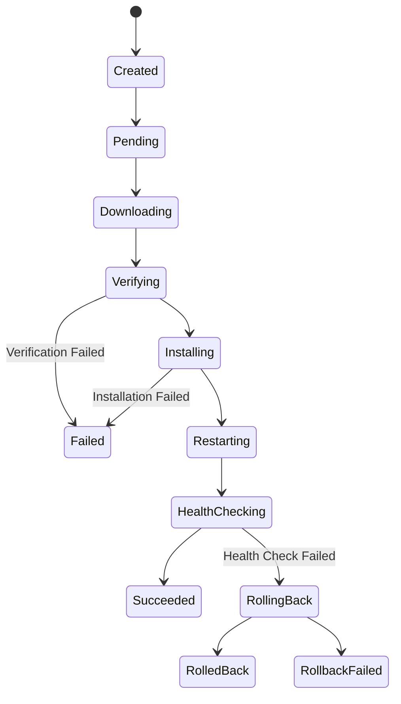

---

## OTA Verification

Before ECU software is installed, the gateway validates:

- package integrity
- SHA-256 checksum
- digital signature
- target ECU
- package size
- software version
- minimum compatible version

```text
OTA Package
     │
     ▼
Checksum Validation
     │
     ▼
Signature Validation
     │
     ▼
Target Validation
     │
     ▼
Version Validation
     │
     ▼
Installation Allowed
```

If any verification step fails, installation is prevented.

---

## A/B Firmware Deployment

Each simulated ECU can maintain an active and inactive firmware bank.

```text
┌─────────────────┐
│     Bank A      │
│                 │
│ Current Image   │
│ Active          │
└─────────────────┘

        +

┌─────────────────┐
│     Bank B      │
│                 │
│ New Image       │
│ Inactive        │
└─────────────────┘
```

The new image is written to the inactive bank.

After installation:

```text
Restart ECU
    │
    ▼
Boot New Image
    │
    ▼
Check Software Version
    │
    ▼
Check ECU Communication
    │
    ▼
Check Critical DTCs
    │
    ▼
Post-Install Health Check
```

Successful update:

```text
Health Check Passed
        │
        ▼
New Image Confirmed
```

Failed update:

```text
Health Check Failed
        │
        ▼
Rollback
        │
        ▼
Previous Bank Reactivated
        │
        ▼
Previous Version Restored
```

---

# Screenshots

The repository also contains actual application screenshots alongside the conceptual project artwork.

| Dashboard | Diagnostics |
|---|---|
| 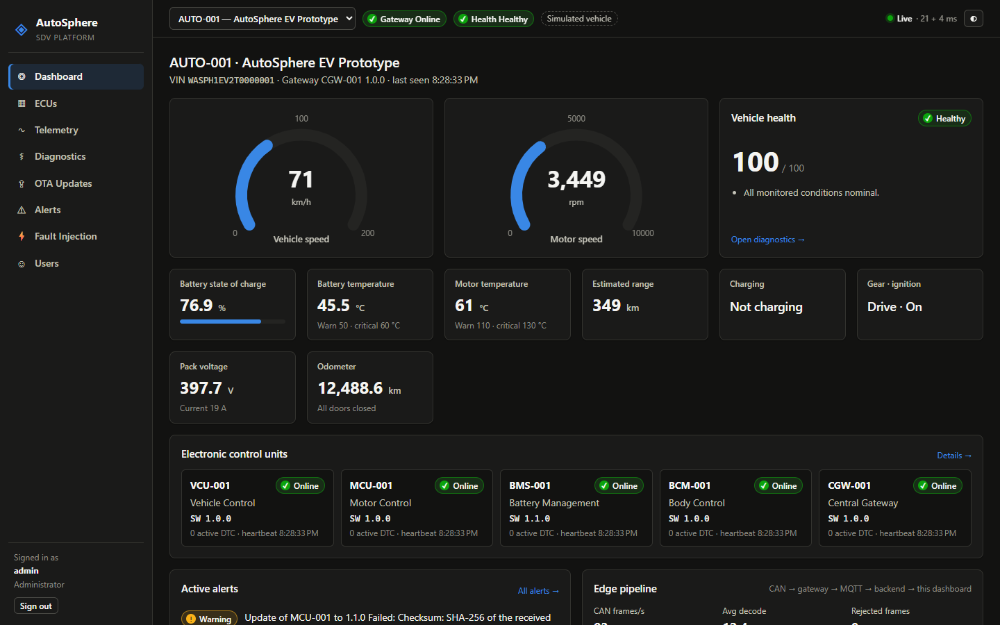 | 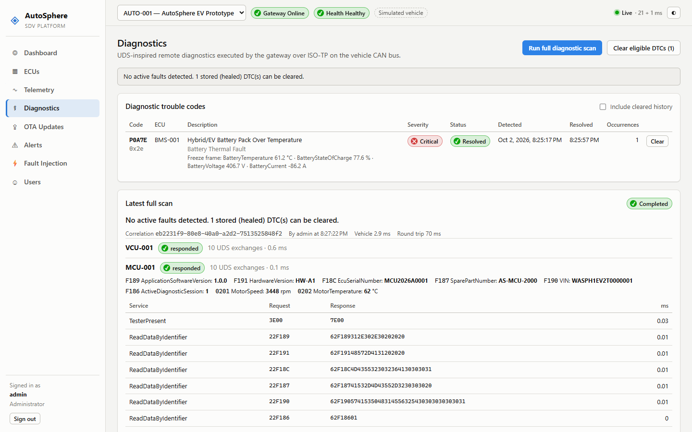 |
| **OTA Updates** | **Fault Injection** |
| 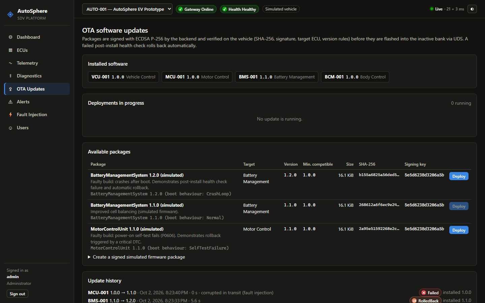 | 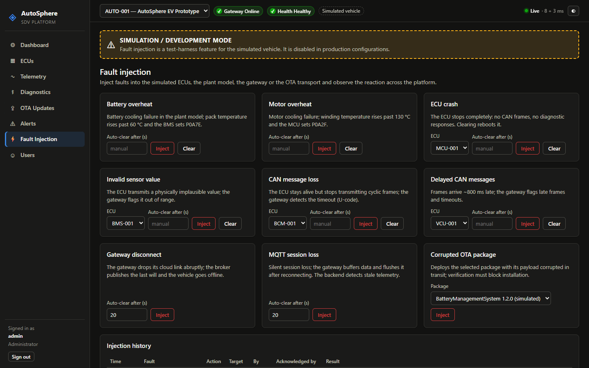 |
| **Telemetry** | **Critical Vehicle State** |
| 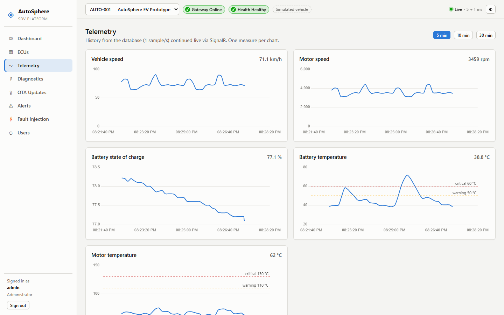 | 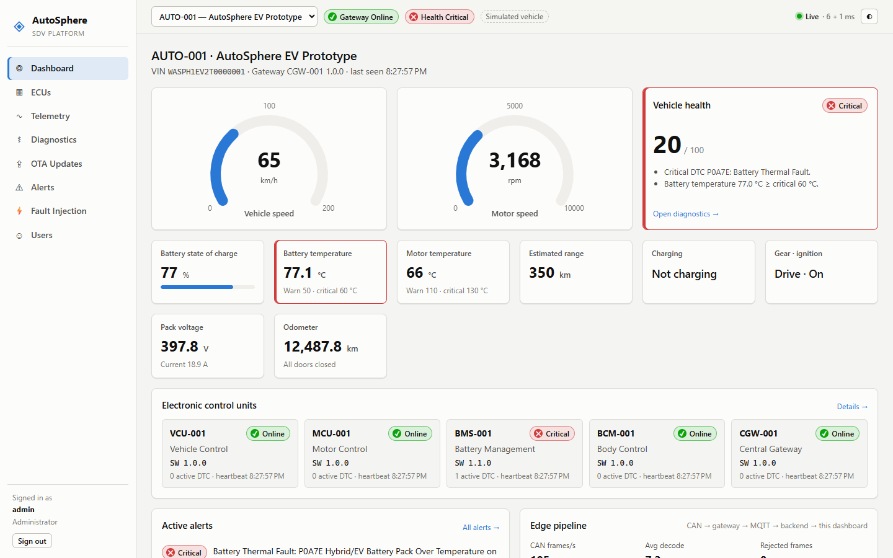 |

---

# Security

AutoSphere includes multiple application and vehicle-update security controls.

### Platform security

- JWT authentication
- Role-based authorization
- ASP.NET Core Identity
- Password hashing
- Login protection
- Input validation
- Centralized error handling
- Environment-based secret management
- Protected administrative operations

### OTA security

- SHA-256 payload integrity
- ECDSA package signatures
- Trusted public-key verification
- Target ECU validation
- Version compatibility validation
- Inactive-bank installation
- Post-update health checks
- Automatic rollback

No custom cryptographic algorithms are used.

---

## Roles

| Role | Access |
|---|---|
| **Viewer** | Monitor vehicles, telemetry, health, alerts, DTCs and update history |
| **Engineer** | Viewer access + diagnostics, DTC actions, ECU reset and ECU data |
| **Administrator** | Engineer access + vehicle administration, OTA campaigns, users and fault injection |

---

# Getting Started

## Prerequisites

For containerized setup:

- Docker
- Docker Compose

For local development:

- .NET SDK
- Node.js
- npm

Linux SocketCAN testing additionally requires:

- Linux
- `can-utils`

---

## Clone Repository

```bash
git clone https://github.com/AbuHurairaPhenologix/autosphere-sdv-platform.git

cd autosphere-sdv-platform
```

---

## Configure Environment

Linux/macOS:

```bash
cp .env.example .env
```

Windows PowerShell:

```powershell
Copy-Item .env.example .env
```

Review the environment values before starting the platform.

---

## Start with Docker

```bash
docker compose up -d --build
```

Services include:

| Service | Address |
|---|---|
| Dashboard | `http://localhost:8080` |
| API / Swagger | `http://localhost:5080/swagger` |
| Health Checks | `http://localhost:5080/health` |

The simulated vehicle becomes available automatically after the platform starts.

---

## Local Development

Windows:

```powershell
./scripts/run-local.ps1
```

Linux/macOS:

```bash
./scripts/run-local.sh
```

Frontend:

```bash
cd src/frontend/autosphere-web

npm install

npm start
```

---

## Run Components Individually

Backend:

```bash
dotnet run --project src/backend/AutoSphere.Api
```

Vehicle gateway:

```bash
dotnet run --project src/gateway/AutoSphere.VehicleGateway
```

---

# SocketCAN

On Linux, create a virtual CAN interface:

```bash
sudo ./scripts/setup-vcan.sh vcan0
```

Run the simulator and gateway through SocketCAN:

```bash
./scripts/run-split-simulation.sh socketcan
```

Inspect CAN traffic:

```bash
candump vcan0
```

The same gateway architecture can later target a physical CAN interface such as:

```text
can0
```

---

# API

Swagger documentation is available at:

```text
http://localhost:5080/swagger
```

Example endpoints:

```text
GET    /api/vehicles
GET    /api/vehicles/{vehicleId}

GET    /api/vehicles/{vehicleId}/dtcs

POST   /api/vehicles/{vehicleId}/diagnostics/scan

POST   /api/vehicles/{vehicleId}/diagnostics/session

POST   /api/vehicles/{vehicleId}/dtcs/clear

POST   /api/vehicles/{vehicleId}/ecus/{ecuId}/reset

GET    /api/vehicles/{vehicleId}/ecus/{ecuId}/software-version
```

---

# Testing

AutoSphere contains several test layers.

### Unit Tests

```bash
dotnet test --project tests/AutoSphere.UnitTests
```

### Architecture Tests

```bash
dotnet test --project tests/AutoSphere.ArchitectureTests
```

### Integration Tests

```bash
dotnet test --project tests/AutoSphere.IntegrationTests
```

### Frontend Tests

```bash
cd src/frontend/autosphere-web

npm test -- --watch=false
```

### Benchmarks

```bash
dotnet run -c Release \
  --project tests/AutoSphere.Benchmarks
```

Testing covers:

- CAN encoding and decoding
- signal validation
- ISO-TP-style transport
- diagnostic services
- DTC lifecycle
- ECU simulation
- health evaluation
- OTA package verification
- software installation
- rollback
- API behavior
- MQTT messaging
- end-to-end system workflows

---

# End-to-End Scenarios

## Battery Overheat

```text
Vehicle Online
     │
     ▼
Telemetry Streaming
     │
     ▼
Battery Overheat Injected
     │
     ▼
Threshold Exceeded
     │
     ▼
Critical DTC Generated
     │
     ▼
Alert Published
     │
     ▼
Vehicle Critical
     │
     ▼
Diagnostic Scan
     │
     ▼
Fault Identified
     │
     ▼
Fault Removed
     │
     ▼
Vehicle Healthy
```

---

## OTA Success

```text
Software Package
      │
      ▼
Sign Package
      │
      ▼
Deploy
      │
      ▼
Vehicle Verification
      │
      ▼
Install
      │
      ▼
Restart
      │
      ▼
Health Check
      │
      ▼
Confirm Version
```

---

## OTA Failure & Rollback

```text
Install New Image
       │
       ▼
Restart ECU
       │
       ▼
New Image Fails
       │
       ▼
Health Check Fails
       │
       ▼
Rollback
       │
       ▼
Previous Bank Activated
       │
       ▼
Vehicle Recovered
```

---

# Performance & Observability

The platform provides measurements for areas such as:

- CAN processing latency
- gateway processing latency
- MQTT message latency
- backend processing latency
- end-to-end telemetry latency
- diagnostic round-trip time
- ECU failure detection
- OTA deployment duration
- health-check duration
- rollback duration
- CPU usage
- memory usage

Structured logs can include:

```text
VehicleId

EcuId

CorrelationId

DiagnosticRequestId

OtaDeploymentId
```

This makes a complete vehicle operation traceable across gateway, messaging and backend components.

---

# Current Scope

AutoSphere currently uses simulated ECUs and a software-based vehicle plant model.

The following automotive concepts are implemented as focused subsets:

- UDS-inspired diagnostics
- ISO-TP-style transport
- E2E-inspired CAN protection
- VSS-inspired signal normalization
- Software-defined vehicle edge architecture

The platform does not claim production certification or full implementation of automotive standards.

---

# Future Enhancements

Potential extensions include:

- Raspberry Pi vehicle gateway
- Physical CAN hardware
- CAN-FD
- DoIP diagnostics
- Expanded diagnostic service coverage
- Mutual TLS vehicle identity
- Per-vehicle MQTT authorization
- Hardware-backed signing keys
- OTA key rotation
- Delta OTA updates
- Resumable downloads
- Advanced battery ageing simulation
- Charging-system simulation
- Multi-vehicle fleet support
- Time-series optimized telemetry storage
- Horizontally scaled backend services

---

# Documentation

Additional technical documentation is available in:

```text
docs/
│
├── api/
├── architecture/
├── automotive/
├── diagrams/
└── images/
```

Documentation covers:

- system architecture
- backend architecture
- vehicle gateway
- data flow
- CAN communication
- ECU simulation
- diagnostics
- vehicle signals
- OTA updates
- fault injection
- security
- API contracts

---

# Contributing

Contributions and technical improvements are welcome.

Before contributing, see:

- [CONTRIBUTING.md](CONTRIBUTING.md)
- [CODE_OF_CONDUCT.md](CODE_OF_CONDUCT.md)
- [SECURITY.md](SECURITY.md)

---

# Author

### Abu Huraira

**Software Engineer**

GitHub: [@AbuHurairaPhenologix](https://github.com/AbuHurairaPhenologix)

---

# License

AutoSphere is available under the **MIT License**.

See [LICENSE](LICENSE) for details.

---

<p align="center">
  <strong>AutoSphere</strong>
  <br><br>
  Connected Vehicle Software • Real-Time Telemetry • Diagnostics • Secure OTA
</p>