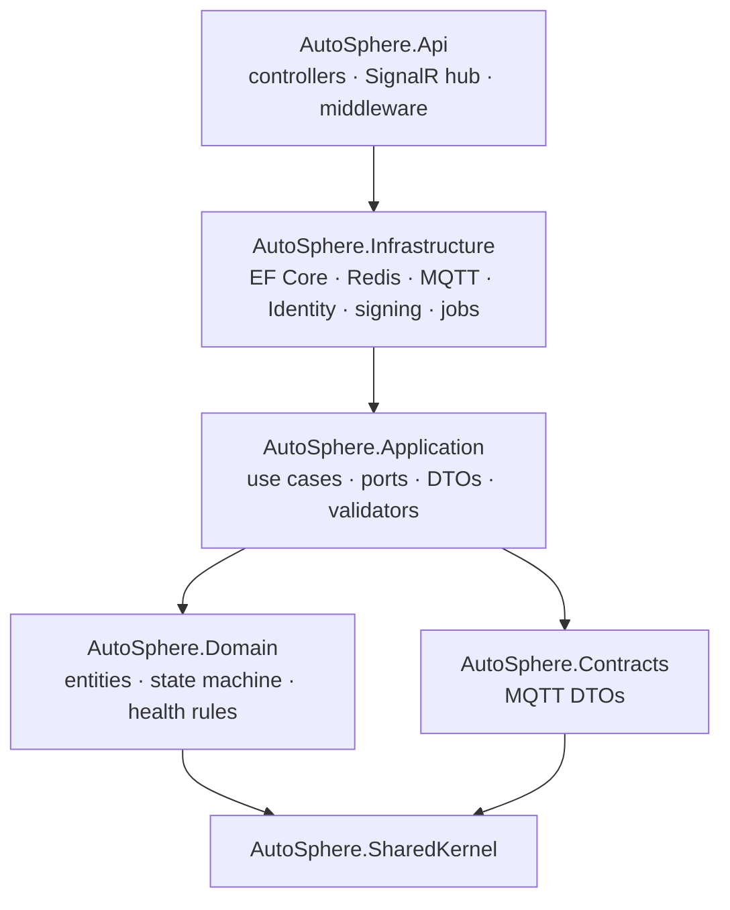
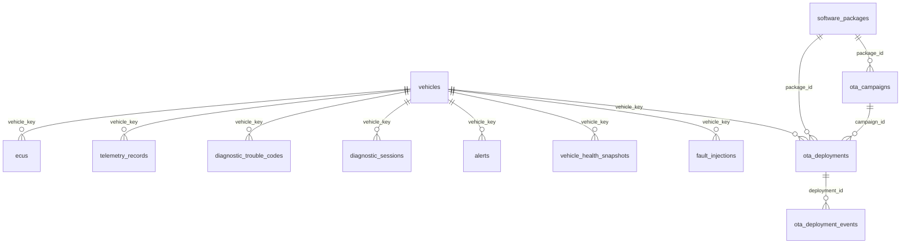

# Backend Architecture

The backend (`src/backend`) follows Clean Architecture: dependencies point inwards, the domain knows
nothing about databases, brokers or HTTP. See [system-architecture.md](system-architecture.md) for the
surrounding containers and [data-flow.md](data-flow.md) for message paths.

## 1. Layers and dependency rules

| Assembly | Must not reference |
|---|---|
| Domain | Application, Infrastructure, Api, Contracts, EF Core, MQTTnet, Npgsql, StackExchange.Redis, ASP.NET Core |
| Application | Infrastructure, Api, Npgsql, StackExchange.Redis, MQTTnet, ASP.NET Core, CAN/gateway assemblies |
| Infrastructure | Api |

These rules are checked on the compiled assemblies by `tests/AutoSphere.ArchitectureTests/LayeringTests.cs`,
which also verifies that controllers do not inject the `DbContext`, that domain entities expose no
public setters and that application types are not named after infrastructure technologies.

Application depends on `Microsoft.EntityFrameworkCore` only for `DbSet<T>` in `IAutoSphereDbContext`:
EF Core already implements repository and unit-of-work, so no extra repository wrappers exist.

## 2. Domain

| Entity / type | Behaviour |
|---|---|
| `Vehicle` (aggregate root) | `Register` validates id and 17-char VIN; `SetConnectivity`, `MarkSeen`, `SetGateway`, `ApplyHealth`, `AddOrGetEcu`. |
| `Ecu` | `ApplyObservation` (status, versions, heartbeat, DTC/timeout/E2E counters), `SetSoftwareVersion`, `MarkUnreachable`. |
| `TelemetryRecord` | One sampled value: vehicle key, VSS path, value, CAN timestamp. |
| `DiagnosticTroubleCode` | `Detect`, `Observe` (Active ⇄ Resolved, occurrence counting, first snapshot kept), `MarkCleared`; `IsClearable` only when Resolved. |
| `DiagnosticSession` | Keyed by correlation id; `Start`, `Complete` (stores raw results JSON, diagnosis, round trip), `TimeOut`. |
| `Alert` | `Raise`, `Update` (escalation resets acknowledgement), `Clear`, `Acknowledge`. |
| `SoftwarePackage` | `Create` (SHA-256, millisecond-truncated timestamp, rules: payload not empty, not gateway, min ≤ version), `ApplySignature`, `ToManifest`. |
| `OtaCampaign` / `OtaDeployment` / `OtaDeploymentEvent` | Campaign rejects unsigned packages and non-newer versions; deployment enforces `OtaStateMachine` (`TransitionTo` throws, `ApplyVehicleReport` ignores duplicates/out-of-order reports) and records an event history. |
| `VehicleHealthSnapshot` | Persisted history of health assessments. |
| `FaultInjectionRecord` | Audit of test-harness faults and their acknowledgement. |
| `VehicleHealthCalculator` | Pure rule set → `HealthAssessment(Status, Score, Reasons)`; thresholds in `HealthThresholds` (config section `Health`). |

Health rules (from `VehicleHealthCalculator`): *Offline* if the gateway is offline or no telemetry for
`OfflineAfterSeconds` (30); *Critical* for an active critical DTC, a temperature at/above its critical
threshold (battery 60 °C, motor 130 °C) or an unreachable powertrain ECU; *Warning* for warning DTCs,
warning temperatures (50 / 110 °C), degraded or offline non-powertrain ECUs, telemetry older than
`StaleTelemetrySeconds` (10) or recent communication errors. The score starts at 100 with penalties
(critical DTC −40, warning DTC −10, critical temperature −40, warning temperature −15, offline powertrain
ECU −35, other offline ECU −15, degraded ECU −10, stale telemetry −20, communication errors −1 each up
to −10) and is clamped to 0–100; a score below 40 is also Critical, below 80 also Warning.

Business-rule violations raise `DomainException` (→ HTTP 409) or `NotFoundException` (→ 404).

## 3. Application

### Ports (`Abstractions/Ports.cs`)

| Port | Implementation |
|---|---|
| `IAutoSphereDbContext` | `AutoSphereDbContext` (EF Core) |
| `IVehicleCommandPublisher` | `MqttVehicleGateway` |
| `ILiveVehicleStateCache` | `RedisLiveVehicleStateCache` or `InMemoryLiveVehicleStateCache` |
| `IRealtimeNotifier` | `SignalRRealtimeNotifier` (Api) |
| `IPackageSigner` | `EcdsaPackageSigner` |
| `ICurrentUser` | `HttpContextCurrentUser` (Api; "system" outside requests) |
| `ITelemetrySampleSink` | `TelemetrySampleWriter` |
| `IIdentityService` | `IdentityService` |

### Services

| Service | Lifetime | Purpose |
|---|---|---|
| `VehicleMessageDispatcher` | singleton | Entry point for MQTT messages; checks the vehicle registry and topic/payload vehicle id; creates a DI scope per message. |
| `VehicleRegistry` | singleton | Vehicle id → key cache with a 30 s negative cache for unknown vehicles. |
| `TelemetryIngestionService` | singleton | Hot path: sampling, live cache, SignalR push, latency metrics — no database access. |
| `DiagnosticResponseAwaiter` | singleton | Correlates HTTP requests with MQTT responses. |
| `VehicleService` | scoped | Register, list, get, delete vehicles; health history. |
| `VehicleStatusIngestionService` | scoped | Connectivity and ECU inventory from the retained status message. |
| `VehicleHealthService` | scoped | Runs the calculator, persists snapshots (on change and at least every 5 min), raises/clears the `vehicle-offline` alert. |
| `TelemetryQueryService` | scoped | Latest state and down-sampled history (bucket averages, 10–2000 points, ≤ 10 signals, ≤ `MaxHistoryHours`). |
| `AlertService` | scoped | Edge alert ingestion, backend alerts, acknowledgement (OTA event alerts are closed on acknowledgement). |
| `DiagnosticService` / `DtcIngestionService` | scoped | Remote diagnostics and DTC reconciliation, see [diagnostics-flow.md](diagnostics-flow.md). |
| `SoftwarePackageService` / `OtaCampaignService` / `OtaStatusIngestionService` | scoped | OTA, see [ota-update-flow.md](ota-update-flow.md). |
| `FaultInjectionService` | scoped | Test-harness faults; only when `FaultInjection:Enabled`. |

Validators (FluentValidation, registered as singletons) cover vehicle registration, diagnostic
requests, package creation, sample packages, campaigns, fault injection, login and user management.
Services call `ValidateAndThrowAsync`; the API maps `ValidationException` to a 400 validation problem.

Options sections: `Telemetry` (`SamplingIntervalSeconds` 1, `RetentionDays` 7, `MaxHistoryHours` 24),
`Diagnostics` (`ResponseTimeoutSeconds` 20), `Ota` (`HealthCheckSeconds` 8, `DeploymentTimeoutMinutes` 5,
`MaxPackageSizeBytes` 1 MiB), `FaultInjection` (`Enabled`), `Health` (thresholds).

## 4. Infrastructure

| Concern | Implementation |
|---|---|
| Persistence | `AutoSphereDbContext : IdentityDbContext<ApplicationUser>`; one `IEntityTypeConfiguration` per entity; enums stored as strings; `UseSnakeCaseNamingConvention()`. Provider from `Database:Provider` (`PostgreSql` default, `Sqlite`); connection string `ConnectionStrings:AutoSphere`; Npgsql with retry on failure. |
| Migrations | `Persistence/Migrations/…_InitialCreate` (PostgreSQL). `DatabaseInitializer` applies migrations, or `EnsureCreated` for SQLite (where `DateTimeOffset` is stored via `DateTimeOffsetToBinaryConverter`). |
| Seeding | `Seed:Enabled` creates roles, users `admin`/`engineer`/`viewer` (passwords from `Seed:*Password`; skipped if missing), vehicle `AUTO-001` with five ECUs and three signed sample packages. |
| Cache | `ConnectionStrings:Redis` set → `RedisLiveVehicleStateCache` (key `autosphere:vehicle:{ID}:live`, TTL 1 h, failures logged and ignored); otherwise in-memory. |
| MQTT | `MqttVehicleGateway` (MQTT 5, clean start) subscribes `autosphere/vehicles/+/…` and `autosphere/simulation/+/faults/ack`; telemetry goes to a bounded **telemetry lane** (5000, drop-oldest), everything else to an unbounded **ordered lane** processed sequentially. Commands are published QoS 1; publishing while disconnected raises `ServiceUnavailableException` (→ 503). |
| Identity | ASP.NET Core Identity (PBKDF2 hashing), `JwtTokenService` (HMAC-SHA256), `IdentityService`. |
| OTA signing | `EcdsaPackageSigner` (ECDSA P-256 private key PEM; `Ota:Signing:*`). |

Background jobs:

| Job | Interval | Work |
|---|---|---|
| `TelemetrySampleWriter` | every 2 s | Drains up to 2000 queued samples (queue 50 000, drop-oldest) into one `SaveChanges`. |
| `TelemetryRetentionService` | hourly | `ExecuteDelete` of samples older than `RetentionDays`. |
| `VehicleHealthMonitorService` | every 2 s | Re-evaluates health of every vehicle that is online or not yet marked offline. |
| `OtaDeploymentTimeoutService` | every 30 s | Fails deployments without progress for `DeploymentTimeoutMinutes`. |
| `MqttVehicleGateway` | 1 s supervision | Reconnects with exponential back-off (`ReconnectDelaySeconds` → `MaxReconnectDelaySeconds`). |

## 5. API

| Controller | Routes (prefix) | Policy |
|---|---|---|
| `AuthController` | `POST /api/auth/login` (anonymous, rate limited), `GET /api/auth/me` | authenticated |
| `UsersController` | `/api/users` CRUD, `PUT {id}/role` | `ManageUsers` |
| `VehiclesController` | `GET /api/vehicles`, `GET {id}`, `GET {id}/ecus`, `GET {id}/health/history`; `POST`, `DELETE` | `ViewVehicles`; writes `ManageVehicles` |
| `TelemetryController` | `GET /api/vehicles/{id}/telemetry/latest` (204 if none), `GET …/history?signal=…` | `ViewVehicles` |
| `DiagnosticsController` | `POST …/diagnostics`, `…/diagnostics/scan`, `…/diagnostics/session`, `GET …/diagnostics`, `GET /api/diagnostics/{correlationId}`, `GET …/dtcs`, `POST …/dtcs/clear`, `POST …/ecus/{ecuId}/reset`, `GET …/ecus/{ecuId}/software-version`, `POST …/ecus/{ecuId}/data` | reads `ViewVehicles`; operations `OperateDiagnostics` |
| `AlertsController` | `GET …/alerts`, `POST /api/alerts/{id}/acknowledge` | `ViewVehicles` / `OperateDiagnostics` |
| `OtaController` / `VehicleOtaController` | `/api/ota/packages` (+ `sample`, `trust-anchor`), `/api/ota/campaigns`, `/api/ota/deployments`, `GET /api/vehicles/{id}/ota/history` | reads `ViewVehicles`; writes `ManageOta` |
| `SimulationController` | `GET /api/simulation/status` | `ViewVehicles` |
| `FaultInjectionController` | `GET/POST /api/vehicles/{id}/faults` | `InjectFaults` |

Diagnostic endpoints return 200 for completed *and* failed (NRC) outcomes and 504 when the vehicle did
not answer in time.

Cross-cutting pipeline (`Program.cs`): `CorrelationIdMiddleware` (accepts/creates `X-Correlation-Id`,
echoes it, pushes it to the Serilog `LogContext`) → Serilog request logging → `UseExceptionHandler`
with `GlobalExceptionHandler` → CORS → authentication → authorization → rate limiter.

| Exception | HTTP | ProblemDetails |
|---|---|---|
| `ValidationException` | 400 | `ValidationProblemDetails` with per-property errors |
| `NotFoundException` | 404 | detail = message |
| `DomainException` | 409 | detail = message |
| `ServiceUnavailableException` | 503 | detail = message |
| other | 500 | message only in Development; otherwise a generic text |

All ProblemDetails carry `traceId` and `correlationId`. The login policy allows
`RateLimiting:LoginPermitsPerMinute` (default 10) requests per client IP and minute.

Health endpoints (anonymous): `/health` (all checks, JSON), `/health/live` (no checks), `/health/ready`
(tag `ready`). Checks: `database` (EF `DbContext` check), `mqtt`, `vehicle-gateways` (Degraded when
vehicles are registered but none online) and `redis` (only when configured).

### SignalR

Hub `VehicleHub` at `/hubs/vehicles` (`ViewVehicles` policy; JWT via `access_token` query parameter).
Every connection joins group `fleet`; `SubscribeVehicle(id)` / `UnsubscribeVehicle(id)` manage group
`vehicle:{ID}`.

| Client method | Group | Payload |
|---|---|---|
| `Telemetry` | vehicle | `VehicleTelemetryDto` (typed snapshot, signals, statistics, latency) |
| `VehicleUpdated` | fleet | `VehicleDetailsDto` |
| `DtcsChanged` | vehicle | vehicle id + stored DTCs |
| `Alert` | fleet | `AlertDto` |
| `OtaDeployment` | fleet | `OtaDeploymentDto` |
| `DiagnosticCompleted` | vehicle | `DiagnosticSessionDto` |
| `FaultInjection` | vehicle | `FaultInjectionDto` |

## 6. Database schema

| Table | Key indexes |
|---|---|
| `vehicles` | unique `vehicle_id`, unique `vin` |
| `ecus` | unique (`vehicle_key`, `ecu_id`) |
| `telemetry_records` | (`vehicle_key`, `signal_path`, `timestamp`), (`timestamp`) for retention |
| `diagnostic_trouble_codes` | (`vehicle_key`, `status`), (`vehicle_key`, `ecu_id`, `code`); snapshot stored as JSON text in `snapshot_json` |
| `diagnostic_sessions` | (`vehicle_key`, `requested_at`) |
| `alerts` | (`vehicle_key`, `raised_at`), (`vehicle_key`, `alert_key`, `cleared_at`) |
| `software_packages` | unique (`target_ecu_type`, `version`) |
| `ota_deployments` | (`vehicle_key`, `created_at`), (`status`) |
| `ota_deployment_events` | (`deployment_id`, `timestamp`) |
| `vehicle_health_snapshots` | (`vehicle_key`, `timestamp`) |
| `fault_injections` | (`vehicle_key`, `requested_at`) |

ASP.NET Core Identity adds the `asp_net_*` tables. Vehicle deletion cascades to dependent rows;
packages are protected from deletion while referenced (`Restrict`).

## 7. Telemetry sampling and retention

The gateway publishes a snapshot of ~20 signals at 4 Hz. The backend keeps every snapshot in the live
cache and pushes it to dashboards, but persists **at most one sample per signal and vehicle per
`SamplingIntervalSeconds` (1 s)** based on the CAN timestamp; stale signals are not persisted. Samples
are written in batches every 2 s and deleted after `RetentionDays` (7). One vehicle therefore produces
about 20 rows/s (≈ 1.7 M rows/day), which the composite index serves for chart queries. History
responses are down-sampled to at most `maxPoints` bucket averages. Messages flushed from the gateway's
offline buffer are persisted but never move the live view backwards (sequence check). A time-series
store (e.g. TimescaleDB) is future work.
