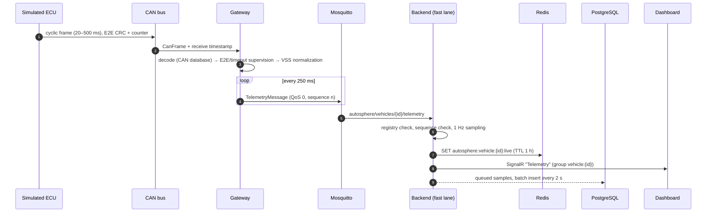
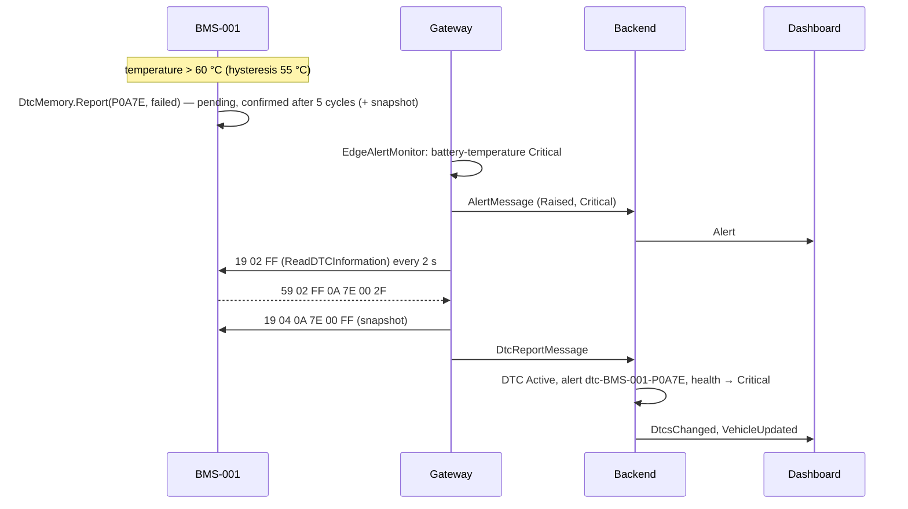
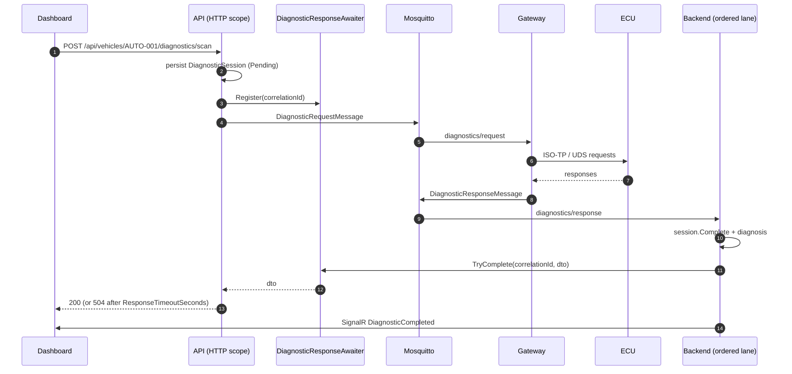

# Data Flow

This document follows every message type end to end: from the simulated ECU to the dashboard and,
for commands, back to the ECU. Topics and payloads are defined once in `AutoSphere.Contracts`
(`MqttTopics`, `Messages/*`); see [design-overview.md](design-overview.md) §6 for the topic table.

## 1. Telemetry

| Stage | Rate | Notes |
|---|---|---|
| CAN | ≈ 96 frames/s measured (6 cyclic messages) | Each frame carries one message of the CAN database. |
| Gateway → MQTT | 4 Hz | Edge aggregation: one snapshot of all signals per message, QoS 0 (superseded by the next sample). |
| Backend live path | 4 Hz | No database access: live cache + SignalR only. |
| Persistence | 1 sample per signal per second | Batched writes; 7-day retention. |
| Dashboard charts | 1 point per second | Initial history via REST (`/telemetry/history`), then appended from SignalR. |

Out-of-order or replayed telemetry (e.g. flushed from the gateway's offline buffer) is persisted but
does not overwrite the live view: the backend only accepts a higher sequence number (or a large reset,
indicating a gateway restart).

## 2. Status, DTCs and alerts

| Message | Topic | QoS / retain | Producer trigger | Backend handler | Effect |
|---|---|---|---|---|---|
| `VehicleStatusMessage` | `…/status` | 1 / retained (+ last will) | every 5 s and on ECU status change | `VehicleStatusIngestionService` | Connectivity, gateway info, ECU upsert; health re-evaluation; `VehicleUpdated` push |
| `DtcReportMessage` | `…/dtcs` | 1 | on change, at least every 30 s | `DtcIngestionService` | DTC lifecycle, backend alerts for critical DTCs, `DtcsChanged`, health re-evaluation |
| `AlertMessage` | `…/alerts` | 1 | edge rule rising/falling edge | `AlertService` | Upsert by alert key; `Alert` push; health re-evaluation |

All three go through the backend's **ordered lane**: one consumer processes them sequentially, which
keeps per-vehicle state changes in arrival order. A retained "online" status older than two minutes
(replayed on subscription) is treated as offline. When the gateway disappears abruptly, Mosquitto
publishes the retained last will (`connectivity = Offline`).

## 3. Commands (cloud → vehicle)

Commands carry a `correlationId` that is reused in every log entry, response and database record.

| Command | Topic | Response topic | Correlation |
|---|---|---|---|
| `DiagnosticRequestMessage` | `…/diagnostics/request` | `…/diagnostics/response` | `DiagnosticSession.Id` = correlation id; HTTP waits via `DiagnosticResponseAwaiter` |
| `OtaUpdateCommand` | `…/ota/command` | `…/ota/status` (many) | correlation id = deployment id |
| `FaultInjectionCommand` | `autosphere/simulation/{id}/faults` | `…/faults/ack` | `FaultInjectionRecord.Id` |

## 4. Latency measurement points

Each `VehicleTelemetryDto` pushed to the dashboard carries `LatencyDto`, computed by the backend from
timestamps that travel with the data:

| Field | From → to | Computation |
|---|---|---|
| `canToGatewayPublishMs` | newest CAN frame receive → gateway publish | `gatewayTimestamp − max(signal.timestamp)` |
| `gatewayToBackendMs` | gateway publish → backend receive (MQTT transport) | `backendReceivedAt − gatewayTimestamp` |
| `canToBackendMs` | newest CAN frame → backend receive | `backendReceivedAt − max(signal.timestamp)` |
| dashboard latency | backend receive → browser receive | computed in the Angular `VehicleStore` (`Date.now() − backendReceivedAt`) and shown in the top bar |

`canToGatewayPublishMs` is dominated by the 250 ms aggregation interval (a value waits up to one
interval before publication). All cross-process latencies assume synchronized clocks, which holds when
all components run on one host or in Docker on one host. The methodology is described in
[../thesis/performance-testing.md](../thesis/performance-testing.md).

| Meter | Instruments |
|---|---|
| `AutoSphere.Gateway` | `can.frames_received`, `can.frames_rejected`, `can.decode_duration` (µs), `can_to_mqtt_latency` (ms), `mqtt.messages_published`, `diagnostic_duration` (ms) |
| `AutoSphere.Backend` | `autosphere.backend.gateway_to_backend_latency` (ms), `autosphere.backend.can_to_backend_latency` (ms) |
| `AutoSphere.Backend.Mqtt` | `autosphere.backend.mqtt.messages_received` |

Further timings recorded per operation: `DiagnosticSession.VehicleDurationMs` / `RoundTripMs`, the UDS
exchange durations in diagnostic results, and the OTA deployment event timeline
(`OtaDeploymentDto.DurationSeconds`, rollback duration in the final event message).

## 5. Failure behaviour along the path

| Failure | Detection | Visible effect |
|---|---|---|
| ECU stops transmitting | Message timeout in the gateway | ECU Offline/Warning, U-code DTC, `communication-lost-*` alert, health degraded |
| Corrupted CAN frame | CRC-8 mismatch | Frame dropped, E2E counter, U0401 when recent |
| Gateway crash / abrupt disconnect | Broker last will | Vehicle Offline immediately |
| Silent MQTT loss | No telemetry for 30 s (`Health:OfflineAfterSeconds`) | Vehicle Offline inferred; data buffered at the edge and flushed on reconnect |
| Broker down for the backend | Publish while disconnected | HTTP 503 for commands, `/health` unhealthy |
| Redis down | Exceptions caught | Live cache read/write skipped (logged), `/health` reports the `redis` check unhealthy |
