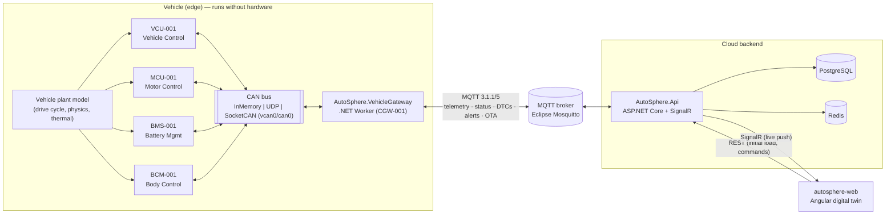
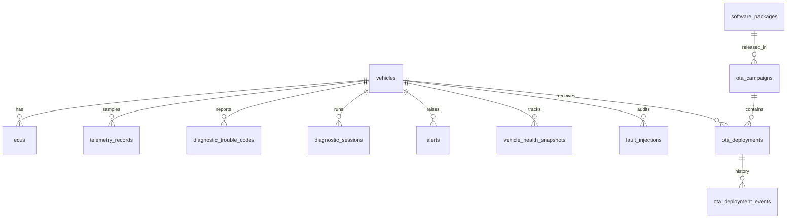

# AutoSphere — Design Overview

This document is the entry point to the AutoSphere design. It records the architecture decisions made
**before** implementation started and is kept in sync with the code. Detailed views live in the sibling
documents (`system-architecture.md`, `gateway-architecture.md`, …).

> **Terminology honesty.** AutoSphere is an academic prototype. Where this document says *UDS*, *ISO-TP*,
> *E2E protection*, *AUTOSAR* or *VSS* it means an **educational, inspired-by implementation** of the
> concept. Nothing in this repository is certified or claims ISO 14229, ISO 15765-2, ISO 26262,
> AUTOSAR or COVESA VSS compliance. Simplifications are listed in [§10](#10-risks-and-simplifications).

---

## 1. Final architecture



Key decisions:

| Decision | Rationale |
|---|---|
| **CAN is abstracted behind `ICanBus` / `ICanChannel`** with three transports: in-memory, UDP bridge, Linux SocketCAN. | Develop on Windows, demo in Docker, run on real Linux/vcan or a Raspberry Pi + CAN HAT without changing business logic. |
| **One CAN database (`can-database.json`) drives both encoding (ECUs) and decoding (gateway).** | Single source of truth, like a DBC file. No decoding logic is hand-written per signal. |
| **ECUs are simulated against a shared *plant model*.** | Mirrors HIL (hardware-in-the-loop) practice: ECUs read "sensors" from a physical model, so speed, RPM, current, SOC and temperature stay physically coherent. |
| **Diagnostics really travel over CAN** using an ISO-TP-style transport and a UDS-inspired service layer. | Demonstrates segmentation, flow control, NRCs and session handling instead of faking results in the backend. |
| **OTA flashing really happens over UDS** (`0x34/0x36/0x37`) to an ECU with **A/B banks**. | Rollback is then a genuine bank switch, not a database flag. |
| **Signature verification happens on the vehicle (gateway)**, signing happens in the backend. | Matches the real trust model: the vehicle must not trust the transport or the backend's database. |
| **Clean Architecture backend** (Domain → Application → Infrastructure → Api). | Testable business rules (health formula, OTA state machine) independent of EF/MQTT/SignalR. |
| **REST for initial load and commands, SignalR for live data.** | No polling of REST endpoints for live values. |
| **Redis is optional** and used only for the live vehicle state cache. | Keeps the prototype runnable (and testable) without Redis; an in-memory implementation is used when Redis is not configured. |

## 2. Repository structure

```text
autosphere-sdv-platform/
├── src/
│   ├── shared/
│   │   ├── AutoSphere.SharedKernel/      # value types shared by edge + cloud: SoftwareVersion, DtcCode, enums,
│   │   │                                 # OTA package integrity (SHA-256 + ECDSA), simulated firmware image format
│   │   └── AutoSphere.Contracts/         # MQTT topics + typed message DTOs + JSON options
│   ├── backend/
│   │   ├── AutoSphere.Domain/            # entities, value objects, domain services (health, OTA state machine)
│   │   ├── AutoSphere.Application/       # use cases, DTOs, validators, ports (interfaces)
│   │   ├── AutoSphere.Infrastructure/    # EF Core/PostgreSQL, Redis, MQTT, Identity/JWT, OTA signing
│   │   └── AutoSphere.Api/               # controllers, SignalR hub, middleware, health checks, Swagger
│   ├── gateway/
│   │   ├── AutoSphere.CanBus/            # CanFrame, ICanBus, InMemory/UDP/SocketCAN transports, ISO-TP
│   │   ├── AutoSphere.VehicleSignals/    # CAN database, bit-level codec, signal decoder, VSS mapping
│   │   ├── AutoSphere.Diagnostics/       # UDS-inspired protocol: services, NRCs, DIDs, DTC encoding, client
│   │   └── AutoSphere.VehicleGateway/    # .NET Worker Service (the edge gateway / CGW)
│   ├── simulator/
│   │   ├── AutoSphere.EcuSimulation/     # plant model, ECU simulators, UDS server, fault injection
│   │   └── AutoSphere.VehicleSimulator/  # standalone host for running ECUs in a separate process
│   └── frontend/
│       └── autosphere-web/               # Angular dashboard
├── tests/
│   ├── AutoSphere.UnitTests/
│   ├── AutoSphere.IntegrationTests/      # API + DB + embedded MQTT broker + end-to-end scenarios
│   ├── AutoSphere.ArchitectureTests/
│   └── AutoSphere.Benchmarks/            # BenchmarkDotNet micro-benchmarks for the thesis (not run in CI)
├── docs/ (architecture, automotive, thesis, api, diagrams)
├── docker/ (Mosquitto config, nginx config)
├── scripts/ (vcan setup, env loading, demo helpers)
├── .github/workflows/
└── AutoSphere.sln
```

**Deviations from the suggested structure (justified):**

* `src/shared/*` was added. Without it, MQTT DTOs and value types such as `SoftwareVersion` would be duplicated
  between gateway and backend, which the coding standards forbid.
* The three suggested per-ECU simulator projects were merged into one `AutoSphere.EcuSimulation` library.
  Each ECU is still an independent, independently-configurable class; separate assemblies would add build
  noise without creating a meaningful boundary.
* OTA lives in `SharedKernel` (package format/integrity), `Domain` (deployment lifecycle) and the gateway
  (update agent). This follows *where the responsibility lives in a real vehicle*, not a technical layer.

## 3. Projects in `AutoSphere.sln`

| Project | Type | References |
|---|---|---|
| AutoSphere.SharedKernel | classlib | — |
| AutoSphere.Contracts | classlib | SharedKernel |
| AutoSphere.Domain | classlib | SharedKernel |
| AutoSphere.Application | classlib | Domain, Contracts |
| AutoSphere.Infrastructure | classlib | Application |
| AutoSphere.Api | web | Infrastructure |
| AutoSphere.CanBus | classlib | — |
| AutoSphere.VehicleSignals | classlib | CanBus, SharedKernel |
| AutoSphere.Diagnostics | classlib | CanBus, SharedKernel |
| AutoSphere.EcuSimulation | classlib | VehicleSignals, Diagnostics, Contracts |
| AutoSphere.VehicleSimulator | worker | EcuSimulation |
| AutoSphere.VehicleGateway | worker | VehicleSignals, Diagnostics, Contracts, EcuSimulation (optional in-process simulation) |
| AutoSphere.UnitTests | xunit v3 | VehicleGateway (→ signals, diagnostics, simulation), Application |
| AutoSphere.IntegrationTests | xunit v3 | Api, VehicleGateway |
| AutoSphere.ArchitectureTests | xunit v3 | Api, VehicleGateway, VehicleSimulator |
| AutoSphere.Benchmarks | console | VehicleSignals, Diagnostics |

## 4. Domain entities

| Entity / value object | Purpose |
|---|---|
| `Vehicle` (aggregate root) | VIN, model, connectivity, last seen, current health. Owns its `Ecu`s. |
| `Ecu` | ECU id (`BMS-001`), type, hardware/software version, status, last heartbeat. |
| `TelemetryRecord` | One sampled signal value (`vehicleId`, VSS path, value, timestamp). |
| `DiagnosticTroubleCode` | DTC code, ECU, severity, status (Active/Inactive/Cleared), detected/resolved timestamps, snapshot (freeze-frame) data. |
| `DiagnosticSession` | One diagnostic request/response exchange identified by its correlation id. |
| `Alert` | Threshold / communication / OTA alert with raise, clear and acknowledge times. |
| `SoftwarePackage` | Signed package: target ECU type, version, payload, SHA-256, ECDSA signature, min compatible version. |
| `OtaCampaign` | A release of one package to a set of vehicles. |
| `OtaDeployment` | Per-vehicle/ECU execution with an enforced state machine and an event history (`OtaDeploymentEvent`). |
| `VehicleHealthSnapshot` | Persisted output of the health calculation when it changes. |
| `SoftwareVersion` (value object) | Semantic version with ordering. |
| `DtcCode` (value object) | `P0A7E` ⇄ 2-byte SAE J2012 / ISO 15031-6 style encoding. |

## 5. Main interfaces

```csharp
// CAN (AutoSphere.CanBus)
interface ICanBus          { ValueTask<ICanChannel> OpenChannelAsync(CanFilter[]? filters, CancellationToken ct); }
interface ICanFrameReader  { IAsyncEnumerable<CanFrame> ReadAllAsync(CancellationToken ct); }
interface ICanFrameWriter  { ValueTask WriteAsync(CanFrame frame, CancellationToken ct); }
interface ICanChannel : ICanFrameReader, ICanFrameWriter, IAsyncDisposable { }

// Signals (AutoSphere.VehicleSignals)
interface ICanSignalDecoder { bool TryDecode(CanFrame frame, out DecodedMessage? message); }
interface ICanSignalEncoder { byte[] Encode(CanMessageDefinition message, IReadOnlyDictionary<string,double> values, int aliveCounter); }

// Diagnostics (AutoSphere.Diagnostics)
interface IUdsClient        { Task<UdsResponse> RequestAsync(byte[] request, UdsTrace? trace, CancellationToken ct); }

// Application ports (backend)
interface IVehicleCommandPublisher   // sends diagnostic/OTA/fault commands to vehicles (MQTT)
class DiagnosticResponseAwaiter      // correlates async MQTT responses to HTTP requests (concrete singleton)
interface ILiveVehicleStateCache     // latest state (Redis or in-memory)
interface IRealtimeNotifier          // pushes to dashboards (SignalR)
interface IPackageSigner             // ECDSA P-256 signing of OTA manifests
interface IAutoSphereDbContext       // EF Core unit of work (no extra repository wrappers)
```

## 6. MQTT topic design

All topics are rooted at `autosphere/`. Payloads are UTF-8 JSON, camelCase, enums as strings, and every
message carries `schemaVersion`, `vehicleId` and a UTC `timestamp`. Commands carry a `correlationId`.

| Topic | Direction | QoS | Retained | Payload |
|---|---|---|---|---|
| `autosphere/vehicles/{vehicleId}/telemetry` | vehicle → cloud | 0 | no | `TelemetryMessage` |
| `autosphere/vehicles/{vehicleId}/status` | vehicle → cloud | 1 | **yes** (+ LWT "offline") | `VehicleStatusMessage` |
| `autosphere/vehicles/{vehicleId}/dtcs` | vehicle → cloud | 1 | no | `DtcReportMessage` |
| `autosphere/vehicles/{vehicleId}/alerts` | vehicle → cloud | 1 | no | `AlertMessage` |
| `autosphere/vehicles/{vehicleId}/diagnostics/request` | cloud → vehicle | 1 | no | `DiagnosticRequestMessage` |
| `autosphere/vehicles/{vehicleId}/diagnostics/response` | vehicle → cloud | 1 | no | `DiagnosticResponseMessage` |
| `autosphere/vehicles/{vehicleId}/ota/command` | cloud → vehicle | 1 | no | `OtaUpdateCommand` |
| `autosphere/vehicles/{vehicleId}/ota/status` | vehicle → cloud | 1 | no | `OtaStatusMessage` |
| `autosphere/simulation/{vehicleId}/faults` | cloud → simulator/gateway | 1 | no | `FaultInjectionCommand` |
| `autosphere/simulation/{vehicleId}/faults/ack` | simulator/gateway → cloud | 1 | no | `FaultInjectionAck` |

Fault injection deliberately uses a separate `simulation/` namespace: it is a **test-harness** function, not a
vehicle function, and must be impossible to confuse with production command topics.

## 7. CAN signal design

11-bit identifiers, classic CAN (8-byte payload); CAN-FD is supported by the frame model and transports.
Every cyclic message carries an **E2E-inspired protection header**: byte 0 = CRC-8 (SAE J1850 polynomial
0x1D) over the payload and a data id, byte 1 low nibble = alive counter. The gateway rejects frames with a
bad CRC or a repeated/jumping counter.

| CAN ID | Message | Sender | Cycle | Signals (start bit / length / factor / unit) |
|---|---|---|---|---|
| 0x100 | `VCU_Status` | VCU-001 | 50 ms | GearPosition 12/3 (P,R,N,D) · BrakeStatus 15/1 · VehicleSpeed 16/16 ×0.01 km/h · AcceleratorPedalPosition 32/8 ×0.4 % · IgnitionStatus 40/2 |
| 0x101 | `VCU_Trip` | VCU-001 | 500 ms | Odometer 16/24 ×0.1 km · VehicleRange 40/16 ×0.1 km |
| 0x200 | `MCU_Status` | MCU-001 | 20 ms | MotorRPM 16/16 signed rpm · MotorTorque 32/16 signed ×0.1 Nm · MotorTemperature 48/8 offset −40 °C |
| 0x300 | `BMS_Status` | BMS-001 | 100 ms | ChargingStatus 12/3 · BatteryStateOfCharge 16/10 ×0.1 % · BatteryTemperature 32/16 signed ×0.1 °C |
| 0x301 | `BMS_Pack` | BMS-001 | 100 ms | BatteryVoltage ×0.1 V · BatteryCurrent signed ×0.1 A — **Motorola (big-endian) byte order** |
| 0x400 | `BCM_Status` | BCM-001 | 500 ms | Door FL/FR/RL/RR, Trunk (1 bit each) |
| 0x7E0–0x7E3 | Diagnostic requests (physical) | tester (gateway) | event | ISO-TP-style |
| 0x7E8–0x7EB | Diagnostic responses | VCU/MCU/BMS/BCM | event | ISO-TP-style |

Full details including VSS mapping: [`docs/automotive/vehicle-signals.md`](../automotive/vehicle-signals.md).

## 8. Database design



Foreign keys to `vehicles.id` are named `vehicle_key` (the business id `AUTO-001` is `vehicles.vehicle_id`).
Indexes target the actual queries: `telemetry_records (vehicle_key, signal_path, timestamp)`,
`diagnostic_trouble_codes (vehicle_key, status)`, `alerts (vehicle_key, raised_at)`,
`ota_deployments (vehicle_key, created_at)`, unique `ecus (vehicle_key, ecu_id)` and unique
`software_packages (target_ecu_type, version)`. See [backend-architecture.md](backend-architecture.md).

**Telemetry sampling and retention.** The gateway decodes every CAN frame (~94 frames/s for the four simulated ECUs) but publishes an
aggregated snapshot at 4 Hz. The backend pushes every snapshot to SignalR and Redis, but persists **one
sample per signal per second** in a narrow `telemetry_records` table, written in batches. A retention
service deletes samples older than 7 days (configurable). A time-series extension (TimescaleDB) is listed as
future work.

## 9. Implementation milestones

| # | Milestone | Content |
|---|---|---|
| 1 | Foundation | solution, build props, shared kernel, contracts, Docker skeleton |
| 2 | Vehicle simulation | CAN abstraction, transports, CAN database + codec, plant model, ECUs |
| 3 | Gateway | worker, decoding, ECU monitoring, MQTT publish/subscribe, reconnect |
| 4 | Backend | domain, EF Core, ingestion, vehicle management, telemetry, SignalR, auth |
| 5 | Diagnostics | ISO-TP, UDS-inspired services, DTC lifecycle, diagnostic endpoints |
| 6 | OTA | signed packages, verification, UDS flashing, A/B rollback, campaigns |
| 7 | Dashboard | Angular pages: dashboard, ECUs, telemetry, diagnostics, OTA, fault injection |
| 8 | Testing | unit, integration, architecture, end-to-end scenarios, benchmarks |
| 9 | Thesis | docs, research questions, performance methodology, diagrams |

The detailed, issue-ready roadmap is in [`docs/thesis/roadmap.md`](../thesis/roadmap.md).

## 10. Risks and simplifications

| Area | Simplification / risk | Mitigation |
|---|---|---|
| UDS | Subset of ISO 14229-1 services; project-specific DIDs and routine ids; simplified security access (HMAC seed/key). | Clearly labelled *UDS-inspired*; service/NRC byte values follow the standard so the concepts transfer. |
| ISO-TP | Single-frame/first-frame/consecutive-frame/flow-control implemented; no extended/mixed addressing, no CAN-FD ISO-TP lengths > 4095. | Documented; covered by unit tests. |
| E2E | CRC-8 + alive counter only, inspired by AUTOSAR E2E profile 1; not a certified E2E library. | Labelled *E2E-inspired*. |
| VSS | ~20 signals; some project extensions (e.g. `Charging.Status`, `Brake.IsPressed`); range in km not m. | Extensions marked in `vehicle-signals.md`. |
| SocketCAN | Cannot run on Windows; Linux transport validated with `vcan` only. | Transport is isolated behind `ICanBus`; marshalling unit-tested on all platforms. |
| OTA payload transfer | The package is embedded in the MQTT command instead of being downloaded from a CDN. | Documented; signature verification is independent of the transport. |
| OTA keys | Dev signing key generated locally into a git-ignored folder; no HSM. | Key loading is behind `IPackageSigner`; production would use a KMS/HSM. |
| MQTT security | Broker allows anonymous connections in development. | Username/password and TLS are configurable; documented in `security.md`. |
| Firmware | The "firmware" is a sample image whose header tells the simulated ECU how to behave after boot (e.g. crash loop). | Explicitly called *simulated firmware*; needed to demonstrate a failed post-install health check honestly. |
| Time sync | Latency measurements assume a shared clock (single host / Docker host). | Methodology in `docs/thesis/performance-testing.md`. |
| Scale | Single backend instance; no MQTT shared subscriptions or sharding. | Out of scope; listed as future work. |
