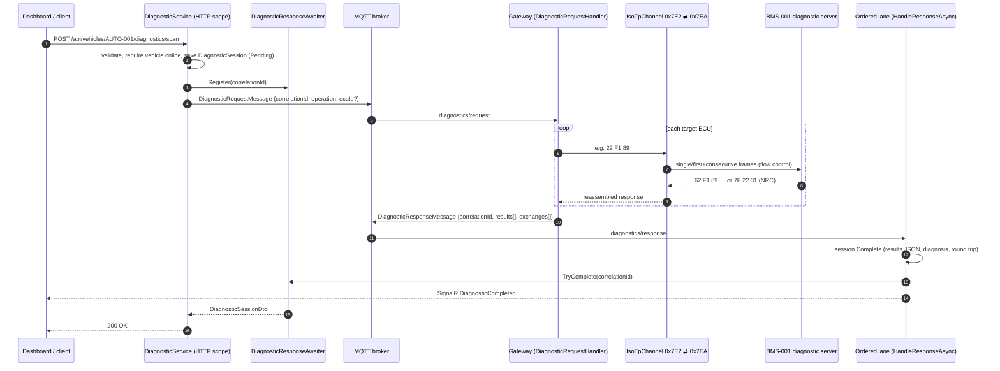
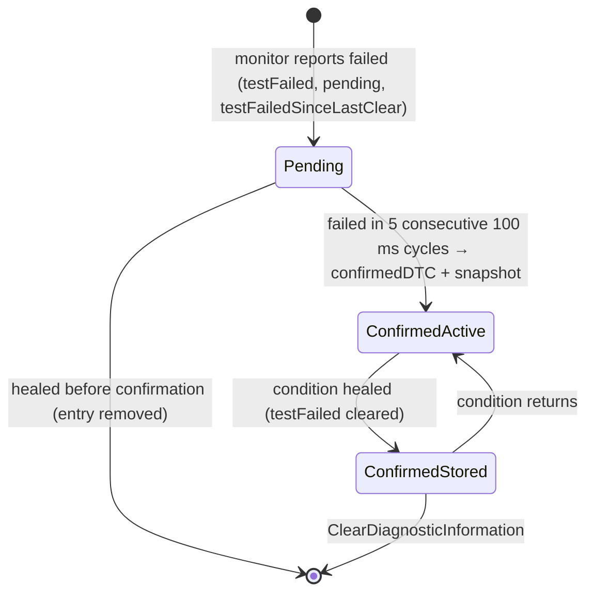

# Diagnostics Flow

Remote diagnostics in AutoSphere are **UDS-inspired**: the gateway acts as a diagnostic tester and
exchanges real request/response bytes with the simulated ECUs over an **ISO-TP-style** transport on the
CAN bus. Service identifiers and negative response codes use the byte values of ISO 14229-1; the DIDs
in the 0x01xx–0x04xx range and routines 0xF001/0xF002 are project-specific. The implementation is a
subset for education and is not claimed to conform to ISO 14229 or ISO 15765-2. Protocol background:
[../automotive/uds-diagnostics.md](../automotive/uds-diagnostics.md).

## 1. End-to-end request/response

* The session is persisted **before** publishing; the response is processed in a different DI scope
  (ordered MQTT lane), which completes the session and the in-memory awaiter.
* `ExecuteAsync` waits `Diagnostics:ResponseTimeoutSeconds` (20 s). On timeout it re-reads the session
  without tracking (a late response may already have completed it); if still pending it marks it
  *TimedOut* and the controller returns **504 Gateway Timeout** with the session body.
* A negative response (NRC) is a valid diagnostic outcome: the session is *Failed* and the HTTP status
  is 200. Every result carries the raw exchanges (`service`, `requestHex`, `responseHex`, `durationMs`,
  `negativeResponse`) for traceability — the dashboard shows them.
* Diagnostics require an online vehicle (409 otherwise) and the `OperateDiagnostics` policy.

## 2. Supported operations

| Operation | API entry point | UDS traffic per ECU |
|---|---|---|
| `FullScan` | `POST …/diagnostics/scan` | `3E 00`, `22` for identification DIDs (F189, F191, F18C, F187, F190, F186) and the ECU's live-data DIDs, `19 02 FF`, `19 04 …` for confirmed DTCs |
| `ReadDtcs` | `POST …/diagnostics` | `19 02 FF` + snapshots |
| `ClearDtcs` | `POST …/dtcs/clear` | `14 FF FF FF` (all eligible) or `14` + 3-byte DTC, then `19 02 FF` |
| `EcuReset` | `POST …/ecus/{ecuId}/reset` | `11 01` (positive response before the reset) |
| `ReadSoftwareVersion` | `GET …/ecus/{ecuId}/software-version` | `22 F1 89`, `22 F1 91` |
| `ReadDataByIdentifier` | `POST …/ecus/{ecuId}/data` | `22` + DID (≤ 16 DIDs per request) |
| `SessionControl` | `POST …/diagnostics/session` | `10 01` / `10 03` (programming only from extended) |
| `TesterPresent` | `POST …/diagnostics` | `3E 00` |

Without an `ecuId` the gateway addresses every ECU and its own node `CGW-001`, which answers
DTC reads/clears and the software version locally (it is not a CAN diagnostic node).

Physical addressing follows the OBD convention: VCU 0x7E0/0x7E8, MCU 0x7E1/0x7E9, BMS 0x7E2/0x7EA,
BCM 0x7E3/0x7EB. The tester client (`UdsClient`) serialises requests per ECU, applies P2 = 500 ms and
P2* = 5 s after NRC 0x78 (`responsePending`), and discards stale responses before each request.

## 3. Fault memory in the ECU

Each simulated ECU (and the gateway) owns a `DtcMemory`:

| Producer | DTC | Condition |
|---|---|---|
| BMS | P0A7E Battery Pack Over Temperature (critical) | pack temperature > 60 °C, clears below 55 °C |
| BMS | P0A9C Temperature Sensor Implausible (warning) | invalid-sensor fault injected |
| MCU | P0A2F Drive Motor Temperature Too High (critical) | winding temperature > 130 °C, clears below 120 °C |
| MCU | P0A2C Motor Temperature Sensor Implausible (warning) | invalid-sensor fault injected |
| any ECU | P0606 Control Module Self-Test Fault (critical) | running image has `SelfTestFailure` behaviour |
| Gateway | U0100 / U0111 / U0140 / U0293, U0001, U0401 | message timeouts, late frames, E2E errors (see [gateway-architecture.md](gateway-architecture.md)) |

The snapshot (freeze frame) is captured once, at confirmation, from the ECU's snapshot DIDs (e.g. BMS:
temperature, SOC, voltage, current) and returned by `19 04` with record number 0x01.

**Clear-eligibility rule (project policy).** Clearing a single DTC whose test is currently failing is
refused with NRC 0x22 *conditionsNotCorrect*; clearing the group `FFFFFF` removes only DTCs whose
condition is no longer present. Real ECUs usually clear and re-detect the fault in the next monitor
cycle; refusing makes the "only clear resolved faults" rule observable. The backend enforces the same
rule before sending (`DtcRecordDto.IsClearable` → 409 for active DTCs).

## 4. DTC propagation to the cloud

`DtcMonitorService` polls every reachable, non-updating ECU every 2 s (`19 02 FF`), fetches the snapshot
once per confirmed DTC and publishes a `DtcReportMessage` when the set changes (and every 30 s). The
report lists `ReportedEcuIds`: only ECUs that answered are authoritative, so an offline ECU never
"clears" its DTCs in the cloud.

`DtcIngestionService` reconciles the report with the stored records:

| Vehicle report | Cloud record (`DtcRecordStatus`) |
|---|---|
| New code with testFailed | created **Active** (`DetectedAt`) |
| New code without testFailed | created **Resolved** |
| testFailed cleared | Active → **Resolved** (`ResolvedAt`) |
| testFailed set again | Resolved → Active, `OccurrenceCount++` |
| Absent although its ECU was reported | → **Cleared** (`ClearedAt`) |

Newly active *critical* DTCs raise backend alert `dtc-{ecuId}-{code}`, which is cleared when the DTC is
no longer active. Changes are pushed via `DtcsChanged` and trigger a health re-evaluation (an active
critical DTC makes the vehicle *Critical*).

## 5. Diagnosis interpretation

`DiagnosticService.Diagnose` turns raw results into an engineer-readable sentence:

* `FullScan` / `ReadDtcs`: "Active faults: *FaultCategory* (*code* on *ECU*); …" ordered by severity,
  or "No active faults detected."; plus "*n* stored (healed) DTC(s) can be cleared." and
  "Not responding: *ECUs*." when applicable. The fault category comes from the shared catalogue
  `KnownDtcs` (e.g. P0A7E → *Battery Thermal Fault*).
* Other operations: "*Operation* completed." or "*Operation* failed: *error*."

## 6. Example: battery overheat

1. Fault injection sets the plant's battery cooling failure; the pack temperature rises.
2. At 50 °C the gateway raises edge alert `battery-temperature` (Warning); health → Warning.
3. Above 60 °C the BMS reports P0A7E failed; after 0.5 s it is confirmed with a snapshot.
4. Within one poll (≤ 2 s) the DTC reaches the backend: alert `dtc-BMS-001-P0A7E`, health → Critical.
5. A full scan returns "Active faults: Battery Thermal Fault (P0A7E on BMS-001)."
6. Clearing is refused (409) while the fault is active.
7. After the fault is cleared the pack cools; below 55 °C the DTC heals → Resolved; once the temperature is below the
   50 °C warning threshold the health returns to Healthy.
8. `POST …/dtcs/clear` sends `14 0A 7E 00` → `54`; the next report marks the record Cleared.

This sequence is automated by the integration test
`Battery_overheat_is_detected_diagnosed_and_resolved`.
