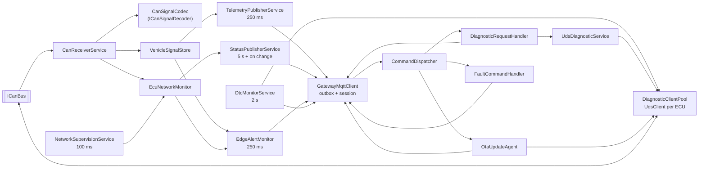

# Vehicle Edge Gateway Architecture

`AutoSphere.VehicleGateway` is a .NET 10 worker service playing the role of a central gateway / telematics
unit (ECU id `CGW-001`). It contains no UI logic. It connects the vehicle CAN network to the cloud:
it decodes and supervises CAN traffic, publishes telemetry and status over MQTT, acts as UDS-inspired
diagnostic tester and executes OTA updates. Supporting libraries:

| Library | Role |
|---|---|
| `AutoSphere.CanBus` | `CanFrame`, `ICanBus`/`ICanChannel`, InMemory/UDP/SocketCAN transports, ISO-TP-style transport (`IsoTpChannel`) |
| `AutoSphere.VehicleSignals` | JSON CAN database (DBC-inspired), bit codec (Intel/Motorola), AUTOSAR E2E-inspired CRC-8 + alive counter, `CanSignalCodec` |
| `AutoSphere.Diagnostics` | UDS-inspired service/NRC constants, DID catalogue, DTC fault memory, seed/key, `UdsClient` |
| `AutoSphere.EcuSimulation` | Optional in-process simulated ECUs (`Simulation:Enabled`) |

See [../automotive/can-bus.md](../automotive/can-bus.md) and
[../automotive/uds-diagnostics.md](../automotive/uds-diagnostics.md) for the protocol background.

## 1. Composition

All services are registered by `GatewayServiceCollectionExtensions.AddVehicleGateway`. Components
that are both hosted services and called by others (`GatewayMqttClient`, `DtcMonitorService`) are
registered once as singletons and exposed as hosted services.

## 2. Services and responsibilities

| Service | Type | Responsibility |
|---|---|---|
| `CanReceiverService` | BackgroundService | Opens channel `gateway-rx`, skips diagnostic ids (0x7DF, 0x7E0–0x7EF), decodes every frame, passes it to the network monitor, stores accepted signals, records metrics. On `CanBusException`, closed channel or disposal it reconnects with back-off 500 ms → 10 s and reports `CanConnectionState`. |
| `NetworkSupervisionService` | BackgroundService | Calls `EcuNetworkMonitor.Evaluate()` every 100 ms. |
| `VehicleSignalStore` | singleton | Latest normalized value per VSS path (`SignalValueDto`); marks values `Stale` after their message timeout and `OutOfRange` when outside the database range. |
| `TelemetryPublisherService` | BackgroundService | Every `TelemetryPublishIntervalMs` (250 ms) publishes all signals + window statistics as `TelemetryMessage` with QoS 0 and a monotonic sequence number. |
| `StatusPublisherService` | BackgroundService | Publishes the retained `VehicleStatusMessage` (gateway + ECU inventory, CAN state, transport, simulation flag, uptime) every `StatusPublishIntervalMs` (5 s) and immediately on ECU status changes (`StatusSignal`, 50 ms coalescing). |
| `EdgeAlertMonitor` | BackgroundService | Every 250 ms evaluates `EdgeAlertRules`; publishes `AlertMessage` only on rising/falling edges or severity changes. |
| `DtcMonitorService` | BackgroundService + singleton | Every `DtcPollIntervalMs` (2 s) reads identification (once) and fault memory of every reachable, non-updating ECU, caches snapshots of confirmed DTCs, merges the gateway's own DTCs, publishes `DtcReportMessage` on change and at least every 30 s. `RequestPoll()` triggers an immediate poll after clears/resets. |
| `CommandDispatcher` | BackgroundService | Reads inbound commands from `GatewayMqttClient` and runs each on its own task (an OTA update does not block diagnostics). Malformed JSON is logged and dropped. |
| `GatewayMqttClient` | BackgroundService + singleton | Single MQTT 5 session; last will; subscriptions; outbox; reconnect; fault-injection suspension. |
| `DiagnosticRequestHandler` / `UdsDiagnosticService` | singletons | Execute `DiagnosticRequestMessage` per target ECU (or all ECUs + gateway) and publish the correlated `DiagnosticResponseMessage`. |
| `OtaUpdateAgent` | singleton | Verify → flash → restart → health check → confirm or roll back; one update at a time. See [ota-update-flow.md](ota-update-flow.md). |
| `OtaTrustAnchor` | singleton | Lazily loads the trusted ECDSA public key from `OtaTrustedPublicKeyPem` or `OtaTrustedPublicKeyPath`. |
| `FaultCommandHandler` | singleton | Executes `GatewayDisconnect`/`MqttDisconnect`; forwards ECU/plant faults to the in-process `SimulationFaultInjector` when present; ignores `CorruptedOtaPackage` (backend side); acknowledges with `FaultInjectionAck`. |

## 3. ECU network supervision

`EcuNetworkMonitor` holds one `EcuNode` per configured ECU and one `MessageSupervision` per cyclic
message that ECU sends according to the CAN database.

| Rule | Value / behaviour |
|---|---|
| Message timeout | `max(cycle × MessageTimeoutMultiplier, MinimumMessageTimeoutMs)` = `max(cycle × 5, 500 ms)`; e.g. 500 ms for MCU_Status (20 ms) and 2.5 s for VCU_Trip / BCM_Status (500 ms). |
| Start-up grace | 3 s before a never-seen message counts as timed out. |
| Late frame | Inter-arrival time > 2.5 × cycle (and not after a timeout) increments `LateCount`. |
| E2E CRC error | Frame rejected (signals not stored), `E2EErrorCount` incremented. |
| Alive counter | Delta ≠ 1 (repeated or skipped counter) counts as an E2E error. |
| "Recent" window | Late or E2E errors within the last 5 s degrade the ECU. |

ECU status per evaluation: `Updating` while an OTA update runs; `Offline` when all messages timed out;
`Critical` when the last DTC poll found an active critical DTC; `Warning` for partial timeouts, recent
late/E2E errors or active warning DTCs; otherwise `Online`. Status changes raise `StatusChanged`, which
triggers an immediate status publication.

The gateway records network faults in its own `DtcMemory` (reported under ECU id `CGW-001`):

| Condition | DTC |
|---|---|
| Any message of the VCU timed out | U0293 Lost Communication With Vehicle Control Unit |
| Any message of the MCU timed out | U0100 Lost Communication With Motor Controller |
| Any message of the BMS timed out | U0111 Lost Communication With Battery Management System |
| Any message of the BCM timed out | U0140 Lost Communication With Body Control Module |
| Recent late frames on any ECU | U0001 CAN Bus Message Timing Out Of Range |
| Recent E2E errors on any ECU | U0401 Invalid Data Received (E2E Check Failed) |

While an ECU is being reprogrammed its silence is expected and does not set a U-code.

## 4. Edge alert rules

`EdgeAlertRules` is a pure function (unit-tested) over the signal snapshot and ECU nodes:

| Key | Condition | Severity |
|---|---|---|
| `battery-temperature` | ≥ 50 °C warning, ≥ 60 °C critical (2 °C hysteresis for clearing/downgrading) | Warning / Critical |
| `motor-temperature` | ≥ 110 °C warning, ≥ 130 °C critical (2 °C hysteresis) | Warning / Critical |
| `implausible-{SignalName}` | Signal quality `OutOfRange` (temperature rules are skipped for implausible values) | Warning |
| `communication-lost-{EcuId}` | ECU status `Offline` | Critical (Warning for the BCM) |

Thresholds come from `Gateway:Thresholds`.

## 5. MQTT session

| Aspect | Implementation |
|---|---|
| Protocol | MQTT 5, client id `{Mqtt:ClientId}-gateway-{VehicleId}`, clean start, keep-alive `Mqtt:KeepAliveSeconds` (15 s); optional credentials and TLS. |
| Last will | Retained `VehicleStatusMessage` with `connectivity = Offline` on the status topic (QoS 1). On graceful shutdown the gateway publishes the same message explicitly. |
| Subscriptions | `diagnostics/request`, `ota/command` and `autosphere/simulation/{vehicleId}/faults` (QoS 1); messages for other vehicles are ignored. |
| Outbox | All publications are queued in a bounded channel (`OfflineBufferCapacity`, default 2000, drop-oldest, drops counted). A send loop publishes when connected and keeps the current message on failure → store-and-forward across outages. |
| Reconnect | Supervisor loop every 500 ms; on failure waits `ReconnectDelaySeconds` (1 s) doubling up to `MaxReconnectDelaySeconds` (15 s). |
| Fault injection | `SuspendAsync(duration, withWill)`: `GatewayDisconnect` disconnects with reason *DisconnectWithWillMessage* (broker publishes the last will → backend marks the vehicle offline immediately); `MqttDisconnect` disconnects normally (backend detects stale telemetry after 30 s). Reconnection is blocked until the duration elapses. |

## 6. Configuration

| Key | Default | Meaning |
|---|---|---|
| `Gateway:VehicleId` / `GatewayId` | `AUTO-001` / `CGW-001` | Identity in topics and DTC reports |
| `Gateway:TelemetryPublishIntervalMs` | 250 | Telemetry rate (4 Hz) |
| `Gateway:StatusPublishIntervalMs` | 5000 | Periodic status |
| `Gateway:DtcPollIntervalMs` | 2000 | DTC polling |
| `Gateway:MessageTimeoutMultiplier` / `MinimumMessageTimeoutMs` | 5 / 500 | Timeout rule |
| `Gateway:SecurityAccessSecret` | (empty; set via env) | Seed/key secret for programming |
| `Gateway:OtaTrustedPublicKeyPath` / `OtaTrustedPublicKeyPem` | `../../../.keys/ota-signing-public.pem` | Trust anchor |
| `Gateway:OfflineBufferCapacity` | 2000 | Outbox size |
| `Gateway:Thresholds:*` | 50/60/110/130/2 | Edge alert thresholds |
| `Gateway:Ecus` | VCU/MCU/BMS/BCM-001 | Expected network nodes |
| `CanBus:Transport` | `InMemory` | `InMemory`, `Udp`, `SocketCan` |
| `CanBus:Interface` / `EnableFd` | `vcan0` / false | SocketCAN |
| `CanBus:UdpLocalPort` / `UdpPeers` | 20001 / `127.0.0.1:20000` | UDP bridge |
| `Mqtt:Host` / `Port` / `ClientId` / `Username` / `Password` / `UseTls` | `localhost` / 1883 / `autosphere` | Broker |
| `Simulation:Enabled` | true | Host ECUs in-process |
| `Simulation:BootTimeMs` / `Vin` / `FaultInjectionEnabled` / `Plant:*` / `Ecus` | 1200 / `WASPH1EV2T0000001` / true | Simulation; `SecurityAccessSecret` and `VehicleId` default to the gateway values |

## 7. Metrics

Meter `AutoSphere.Gateway` (`GatewayMetrics`), observable with
`dotnet-counters monitor --counters AutoSphere.Gateway -n AutoSphere.VehicleGateway`:

| Instrument | Unit | Description |
|---|---|---|
| `autosphere.gateway.can.frames_received` | frames | Every received non-diagnostic frame |
| `autosphere.gateway.can.frames_rejected` | frames | Unknown id, wrong length or E2E failure |
| `autosphere.gateway.can.decode_duration` | µs | Decode + supervision + normalization per frame |
| `autosphere.gateway.can_to_mqtt_latency` | ms | Age of the newest signal at publication |
| `autosphere.gateway.mqtt.messages_published` | messages | Successful publications |
| `autosphere.gateway.diagnostic_duration` | ms | Duration of diagnostic operations per ECU |

The same window statistics (frames received/decoded/rejected, frames/s, average and maximum decode
time) are attached to every `TelemetryMessage` so they reach the dashboard (see
[data-flow.md](data-flow.md)).
