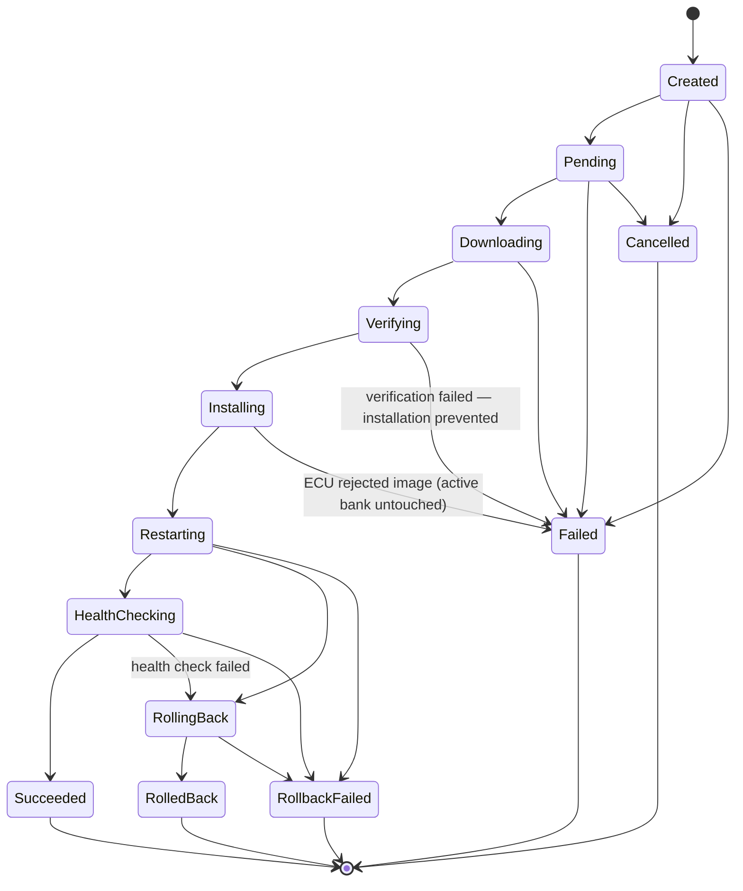
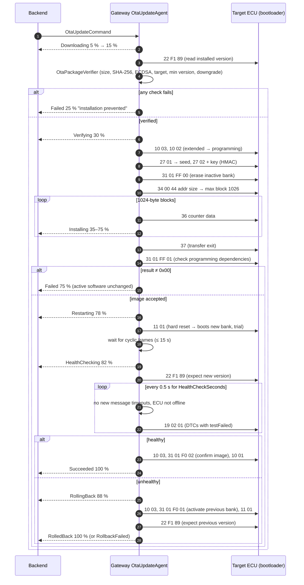

# OTA Update Flow

AutoSphere implements a complete, **simulated** over-the-air update lifecycle: signed packages,
campaigns, vehicle-side verification, flashing via UDS-inspired programming services into an A/B
bank, post-install health check and automatic rollback. The security rationale is in
[security.md](security.md); UDS background in [../automotive/uds-diagnostics.md](../automotive/uds-diagnostics.md).

## 1. Package creation and signing (backend)

| Step | Component | Detail |
|---|---|---|
| Upload or generate | `POST /api/ota/packages` (multipart, ≤ 2 MB request, ≤ `Ota:MaxPackageSizeBytes` = 1 MiB payload) or `POST /api/ota/packages/sample` | Sample packages are simulated firmware images (§6). Administrator only. |
| Validate | `CreatePackageValidator` / `SoftwarePackage.Create` | MAJOR.MINOR.PATCH versions, min ≤ version, not the central gateway, non-empty payload, unique (ECU type, version). |
| Hash | `PackageIntegrity.ComputeSha256` | Lower-case hex SHA-256 stored in the manifest. |
| Sign | `EcdsaPackageSigner` | ECDSA P-256 / SHA-256 over `PackageManifest.ToCanonicalBytes()`; stores signature and `SigningKeyId` (first 16 hex characters of SHA-256 over the public key). |

The creation timestamp is truncated to whole milliseconds so the manifest re-assembled on the vehicle
is byte-identical regardless of the database provider.

## 2. Campaigns and deployments

`POST /api/ota/campaigns` (`OtaCampaignService.CreateAsync`):

1. Loads the package and the requested vehicles (unknown vehicle → 404).
2. Requires each vehicle to be **online**, to have an ECU of the target type, and to have no running
   deployment for that ECU (→ 409 otherwise).
3. `OtaCampaign.AddDeployment` rejects packages that are not newer than the ECU's recorded version.
4. Each deployment is moved to **Pending** and saved *before* the command is published, because the
   vehicle may report progress immediately.
5. Publishes `OtaUpdateCommand` (QoS 1) containing the manifest fields, Base64 signature, Base64
   payload and `HealthCheckSeconds` (`Ota:HealthCheckSeconds`, 8 s). If publishing fails the deployment
   becomes Failed.

Progress arrives as `OtaStatusMessage`s and is applied by `OtaStatusIngestionService`:
`OtaDeployment.ApplyVehicleReport` ignores duplicates, regressions and reports after a terminal state;
terminal states update the ECU's software version; Failed/RolledBack (Warning) and RollbackFailed
(Critical) raise an `ota-{deploymentId}` alert. `OtaDeploymentTimeoutService` fails deployments that
stayed in Created/Pending/Downloading/Verifying/Installing without a new event for
`Ota:DeploymentTimeoutMinutes` (5).

## 3. State machine



The rule behind the diagram (`OtaUpdateStatus` remarks): a failure **before** the ECU restarts never
touches the active bank and ends in *Failed*; once the new image has booted, any failure triggers a
rollback. Transitions are enforced by `OtaStateMachine.CanTransition`; vehicle reports may skip
intermediate states (`IsReachable`) but never move backwards. Unit tests cover the transition table.

## 4. Vehicle-side sequence (`OtaUpdateAgent`)



Details:

* Only one update runs per vehicle (`SemaphoreSlim`); a second command is answered with *Failed: Busy*.
* While flashing and until the ECU transmits again after the reset, the ECU is flagged `IsUpdating`:
  its planned silence does not set lost-communication DTCs and the DTC poller skips it.
* Health-check failures: reported version differs, a new message timeout or Offline status, no
  diagnostic response, or an active DTC whose catalogue severity is Critical (e.g. P0606).
* Transport or protocol exceptions abort the update: *Failed* before the restart, *RollbackFailed*
  after it.

## 5. Corrupted package path

Fault injection `CorruptedOtaPackage` (or a campaign with `SimulateTransportCorruption`) starts a normal
campaign, but `OtaCampaignService` flips 16 bytes in the middle of the payload **after** signing, as a
damaged transfer would. The vehicle's checksum check fails (`Checksum: SHA-256 of the received payload
does not match the manifest`), the deployment ends *Failed* at ~25 % with no *Installing* event, and the
ECU keeps its version. The integration test `Corrupted_ota_package_is_rejected_before_installation`
asserts exactly this. The regular campaign endpoint always forces `SimulateTransportCorruption = false`.

## 6. Simulated firmware image (ASFW)

```text
"ASFW" (4 bytes) | header length (uint16, big-endian) | UTF-8 JSON header | body
header = { ecuType, version, bootBehavior, buildId }
body   = deterministic filler (seeded from SHA-256 of buildId|version)
```

The simulated ECU's bootloader stores the received image in the inactive bank. `CheckProgrammingDependencies`
parses the header and requires `ecuType` to match the ECU; the new bank's version and boot behaviour
come from the header. Boot behaviours:

| Behaviour | Effect after boot | Demonstrates |
|---|---|---|
| `Normal` | ECU operates normally | successful update |
| `CrashLoop` | Application runs 2.5 s, crashes for 1.5 s, repeatedly (bootloader stays reachable) | health check fails on message timeouts → rollback |
| `SelfTestFailure` | ECU sets P0606 (critical) continuously | health check fails on a critical DTC → rollback |

The seeded demo packages are BMS 1.1.0 (Normal), BMS 1.2.0 (CrashLoop) and MCU 1.1.0 (SelfTestFailure).

## 7. Simulated versus real

| Aspect | AutoSphere | Real vehicle programs |
|---|---|---|
| Firmware | Header-driven behaviour of a simulated ECU | Machine code for the ECU's microcontroller |
| Transfer to vehicle | Payload embedded Base64 in the MQTT command | CDN download with signed URLs, resumable, delta updates |
| Signature check | Gateway (ECU checks image structure and target only) | Gateway and/or ECU (secure boot) |
| Security access | HMAC seed/key with shared secret | OEM-specific algorithms, often HSM-backed |
| A/B banks | Two logical banks in memory, trial boot, confirm/rollback routines | Physical flash partitions, boot counters, secure boot |
| UDS services | Byte values follow ISO 14229-1; DIDs and routines 0xF001/0xF002 are project-specific | Full OEM diagnostic specification |
| Campaign management | Immediate dispatch to online vehicles | Scheduling, consent, preconditions (parked, charged), staged roll-out |

## 8. Timing reference (measured on a development laptop, in-process simulation)

| Scenario | Duration |
|---|---|
| Successful 16 KiB update incl. 8 s health check | ≈ 9.5 s |
| Rollback after crash loop (total) | ≈ 5.7 s; rollback itself ≈ 1.3 s |
| Corrupted package rejected | < 1 s |

These are indicative values from manual runs; the measurement method is defined in
[../thesis/performance-testing.md](../thesis/performance-testing.md).
