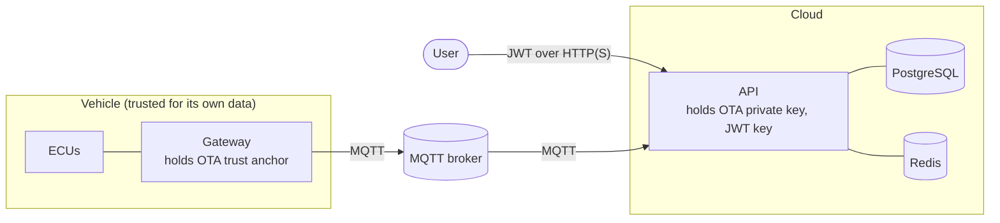

# Security Architecture

Security was designed in from the start, but AutoSphere is a prototype: §8 lists what a production
deployment would additionally require. Nothing here claims compliance with ISO/SAE 21434 or UNECE R155/R156.

## 1. Assets and trust boundaries



| Asset | Protection |
|---|---|
| ECU software | Signed manifests verified on the vehicle; A/B banks with rollback |
| Vehicle commands (diagnostics, OTA, faults) | Only authorised roles can trigger them; correlated and audited |
| User accounts | ASP.NET Core Identity hashing, lockout, rate-limited login |
| Signing keys / secrets | Supplied through environment/volumes, never committed or logged |
| Telemetry and fault data | Authenticated API, RBAC; registered vehicles only |

## 2. Threat model (STRIDE summary)

| Threat | Example | Mitigation in AutoSphere | Residual risk |
|---|---|---|---|
| **S**poofing | Attacker publishes messages as another vehicle | Backend accepts only registered vehicles (`VehicleRegistry`) and rejects payloads whose `vehicleId` differs from the topic (`VehicleMessageDispatcher`) | Broker allows anonymous clients in development; no per-device identity |
| **S**poofing | Stolen user credentials | Password policy, lockout after 5 failures, login rate limit, short-lived JWT (120 min) | No MFA |
| **T**ampering | Modified OTA payload in transit | SHA-256 of the payload is part of the signed manifest; vehicle rejects mismatches | — |
| **T**ampering | Forged OTA package | ECDSA P-256 signature over the canonical manifest, verified with the vehicle's trust anchor | Key stored as a file, not in an HSM |
| **T**ampering | Corrupted CAN frame | AUTOSAR E2E-inspired CRC-8 + alive counter; frame dropped | CRC is integrity, not authenticity (no SecOC-style MAC) |
| **R**epudiation | "Who reset the ECU?" | Diagnostic sessions, fault injections and OTA campaigns store the user; structured logs with correlation id | Logs are not tamper-evident |
| **I**nformation disclosure | Stack traces, secrets in logs | Generic 500 messages outside Development; no tokens/keys/passwords logged; SignalR access token only in the query string of `/hubs` (request logging records the path without query) | Traffic unencrypted in the compose stack |
| **D**enial of service | Login brute force, flood of telemetry | Fixed-window login limiter; bounded queues (drop-oldest) on gateway outbox and backend telemetry lane | No broker-level quotas |
| **E**levation of privilege | Viewer triggers OTA | Role policies on every controller; authenticated fallback policy; programming requires SecurityAccess on the ECU | — |
| **E**levation of privilege | Downgrade attack | Vehicle rejects packages not newer than the installed version and below the minimum compatible version | — |

## 3. Authentication and authorisation

* `POST /api/auth/login` validates credentials with ASP.NET Core Identity and issues a JWT
  (HMAC-SHA256, issuer `autosphere`, audience `autosphere-clients`, `Jwt:AccessTokenMinutes` = 120).
  `Jwt:SigningKey` must be ≥ 32 bytes; outside Development/Testing a missing key stops the API.
  In Development an ephemeral random key is generated (tokens become invalid on restart).
* Token validation checks issuer, audience, signing key and lifetime (30 s clock skew). For SignalR the
  token is read from `access_token` only on paths below `/hubs`.
* `Policies.cs` sets an **authenticated fallback policy**: any endpoint without explicit
  `[AllowAnonymous]` requires a signed-in user. Anonymous: login and the health endpoints.

| Policy | Roles | Used for |
|---|---|---|
| `ViewVehicles` | Viewer, Engineer, Administrator | Vehicles, telemetry, DTCs, alerts, OTA history, SignalR hub |
| `OperateDiagnostics` | Engineer, Administrator | Diagnostic operations, DTC clearing, ECU reset/reads, alert acknowledgement |
| `ManageVehicles` | Administrator | Register/delete vehicles |
| `ManageOta` | Administrator | Upload/generate packages, start campaigns |
| `InjectFaults` | Administrator | Fault injection (additionally requires `FaultInjection:Enabled`) |
| `ManageUsers` | Administrator | User management; the last administrator cannot be deleted |

Identity options: minimum length 12 with digit, upper case, lower case and symbol; unique e-mail;
lockout for 5 minutes after 5 failed attempts. The login endpoint is limited to
`RateLimiting:LoginPermitsPerMinute` (10) requests per client IP and minute. The dashboard keeps the
token in `sessionStorage` and signs out on HTTP 401; UI role checks are cosmetic — the API enforces.

## 4. Secrets handling

| Secret | Source | Never |
|---|---|---|
| PostgreSQL password | `.env` (`POSTGRES_PASSWORD`) for compose; `PGPASSWORD` or user secrets for local runs — the committed development connection string has no password | committed |
| JWT signing key | `JWT_SIGNING_KEY` → `Jwt__SigningKey` | logged, committed |
| Seed user passwords | `SEED_*_PASSWORD` → `Seed__*Password`; seeding skips users without a password | logged |
| OTA private key | `ota-private` volume mounted **only** into the API (`/ota/private`), or `.keys/` locally (git-ignored); generated only when `Ota:Signing:GenerateIfMissing` is true | exposed by any API, logged |
| OTA public key (trust anchor) | `ota-trust` volume, read-only in the gateway; also served at `GET /api/ota/trust-anchor` for inspection | — |
| SecurityAccess secret | `SECURITY_ACCESS_SECRET` → `Gateway__SecurityAccessSecret` | committed |

`.gitignore` excludes `.env`, `*.pem`, `*.key`, `.keys/` and `secrets/`; `.env.example` contains
clearly marked example values only. The API containers run as the non-root `app` user.

## 5. OTA trust chain

```mermaid
flowchart LR
    pkg["Payload"] -->|SHA-256| manifest["Canonical manifest<br/>packageId · targetEcuType · version ·<br/>minimumCompatibleVersion · payloadSha256 ·<br/>payloadSize · createdAt"]
    manifest -->|ECDSA P-256 / SHA-256<br/>private key (API)| sig["Signature (IEEE P1363)"]
    sig --> cmd["OtaUpdateCommand (MQTT)"]
    pkg --> cmd
    cmd --> verify["Gateway: OtaPackageVerifier<br/>size · checksum · signature ·<br/>target ECU · min version · no downgrade"]
    verify -->|all pass| flash["UDS programming into inactive bank"]
    verify -->|any fails| reject["Failed — installation prevented"]
```

* The manifest is serialized to a fixed line-based canonical form (`PackageManifest.ToCanonicalBytes`),
  so serializer differences can never change the signed bytes.
* Checksum comparison uses `CryptographicOperations.FixedTimeEquals`; only .NET platform cryptography
  is used — no custom algorithms.
* Verification happens on the **vehicle** against the version read live from the ECU, so neither the
  transport nor the backend database is trusted.
* After installation the image runs as a trial boot; failed health checks re-activate the previous bank
  (see [ota-update-flow.md](ota-update-flow.md)).

## 6. Vehicle-side controls

* **SecurityAccess (0x27)**: programming services require an unlocked ECU. The key is
  `HMAC-SHA256(secret, seed)` truncated to 4 bytes — a standard primitive replacing confidential OEM
  algorithms. After three invalid keys the simulated ECU answers `exceededNumberOfAttempts` (NRC 0x36); the
  prototype implements no delay timer; the attempt counter is volatile and is released by an ECU reset (power cycle).
* **Session gating**: programming is only reachable from the extended session; the S3 timer (5 s)
  returns idle ECUs to the default session and relocks them.
* **ECU-side image check**: `CheckProgrammingDependencies` validates the image header and target type.
* **E2E protection** on cyclic frames detects corruption, repetition and loss.

## 7. Transport and web

* nginx (dashboard container) sets `X-Content-Type-Options`, `X-Frame-Options: DENY`,
  `Referrer-Policy: no-referrer` and a Content-Security-Policy (`default-src 'self'`, WebSockets to self,
  `frame-ancestors 'none'`), hides the server version and limits request bodies to 2 MB. The API
  limits package uploads to 2 MB (`RequestSizeLimit`) and validates them (≤ 1 MiB payload).
* Because nginx proxies the API on the same origin, the browser needs no CORS; the API's CORS policy
  only allows configured origins (`Cors:AllowedOrigins`).
* MQTT payloads are typed DTOs; malformed JSON is rejected and logged, never executed.

## 8. Known limitations and production hardening

| Limitation (prototype) | Production measure |
|---|---|
| Mosquitto allows anonymous clients (`docker/mosquitto/mosquitto.conf`) | Per-vehicle credentials or X.509 client certificates; topic ACLs restricting each vehicle to `autosphere/vehicles/{own id}/#` |
| No TLS in the compose stack | TLS for HTTP (reverse proxy), MQTT on 8883 (`Mqtt:UseTls`), PostgreSQL and Redis |
| OTA signing key is a PEM file | HSM / cloud KMS, offline release signing, key rotation, multiple trust anchors |
| No device identity (mTLS) for the gateway | Hardware-backed vehicle identity (TPM/secure element) |
| Payload embedded in the MQTT command | Signed short-lived CDN URLs, resumable download |
| CAN frames are not authenticated | SecOC-style MACs with freshness values |
| Redis without password | `requirepass`/ACLs, network isolation |
| Fault injection API | Keep `FaultInjection:Enabled=false` (default) outside simulation environments |
| Logs not tamper-evident | Central log shipping with retention and integrity protection |
