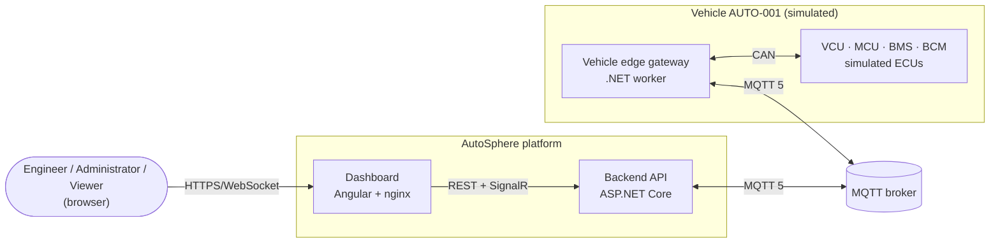
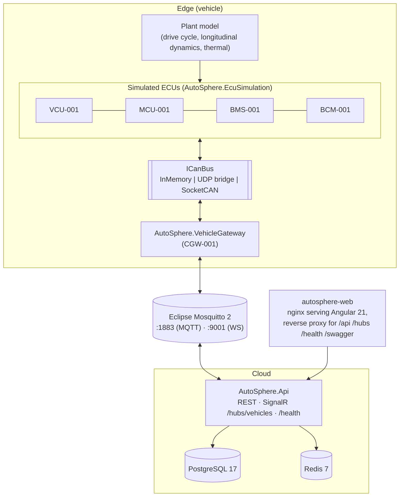
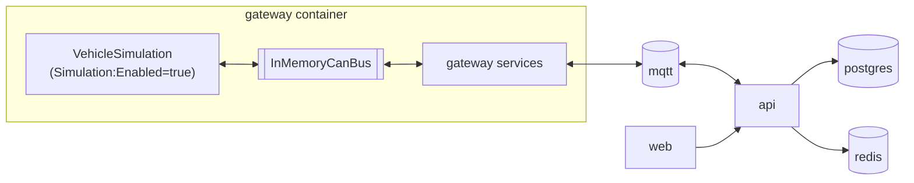

# System Architecture

This document describes AutoSphere as a whole: its context, the runtime containers, how they can be
deployed and which quality attributes drove the design. Decisions taken before implementation are
recorded in [design-overview.md](design-overview.md); the parts are detailed in
[backend-architecture.md](backend-architecture.md), [gateway-architecture.md](gateway-architecture.md),
[data-flow.md](data-flow.md) and [security.md](security.md).

> AutoSphere is an academic prototype. Diagnostics are **UDS-inspired**, the transport is
> **ISO-TP-style**, frame protection is **AUTOSAR E2E-inspired** and the signal model is
> **COVESA VSS-inspired**. No conformance with ISO 14229, ISO 15765-2, ISO 26262, AUTOSAR or VSS is claimed.

## 1. Context

The platform has three kinds of actors:

| Actor | Interaction |
|---|---|
| Viewer | Read-only monitoring of vehicles, telemetry, DTCs, alerts and OTA history. |
| Engineer | Additionally runs remote diagnostics, clears eligible DTCs, resets ECUs, acknowledges alerts. |
| Administrator | Additionally manages users and vehicles, creates/deploys OTA packages and (in simulation mode) injects faults. |
| Vehicle | Publishes telemetry, status, DTC reports, alerts, diagnostic responses and OTA progress; executes commands. |

## 2. Containers

| Container | Technology | Responsibility | Compose service |
|---|---|---|---|
| Simulated ECUs | .NET 10 library `AutoSphere.EcuSimulation` | Cyclic CAN frames, fault monitors with UDS-style fault memory, diagnostic server, A/B bootloader | hosted in `gateway` (or `AutoSphere.VehicleSimulator`) |
| Vehicle gateway | .NET 10 worker `AutoSphere.VehicleGateway` | Decode/normalize CAN, supervise ECUs, publish telemetry/status/DTCs/alerts, execute diagnostics and OTA | `gateway` |
| MQTT broker | Eclipse Mosquitto 2 | Pub/sub between edge and cloud, retained status, last will | `mqtt` |
| Backend API | ASP.NET Core (.NET 10) | REST API, SignalR push, ingestion, persistence, health computation, OTA signing | `api` |
| Database | PostgreSQL 17 (EF Core 10 + Npgsql) | Vehicles, ECUs, DTCs, alerts, sessions, sampled telemetry, OTA, users | `postgres` |
| Cache | Redis 7 (StackExchange.Redis) | Latest live state per vehicle (`autosphere:vehicle:{id}:live`, TTL 1 h) | `redis` |
| Dashboard | Angular 21 + nginx | Digital-twin UI; same-origin proxy to the API | `web` |

## 3. Deployment views

The CAN transport is chosen with `CanBus:Transport`; business logic is unaffected because every
component talks to `ICanBus` / `ICanChannel` (see [gateway-architecture.md](gateway-architecture.md)).

### 3.1 In-process simulation (default, `docker compose up`)

The ECUs run inside the gateway process on an `InMemoryCanBus` (`CanBus:Transport=InMemory`). This view
needs no hardware and no special privileges and is used by the demo and by the integration tests
(where the API is hosted with `WebApplicationFactory`, SQLite and an embedded MQTTnet broker).

### 3.2 Split processes over UDP (any OS)

`AutoSphere.VehicleSimulator` hosts the ECUs; both processes use `CanBus:Transport=Udp`. Each owns a
local in-memory segment bridged to its peer (`UdpLocalPort`, `UdpPeers`), in the spirit of the
*cannelloni* CAN-over-Ethernet tunnel. Defaults: simulator listens on 20000 and sends to 20001, the
gateway the reverse. Fault-injection commands reach the standalone simulator through its own MQTT
subscription (`SimulationControlListener`).

### 3.3 Linux SocketCAN (vcan or physical CAN)

With `CanBus:Transport=SocketCan` and `CanBus:Interface=vcan0` (or `can0`) every channel is a
`CAN_RAW` socket. Simulator and gateway can then be inspected with standard tools (`candump`,
`cansend`). This view is the bridge to real hardware (e.g. a Raspberry Pi with a CAN HAT): replacing
the simulator by physical ECUs requires no code change in the gateway. The SocketCAN marshalling is
unit-tested on all platforms; the transport itself only runs on Linux.

| View | Transport | Processes | Typical use |
|---|---|---|---|
| In-process | InMemory | 1 (gateway + ECUs) | Demo, CI, development on Windows |
| Split | Udp | 2 | Observing gateway behaviour when the simulator is restarted independently |
| SocketCAN | SocketCan | 2+ | Linux lab set-up, hardware-in-the-loop extension |

## 4. Key decisions

| Decision | Alternatives considered | Reason |
|---|---|---|
| CAN abstraction with SocketCAN semantics (broadcast, filters, no echo) | Direct SocketCAN coupling | Runs on Windows and in CI; Linux path kept realistic. |
| JSON CAN database (DBC-inspired) as the single source of truth | Hand-written decoders | Same definition drives ECU encoding and gateway decoding; validated for overlaps and ranges. |
| ECUs read a shared plant model | Independent random signals | Physically coherent signals (speed ↔ RPM ↔ current ↔ SOC ↔ temperature). |
| Real UDS-inspired traffic over an ISO-TP-style transport | Faking diagnostics in the backend | Diagnostics, DTC snapshots and flashing are observable byte by byte. |
| A/B-bank bootloader in simulated ECUs | Database-only "version" field | Rollback is a genuine bank switch triggered over UDS. |
| Signature verification on the vehicle | Verification only in the cloud | Vehicle must not trust transport or backend database. |
| MQTT 5 with retained status + last will | HTTP polling from the gateway | Push-based, offline detection, standard in connected vehicles. |
| Clean Architecture backend | Layer-less API | Business rules (health, OTA state machine, DTC lifecycle) are unit-testable. |
| REST for initial load/commands, SignalR for live data | REST polling | No per-second polling, low dashboard latency. |
| Redis optional (in-memory fallback) | Mandatory Redis | Tests and minimal runs work without Redis. |
| SQLite supported for tests | Testcontainers only | Integration tests run without Docker. |

## 5. Technology stack

| Area | Technology | Version (as referenced) |
|---|---|---|
| Runtime | .NET / C# | .NET 10 (`net10.0`), C# latest |
| Web | ASP.NET Core, SignalR, Swashbuckle | 10.0.x, Swashbuckle 10.2.3 |
| Persistence | EF Core, Npgsql provider, SQLite provider, EFCore.NamingConventions | 10.0.12, 10.0.3, 10.0.12, 10.0.1 |
| Database | PostgreSQL | `postgres:17-alpine` |
| Cache | Redis, StackExchange.Redis | `redis:7-alpine`, 3.3.1 |
| Messaging | Eclipse Mosquitto, MQTTnet (client and test server) | `eclipse-mosquitto:2`, 5.2.0 |
| Identity | ASP.NET Core Identity, JWT bearer | 10.0.12 |
| Validation / logging | FluentValidation, Serilog | 12.1.1, Serilog.AspNetCore 10.0.0 |
| Tests | xUnit v3, NSubstitute, Microsoft.Testing.Platform, BenchmarkDotNet | 4.0.1, 6.2.0, -, 0.15.8 |
| Frontend | Angular (standalone, signals, zoneless), Chart.js, @microsoft/signalr, Vitest | Angular 21 |
| Containers | Docker, Docker Compose, nginx | `nginx:1.29-alpine`, `node:24-alpine` |

Package versions are pinned centrally in `Directory.Packages.props`.

## 6. Quality attributes

| Attribute | How it is addressed | Where to verify |
|---|---|---|
| Testability | Ports/adapters, pure domain services, in-process full-stack tests | `tests/` (unit, integration, architecture) |
| Real-time behaviour | 4 Hz telemetry, SignalR push, latency fields on every update | [data-flow.md](data-flow.md) |
| Robustness | MQTT reconnect with back-off, store-and-forward outbox, last will, CAN channel reconnect, message timeouts | [gateway-architecture.md](gateway-architecture.md) |
| Security | JWT + RBAC with authenticated fallback policy, signed OTA, vehicle-side verification, no secrets in the repo | [security.md](security.md) |
| Observability | Serilog structured logs with correlation ids; `System.Diagnostics.Metrics` meters; `/health` | [backend-architecture.md](backend-architecture.md) |
| Portability | `ICanBus` transports; Linux containers; Windows development | §3 |
| Maintainability | Central CAN database, central MQTT topic builder, analyzers as errors, layering enforced by tests | `tests/AutoSphere.ArchitectureTests` |
| Honesty of simulation | Simulated parts are named as such (plant model, firmware image, SecurityAccess) | [ota-update-flow.md](ota-update-flow.md), [design-overview.md](design-overview.md) §10 |

## 7. Repository map

| Path | Content |
|---|---|
| `src/shared` | `AutoSphere.SharedKernel` (value types, DTC catalogue, OTA integrity), `AutoSphere.Contracts` (MQTT topics and DTOs) |
| `src/gateway` | `AutoSphere.CanBus`, `AutoSphere.VehicleSignals`, `AutoSphere.Diagnostics`, `AutoSphere.VehicleGateway` |
| `src/simulator` | `AutoSphere.EcuSimulation`, `AutoSphere.VehicleSimulator` |
| `src/backend` | `AutoSphere.Domain`, `AutoSphere.Application`, `AutoSphere.Infrastructure`, `AutoSphere.Api` |
| `src/frontend/autosphere-web` | Angular dashboard |
| `docker/` | Dockerfiles, Mosquitto and nginx configuration |
| `tests/` | Unit, integration, architecture tests and benchmarks |
