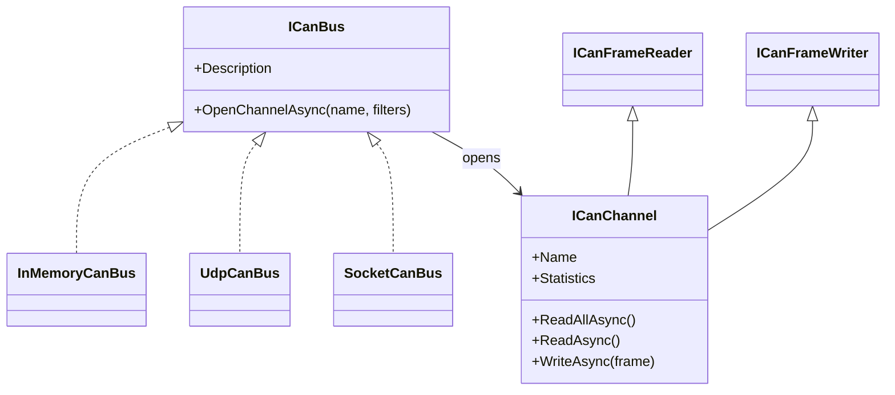
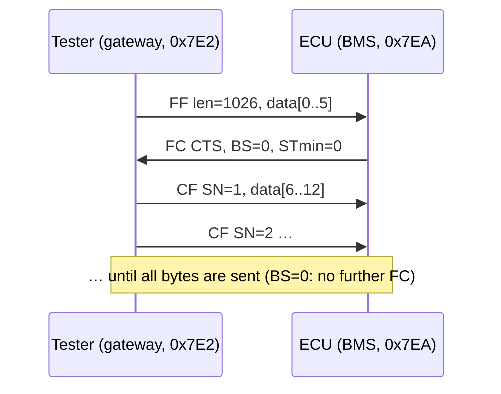

# CAN bus and ISO-TP transport

This document explains the Controller Area Network (CAN) concepts AutoSphere relies on, and how the
`AutoSphere.CanBus` library models them. Signal layout and E2E protection are described in
[vehicle-signals.md](vehicle-signals.md); the diagnostic protocol on top of ISO-TP is described in
[uds-diagnostics.md](uds-diagnostics.md).

> **Scope.** AutoSphere models CAN at the *frame* level. Physical-layer behaviour (bit timing,
> arbitration, error frames, bus-off) is not simulated. The ISO-TP transport is an educational
> implementation inspired by ISO 15765-2 and is not certified or claimed to be compliant.

---

## 1. CAN in a real vehicle

| Concept | Real CAN / CAN-FD | Relevance for AutoSphere |
|---|---|---|
| Topology | Multi-master broadcast bus; every node sees every frame. | Every open channel receives every frame except its own. |
| Identifier | 11-bit (standard, CAN 2.0A) or 29-bit (extended, CAN 2.0B). The identifier is also the **priority**: during bitwise arbitration the lowest id wins. | AutoSphere uses 11-bit ids; lower ids are given to faster, more critical messages (VCU `0x100`, MCU `0x200`, BMS `0x300`, BCM `0x400`). Arbitration itself is not simulated. |
| Payload | Classic CAN: 0–8 bytes. CAN-FD: 0–8, 12, 16, 20, 24, 32, 48 or 64 bytes. | `CanFrame` enforces both rules. |
| DLC | 4-bit data length code. For CAN-FD, DLC 9–15 map to 12…64 bytes. | `CanDlc.FromLength` / `ToLength` implement the mapping. |
| Remote/error frames | RTR frames request data; error frames signal bus errors. | Not modelled. The SocketCAN codec drops error and RTR frames. |
| Timing | Messages are sent cyclically or on events; receivers supervise timeouts. | Cyclic transmission per CAN database; the gateway supervises timeouts (see §5). |

### SocketCAN and `vcan`

Linux exposes CAN controllers as network interfaces (`can0`, `vcan0`). Applications open a
`PF_CAN / SOCK_RAW / CAN_RAW` socket, bind it to an interface, optionally install acceptance filters
(`CAN_RAW_FILTER`) and read/write `struct can_frame` (16 bytes) or `struct canfd_frame` (72 bytes).
By default a frame written on one socket is delivered to all *other* sockets on the same host
(local loopback) but not echoed to the sender. The `vcan` driver provides a purely virtual bus with the
same API, which makes it ideal for development and CI.

---

## 2. AutoSphere CAN abstraction



* **`CanFrame`** (immutable record): `Id`, `Data` (`ReadOnlyMemory<byte>`), `Timestamp`, `IsExtended`,
  `IsFd`, `Source` (logical sender such as `BMS-001`, a diagnostic aid that is never "transmitted"),
  and the computed `Dlc`. Construction validates the id range (`0x7FF` / `0x1FFFFFFF`) and payload length.
* **`ICanChannel`** is the equivalent of one SocketCAN raw socket. A channel receives every frame that
  matches its filters and that it did **not** write itself.
* **`CanFilter(Id, Mask)`** uses SocketCAN semantics: a frame matches when
  `(frame.Id & Mask) == (Id & Mask)`. `CanFilter.ReceiveNothing` is used for transmit-only channels
  (each simulated ECU's transmit channel).
* **`CanChannelStatistics`** counts frames received, sent and dropped (receive-queue overrun).

Business logic (decoder, gateway, ECU simulators, ISO-TP) depends only on these interfaces, so the
same code runs on any transport. The transport is selected by configuration section `CanBus`:

| Key | Default | Meaning |
|---|---|---|
| `CanBus:Transport` | `InMemory` | `InMemory`, `Udp` or `SocketCan` |
| `CanBus:Interface` | `vcan0` | SocketCAN interface name |
| `CanBus:EnableFd` | `false` | Enables `CAN_RAW_FD_FRAMES` on SocketCAN |
| `CanBus:UdpLocalPort` | `20000` (simulator) / `20001` (gateway) | Local UDP port |
| `CanBus:UdpPeers` | `127.0.0.1:20001` / `127.0.0.1:20000` | Remote endpoints as `host:port` |

### 2.1 `InMemoryCanBus`

Used by default (gateway hosting the simulation in-process) and in all tests.

* Broadcast to all other channels, filters applied per channel, no echo to the sender.
* The bus assigns the timestamp at transmit time (analogous to a hardware receive timestamp).
* Each channel has a bounded receive queue (default capacity 8192) with **drop-oldest** behaviour; a
  dropped frame increments `FramesDropped`, mirroring a socket receive-buffer overrun.
* Frames are delivered in write order; arbitration and bus load are not modelled.

### 2.2 `UdpCanBus` (cannelloni-inspired bridge)

Allows the ECU simulator and the gateway to run as **separate processes on any OS**. Internally it is
an in-memory segment plus one bridge channel: frames written locally are forwarded to every UDP peer;
datagrams received from peers are injected into the local segment.

UDP wire format (`CanFrameWireFormat`, 9-byte header):

| Offset | Size | Content |
|---|---|---|
| 0 | 2 | ASCII `'A' 'S'` |
| 2 | 1 | Version `1` |
| 3 | 1 | Flags: bit 0 extended id, bit 1 CAN-FD |
| 4 | 4 | CAN id, big-endian |
| 8 | 1 | Payload length |
| 9 | n | Payload |

UDP gives no delivery guarantee; this is acceptable because receivers already supervise message
timeouts, as they would on a real (error-prone) bus.

### 2.3 `SocketCanBus` (Linux)

Each `OpenChannelAsync` creates its own `CAN_RAW` socket bound to the interface, so the Linux kernel
performs filtering and local loopback exactly as for `candump`/`cansend`.

* Bindings are minimal `libc` P/Invokes (`socket`, `bind`, `setsockopt`, `poll`, `read`, `write`,
  `close`, `if_nametoindex`).
* A dedicated reader thread uses `poll()` with a 200 ms timeout so it can observe shutdown.
* Receive timestamps are taken in user space after `read()` returns; `SO_TIMESTAMP` is not used.
* Error frames (`CAN_ERR_FLAG`) and remote frames (`CAN_RTR_FLAG`) are ignored.

`SocketCanFrameCodec` performs the struct marshalling and is unit-tested on every platform:

| Offset | `struct can_frame` (16 B) | `struct canfd_frame` (72 B) |
|---|---|---|
| 0–3 | `can_id` (host order, little-endian); bit 31 `CAN_EFF_FLAG` (0x80000000) for 29-bit ids | same |
| 4 | `len` (payload length) | `len` |
| 5 | padding | `flags`: AutoSphere sets `CANFD_BRS \| CANFD_FDF` (0x01 \| 0x04) |
| 6–7 | reserved | reserved |
| 8… | 8 data bytes | 64 data bytes |

Acceptance filters are encoded as an array of `struct can_filter { can_id; can_mask; }`.

> **Validation status.** The SocketCAN transport compiles on all platforms and its marshalling is unit
> tested; it can only be exercised end-to-end on Linux with a CAN interface. It throws
> `PlatformNotSupportedException` on other operating systems.

---

## 3. Running on Linux with `vcan`

```bash
sudo ./scripts/setup-vcan.sh          # creates and brings up vcan0
candump -tz vcan0                     # in a second terminal

# Gateway (no in-process simulation) and standalone simulator on the same vcan0:
CanBus__Transport=SocketCan Simulation__Enabled=false Gateway__SecurityAccessSecret=... \
  dotnet run --project src/gateway/AutoSphere.VehicleGateway
CanBus__Transport=SocketCan Simulation__SecurityAccessSecret=... \
  dotnet run --project src/simulator/AutoSphere.VehicleSimulator
```

Typical `candump` output shows the cyclic frames `100`, `101`, `200`, `300`, `301` and `400`
(see [vehicle-signals.md](vehicle-signals.md) for their layout). Byte 0 is the E2E CRC and the low
nibble of byte 1 the alive counter, so these bytes change in every frame.

Diagnostic traffic can be produced by hand. A UDS *TesterPresent* request to the BMS
(physical request id `0x7E2`) as an ISO-TP single frame padded with `0xCC`:

```bash
cansend vcan0 7E2#023E00CCCCCCCCCC
# BMS response on 0x7EA:  7EA [8] 02 7E 00 CC CC CC CC CC
```

---

## 4. ISO-TP style transport (`IsoTpChannel`)

UDS messages can be longer than one CAN frame (a DTC snapshot, a 1 KiB `TransferData` block). ISO 15765-2
(ISO-TP) segments such messages. AutoSphere implements the essential mechanism for classic CAN with
normal addressing:

| Frame type | PCI (byte 0, high nibble) | Layout (AutoSphere) |
|---|---|---|
| Single Frame (SF) | `0x0` | `0L` + up to 7 data bytes (`L` = length) |
| First Frame (FF) | `0x1` | 12-bit total length in bytes 0–1, then 6 data bytes |
| Consecutive Frame (CF) | `0x2` | sequence number 1…15, 0… (wraps), up to 7 data bytes |
| Flow Control (FC) | `0x3` | flow status (0 CTS, 1 WAIT, 2 OVERFLOW), block size (BS), STmin |



Implementation details (`IsoTpOptions`):

| Option | Default | Meaning |
|---|---|---|
| `Padding` | `0xCC` | Unused bytes of every 8-byte frame |
| `BlockSize` | `0` | BS announced in our FC frames (0 = no further FC needed) |
| `SeparationTimeMin` | `0` | STmin announced in our FC frames |
| `FlowControlTimeout` | 1 s | N_Bs: sender waits this long for an FC |
| `ConsecutiveFrameTimeout` | 1 s | N_Cr: maximum gap between CFs while receiving |
| `MaxWaitFrames` | 10 | FC.WAIT frames accepted before aborting |

* STmin encoding: `0x00–0x7F` milliseconds, `0xF1–0xF9` = 100–900 µs, reserved values are treated as
  127 ms (as required by the standard).
* A wrong sequence number or an N_Cr violation aborts the reception; a new SF/FF restarts it.
* Sending is serialized per channel; stale FC frames from an aborted transfer are discarded.
* Messages are limited to 1…4095 bytes.

**Simplifications versus ISO 15765-2:** no extended or mixed addressing, no escape sequence for
messages > 4095 bytes, no CAN-FD single frames longer than 7 bytes, timers N_As/N_Ar/N_Cs are not
enforced, and functional addressing (`0x7DF`) is defined but not used by the gateway.

---

## 5. Message supervision in the gateway

The gateway (`EcuNetworkMonitor`) supervises each cyclic message of each ECU:

* **Timeout:** a message is lost after `max(cycle × Gateway:MessageTimeoutMultiplier, Gateway:MinimumMessageTimeoutMs)`
  = `max(cycle × 5, 500 ms)`. Before the first reception an additional 3 s start-up grace applies.
* **Late frame:** an inter-arrival time above 2.5 × cycle time.
* **E2E error:** CRC mismatch (frame rejected) or an alive-counter jump/repeat (frame accepted but counted).

From these it derives the ECU communication status (`Online`, `Warning`, `Offline`, `Updating`) and
network DTCs (`U0100`, `U0111`, `U0140`, `U0293`, `U0001`, `U0401`) — see
[uds-diagnostics.md](uds-diagnostics.md#8-dtc-catalogue). While an ECU is being reprogrammed it is
flagged `Updating` and its planned silence is not reported as a fault. When the gateway's own CAN
channel fails (e.g. interface down) it reconnects with exponential back-off from 500 ms up to 10 s.

The gateway's receive channel skips the diagnostic id range (`0x7DF`, `0x7E0–0x7EF`); those frames are
consumed by the ISO-TP channels of the diagnostic clients.
