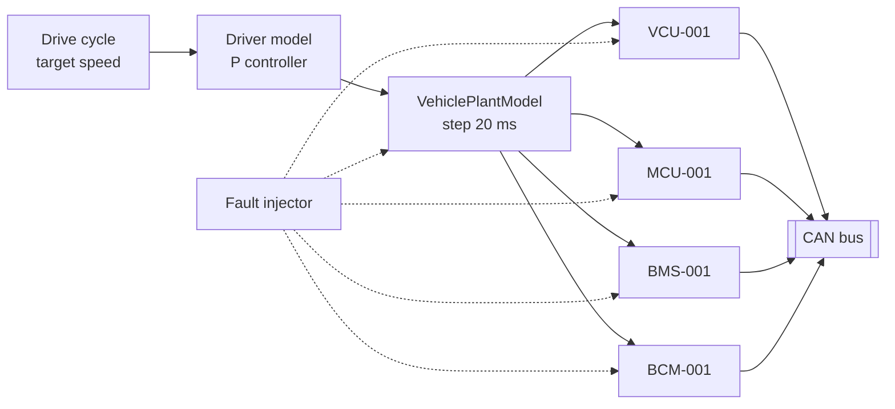
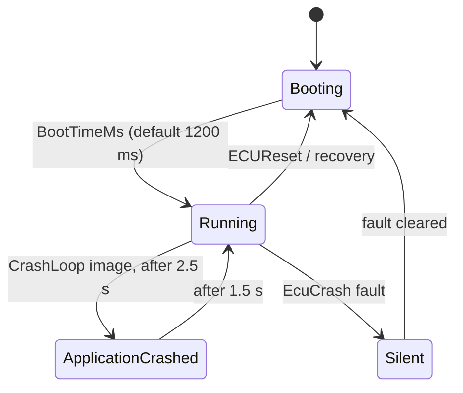

# ECU simulation

AutoSphere runs completely without vehicle hardware. Four electronic control units are simulated in
`AutoSphere.EcuSimulation`; they communicate only via CAN frames and UDS, exactly as the gateway would
experience real ECUs. This document describes what is simulated, how, and where the simulation is
deliberately simplified.

> **Honesty statement.** The ECUs are behavioural models, not real ECU software. They implement no
> AUTOSAR stack, no real bootloader and no real control algorithms. Their purpose is to produce
> physically plausible, protocol-correct traffic and reproducible faults for the platform under test.

---

## 1. Hardware-in-the-loop analogy

In HIL testing, ECUs read their sensors from a real-time *plant model* of the vehicle. AutoSphere uses
the same structure: one `VehiclePlantModel` represents the physical vehicle; every ECU samples it.
This keeps all signals coherent — speed, motor speed, battery current, state of charge and temperatures
are consequences of the same physics rather than independent random numbers.

---

## 2. Plant model

Longitudinal EV model, stepped every **20 ms** (`VehicleSimulation`, step clamped to ≤ 1 s).

| Parameter | Value | Parameter | Value |
|---|---|---|---|
| Mass | 1 900 kg | Wheel radius | 0.33 m |
| Drag coefficient cd | 0.28 | Reduction gear ratio | 6.05 |
| Frontal area | 2.3 m² | Drivetrain efficiency | 0.9 |
| Air density | 1.2 kg/m³ | Auxiliary load | 0.5 kW |
| Rolling resistance | 0.011 | Max traction force | 6 500 N |
| Max braking deceleration | 6 m/s² | Regenerative braking limit | 30 % of max traction force |

**Driver model.** A proportional controller follows a looping drive cycle:
`a_desired = clamp(0.6 · (v_target − v), −6, 2) m/s²`. The required force is
`m · a_desired + F_aero + F_roll`. Positive force → accelerator pedal = force / 6 500 N; negative force →
regenerative braking (limited) with friction brakes supplying the rest; the brake switch is set when
`a_desired < −0.4 m/s²`.

**Drive cycle** (`DriveCycle.Default`, seconds @ km/h, looping):
45 @ 72 → 20 @ 82 → 25 @ 64 → 30 @ 72 → 15 @ 90 → 20 @ 72, with a ±1.2 km/h sinusoidal variation
(`sin(t / 4)`) to imitate a human driver.

**Powertrain.** Motor speed = `v / r · 60 / 2π · 6.05`. At **72 km/h ≈ 3 500 rpm**
(20 m/s / 0.33 m · 60 / 2π · 6.05 ≈ 3 501 rpm), which reproduces the demo values. Motor torque =
`F · r / 6.05`. Electrical power = mechanical power / 0.9 (motoring) or × 0.9 (regeneration) + 0.5 kW.

**Battery.** 75 kWh capacity; open-circuit voltage `330 V + 0.9 V · SOC[%]`; internal resistance
0.08 Ω; current = P / UOC; terminal voltage = UOC − I · R. Range estimate =
remaining energy / 16.5 kWh per 100 km. Initial SOC 78.4 %, odometer 12 480 km.

**Thermal model.** First-order lag towards a power-dependent target temperature, with ambient 25 °C:

| Component | Steady-state rise | Normal time constant | Cooling failure (fault) |
|---|---|---|---|
| Battery pack | 1.55 °C per kW | 150 s | target + 45 °C, time constant 22 s |
| Motor | 4.9 °C per kW | 120 s | target + 100 °C, time constant 22 s |

*Active cooling rule:* when a healthy component is more than 5 °C above its target, the fast 22 s time
constant is used — the thermal management system cools at full power. This keeps normal driving smooth
(large thermal mass) while overheat and recovery stay demonstrable within about a minute. Temperatures
start at their steady-state value for the initial speed (≈ 38 °C pack, ≈ 67 °C motor at 72 km/h).

Configuration (`Simulation:Plant:*`): `InitialStateOfChargePercent`, `InitialOdometerKm`,
`AmbientTemperatureC`, `BatteryCapacityKwh`, `RangeConsumptionKwhPer100Km`.

---

## 3. The simulated ECUs

| ECU | Class | Transmits | Cycle | Own DTC monitors |
|---|---|---|---|---|
| VCU-001 Vehicle Control Unit | `VehicleControlEcuSimulator` | `0x100` VCU_Status, `0x101` VCU_Trip | 50 ms, 500 ms | none (implausible speed is detected by the gateway) |
| MCU-001 Motor Control Unit | `MotorEcuSimulator` | `0x200` MCU_Status | 20 ms | P0A2F set > 130 °C, clear < 120 °C; P0A2C on invalid sensor |
| BMS-001 Battery Management System | `BatteryEcuSimulator` | `0x300` BMS_Status, `0x301` BMS_Pack | 100 ms each | P0A7E set > 60 °C, clear < 55 °C; P0A9C on invalid sensor |
| BCM-001 Body Control Module | `BodyControlEcuSimulator` | `0x400` BCM_Status | 500 ms | none |

Every ECU additionally reports **P0606** (critical) while it runs a firmware image with the simulated
boot behaviour `SelfTestFailure`. Threshold monitors use hysteresis; while an invalid-sensor fault is
injected the over-temperature monitor of that ECU is not evaluated.

*Invalid sensor values* (fault injection): VCU transmits 600 km/h, MCU 215 °C (largest value of the 8-bit
signal), BMS 3 000 °C. The BCM has no sensor substitution.

*Live data DIDs* (ReadDataByIdentifier): VCU `0301` speed, `0302` odometer; MCU `0201` motor speed,
`0202` motor temperature; BMS `0101` temperature, `0102` SOC, `0103` voltage, `0104` current; BCM `0401`
door bit field. *Snapshot DIDs* captured when a DTC is confirmed: VCU `0301, 0302`; MCU `0202, 0201`;
BMS `0101–0104`; BCM `0401`. See [uds-diagnostics.md](uds-diagnostics.md#7-data-identifiers).

Each ECU runs independent tasks:

* one `PeriodicTimer` per transmitted message (encode via the CAN database, apply E2E counter/CRC),
* a 100 ms monitor loop (S3 session timeout, crash-loop logic, DTC monitors),
* a diagnostic server on its ISO-TP channel.

---

## 4. ECU lifecycle

| State | Cyclic CAN frames | Diagnostic responses |
|---|---|---|
| Booting | no | no |
| Running | yes (unless message loss is injected) | yes |
| ApplicationCrashed (crash-loop image) | no | **yes** — the simulated bootloader stays reachable, which enables remote rollback |
| EcuCrash fault | no | no |

On every reset the volatile diagnostic state is lost (session → Default, security locked, download state
cleared) and a pending bank switch is applied. Fault memory (DTCs) is non-volatile and survives resets.

---

## 5. Dual-bank (A/B) bootloader

Each ECU has two software banks. Bank A initially holds the configured version (`1.0.0`).

1. `EraseMemory` (FF00) erases the **inactive** bank — the running software is never touched.
2. `RequestDownload` / `TransferData` / `RequestTransferExit` write the image into the inactive bank.
3. `CheckProgrammingDependencies` (FF01) parses the image header; if it targets this ECU type, the bank is
   marked valid and *pending activation*.
4. `ECUReset` boots the new bank in *trial* mode.
5. `ConfirmActiveImage` (F002) ends the trial; `ActivatePreviousBank` (F001) + reset boots the old bank
   again (rollback).

**Simulated firmware image** (`SimulatedFirmwareImage`): `"ASFW"` magic · 2-byte big-endian header
length · UTF-8 JSON header `{ ecuType, version, bootBehavior, buildId }` · deterministic filler bytes.
The ECU "executes" an image by adopting its version and boot behaviour:

| `bootBehavior` | Effect after boot | Detected by the OTA health check as |
|---|---|---|
| `Normal` | operates normally | success |
| `CrashLoop` | application crashes after 2.5 s, restarts after 1.5 s, repeatedly | communication loss → rollback |
| `SelfTestFailure` | runs, but sets P0606 (critical) | active critical DTC → rollback |

This is how AutoSphere demonstrates a failing post-install health check honestly, without pretending to
execute real machine code.

---

## 6. Fault injection hooks

`SimulationFaultInjector` applies `EcuCrash`, `BatteryOverheat`, `MotorOverheat`, `InvalidSensorValue`,
`CanMessageLoss` and `CanMessageDelay` (default 800 ms, 1–10 000 ms), optionally with automatic clearing
after `DurationSeconds`. Gateway- and backend-level faults are handled elsewhere; see
[fault-injection.md](fault-injection.md).

---

## 7. Hosting and configuration

* **In-process (default):** `AutoSphere.VehicleGateway` with `Simulation:Enabled=true` hosts the ECUs on
  the same in-memory CAN bus. The simulation inherits `Gateway:SecurityAccessSecret` and `Gateway:VehicleId`
  when not configured separately. Used by Docker Compose and the integration tests.
* **Standalone:** `AutoSphere.VehicleSimulator` runs the ECUs in their own process on SocketCAN (`vcan0`)
  or the UDP bridge and receives fault commands directly via MQTT (`SimulationControlListener`).

| Key (`Simulation:`) | Default | Meaning |
|---|---|---|
| `Enabled` | `false` (gateway appsettings: `true`) | host the simulated ECUs |
| `VehicleId` | `AUTO-001` | vehicle identifier |
| `Vin` | `WASPH1EV2T0000001` | VIN returned by DID `F190` |
| `SecurityAccessSecret` | *(required)* | seed/key shared secret |
| `BootTimeMs` | `1200` | simulated start-up time |
| `FaultInjectionEnabled` | `true` | accept simulator-level fault commands |
| `Plant:*` | see §2 | plant parameters |
| `Ecus[]` | four default ECUs | `EcuId`, `Type`, `Name`, `SoftwareVersion` (1.0.0), `HardwareVersion` (HW-A1), `SerialNumber`, `PartNumber`, `Enabled` |

---

## 8. Simplifications

* No bus arbitration, error frames or bus-off; timing relies on .NET timers (jitter of several ms on Windows).
* One shared plant; ECUs do not run closed-loop control (e.g. no torque derating at high temperature).
* No charging scenario in the default drive cycle (`ChargingStatus` stays `NotCharging`), doors stay closed.
* DTC aging, operation cycles and the warning-indicator bit are not modelled.
* The bootloader checks image structure only; signature verification happens in the gateway.
* State (software banks, DTCs) is held in memory and is reset when the simulator process restarts.
