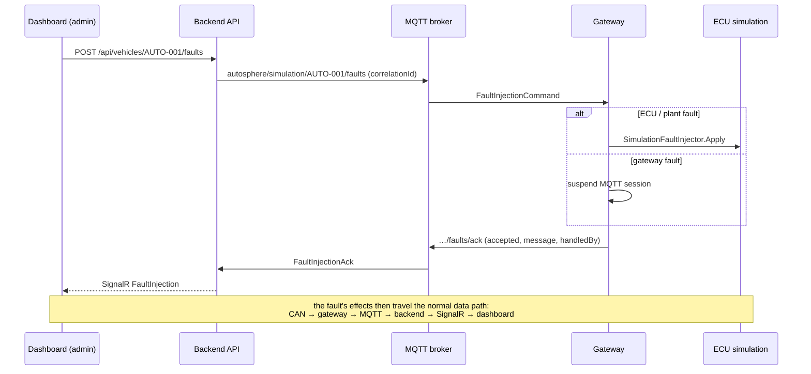

# Fault injection

Fault injection deliberately introduces faults to verify that detection, diagnosis, alerting and
recovery mechanisms work (ISO 26262 lists it as a verification method; HIL test benches use it
routinely). AutoSphere provides a **test-harness** fault injector for its simulated vehicle so that every
monitoring path of the platform can be demonstrated and tested end to end.

> **Safety and scope.** Fault injection is a *Simulation / Development Mode* feature:
> * The API accepts it only when `FaultInjection:Enabled=true` (Development and the demo stack);
>   otherwise requests are rejected (`409`, "Fault injection is disabled in this environment").
> * Only the **Administrator** role may inject faults (`InjectFaults` policy).
> * Commands use the separate MQTT namespace `autosphere/simulation/{vehicleId}/faults`, which is
>   never used for vehicle control. The simulator additionally honours `Simulation:FaultInjectionEnabled`.
> * Every injection is recorded (`fault_injections` table) with requester, correlation id and acknowledgement.

---

## 1. Flow



`CorruptedOtaPackage` is executed by the backend itself (no MQTT command). When the ECUs run in the
standalone simulator process, the simulator subscribes to the same topic and acknowledges ECU/plant faults;
the gateway then only handles gateway-level faults.

---

## 2. Fault catalogue

| Fault | Executed by | Target | Clearable | Auto-clear |
|---|---|---|---|---|
| `BatteryOverheat` | simulator (plant) | vehicle | yes | `durationSeconds` |
| `MotorOverheat` | simulator (plant) | vehicle | yes | `durationSeconds` |
| `EcuCrash` | simulator | ECU (required) | yes (reboot) | `durationSeconds` |
| `InvalidSensorValue` | simulator | ECU (default BMS-001) | yes | `durationSeconds` |
| `CanMessageLoss` | simulator | ECU (required) | yes | `durationSeconds` |
| `CanMessageDelay` | simulator | ECU (required) | yes | `durationSeconds`; `delayMilliseconds` (default 800) |
| `GatewayDisconnect` | gateway | vehicle | automatic reconnect | `durationSeconds` (default 15 s, 1–600) |
| `MqttDisconnect` | gateway | vehicle | automatic reconnect | `durationSeconds` (default 15 s, 1–600) |
| `CorruptedOtaPackage` | backend | package (required) | n/a | one deployment |

### BatteryOverheat
*Physical analogy:* coolant pump or chiller failure. The plant raises the pack's target temperature by
45 °C with a 22 s time constant (≈ 1 °C/s initially).
*Observable chain:* pack temperature in `0x300` rises → gateway edge alert `battery-temperature`
**Warning at 50 °C**, **Critical at 60 °C** → BMS monitor sets **P0A7E** (pending, confirmed after ≈ 0.5 s,
freeze frame captured) → gateway DTC poll (≤ 2 s) → backend DTC `Active`, backend alert
`dtc-BMS-001-P0A7E` (Critical) → health **Critical** (critical DTC and temperature ≥ 60 °C) → dashboard
updates via SignalR. A remote full scan reports *"Battery Thermal Fault (P0A7E on BMS-001)"*.
*Clearing:* cooling is restored; active cooling (22 s time constant) brings the pack down. Below 55 °C the
DTC heals (`Resolved`, status `0x2E`), below 48 °C (50 °C − 2 °C hysteresis) the edge alert clears, and
the vehicle returns to Healthy once the temperature is below 50 °C. The DTC can then be cleared.

### MotorOverheat
Same chain for the motor: target + 100 °C; edge alert `motor-temperature` Warning 110 °C, Critical 130 °C;
MCU DTC **P0A2F** above 130 °C (heals below 120 °C).

### EcuCrash
*Analogy:* ECU power loss or watchdog lock-up. The ECU stops transmitting and does not answer diagnostics.
*Chain:* all messages of the ECU time out (`max(5 × cycle, 500 ms)`) → ECU `Offline` → gateway sets the
lost-communication DTC (U0100 for MCU, U0111 BMS, U0293 VCU, U0140 BCM) and the edge alert
`communication-lost-<ecuId>` (Critical; Warning for the BCM) → diagnostic requests to the ECU end with a
P2 timeout → health **Critical** for powertrain ECUs (VCU, MCU, BMS), **Warning** for the BCM.
*Clearing:* the ECU reboots (default 1.2 s boot time) and resumes; the U-code heals and becomes clearable.

### InvalidSensorValue
*Analogy:* sensor short circuit or broken wire producing an implausible value.
VCU transmits 600 km/h, MCU 215 °C, BMS 3 000 °C. The BCM has no analog sensor, so the request is rejected (`accepted: false`). The gateway flags the signal
`OutOfRange` and raises `implausible-<SignalName>` (Warning). MCU/BMS additionally set their plausibility
DTC (**P0A2C** / **P0A9C**, Warning) and suspend their over-temperature monitor. Out-of-range values are
excluded from the temperature rules of the health calculation; the warning DTC makes the vehicle
**Warning**.

### CanMessageLoss
The ECU stays alive (it still answers diagnostics) but stops transmitting cyclic frames. This shows the
difference between a *communication* fault and an *ECU* fault: the gateway reports `Offline` and a U-code,
while a diagnostic scan still reaches the ECU.

### CanMessageDelay
Each transmission is delayed (default 800 ms). Fast messages (20–100 ms cycles) then exceed their
500 ms timeout between arrivals, so the gateway reports alternating timeouts and recoveries (U-code,
`TimeoutCount` increases). For the BCM (500 ms cycle, 2.5 s timeout) the same delay is detected only as
*late* frames (interval > 2.5 × cycle) → ECU `Warning` and **U0001**. Shorter delays exercise the
late-frame path for other ECUs.

### GatewayDisconnect
*Analogy:* telematics unit crash or sudden power loss. The gateway disconnects with the MQTT 5 reason
*Disconnect with Will Message*, so the broker publishes the retained offline status (last will).
The backend marks the vehicle and all ECUs offline immediately, raises `vehicle-offline` and evaluates
health as **Offline**. After the configured duration the gateway reconnects and publishes its status
again. (A *Clear* command cannot reach a disconnected gateway; recovery is time-based.)

### MqttDisconnect
*Analogy:* loss of cellular coverage. The session ends normally (no last will). The gateway keeps
queuing messages in its bounded store-and-forward outbox (2 000 messages, oldest dropped). The backend
detects the loss only through missing telemetry: health **Warning** after 10 s (stale), **Offline** after
30 s (connectivity inferred offline). After reconnecting, buffered messages are flushed: their samples are
persisted, but telemetry with an older sequence number does not move the live view backwards.

### CorruptedOtaPackage
Starts an OTA deployment of the selected package for this vehicle in which the backend XORs 16 bytes in the
middle of the payload with `0x5A` **after** signing, simulating a damaged transfer. The gateway's
verification fails the SHA-256 check (*"Checksum: SHA-256 of the received payload does not match the
manifest"*), the deployment ends as `Failed` at the Verifying stage, nothing is flashed, the installed
version is unchanged and a backend alert `ota-<deploymentId>` (Warning) is raised. The normal OTA
preconditions apply (vehicle online, version newer than installed, no other update running).

---

## 3. API usage

`POST /api/vehicles/{vehicleId}/faults` (Administrator) → `202 Accepted` with the injection record.

```bash
# Battery overheat until cleared manually
curl -X POST http://localhost:5080/api/vehicles/AUTO-001/faults \
  -H "Authorization: Bearer $TOKEN" -H "Content-Type: application/json" \
  -d '{"fault":"BatteryOverheat","action":"Inject"}'

# Clear it
curl ... -d '{"fault":"BatteryOverheat","action":"Clear"}'

# Crash the MCU for 20 s
curl ... -d '{"fault":"EcuCrash","action":"Inject","targetEcuId":"MCU-001","durationSeconds":20}'

# Delay BCM frames by 900 ms
curl ... -d '{"fault":"CanMessageDelay","action":"Inject","targetEcuId":"BCM-001","delayMilliseconds":900}'

# Abrupt gateway loss for 30 s
curl ... -d '{"fault":"GatewayDisconnect","action":"Inject","durationSeconds":30}'

# Deploy a package corrupted in transit
curl ... -d '{"fault":"CorruptedOtaPackage","action":"Inject","packageId":"<package-guid>"}'
```

Validation: `durationSeconds` 1–3600, `delayMilliseconds` 1–10 000, `targetEcuId` required for
`EcuCrash`, `CanMessageLoss` and `CanMessageDelay` and must belong to the vehicle; `packageId` required for
`CorruptedOtaPackage`. History: `GET /api/vehicles/{vehicleId}/faults`.

---

## 4. Dashboard

The *Fault Injection* page is shown only to administrators when fault injection is enabled. It is
labelled **"Simulation / Development Mode"**, offers one card per fault (ECU / package selection,
optional auto-clear) and lists the injection history with the acknowledging component
(`simulator`, `gateway` or `backend`). The effects are observed on the Dashboard, ECUs, Diagnostics,
Alerts and OTA pages, all updated live via SignalR.

---

## 5. Use in automated tests

`EndToEndScenarioTests` uses the same API to run the thesis scenarios against the in-process platform:
battery overheat → DTC → alert → Critical → diagnosis → resolution → clear, and the corrupted-package
scenario. `UdsServerTests` use `SimulationFaultInjector` directly (ECU crash, invalid sensor value).

## Gate on the vehicle side

Gateway-level faults (`GatewayDisconnect`, `MqttDisconnect`) are additionally gated by the gateway's own
`Gateway:FaultInjectionEnabled` setting (default `false`; `true` only in the development `appsettings.json`
and when `FAULT_INJECTION_ENABLED=true` in Docker Compose). A gateway with the flag disabled acknowledges the
command with `accepted: false`, so a production vehicle cannot be disconnected by a test command even if the
backend were misconfigured. ECU and plant faults are gated by `Simulation:FaultInjectionEnabled`.

