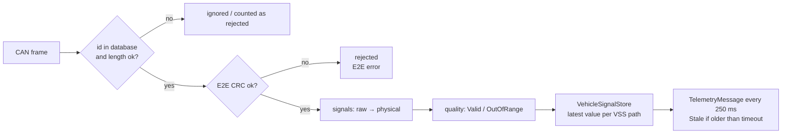

# Vehicle signals, CAN database and VSS mapping

In series vehicles, the meaning of every bit on the CAN bus is defined in a communication matrix,
usually exchanged as a **DBC file**: messages (`BO_`), signals (`SG_`) with start bit, length, byte
order, signedness, factor, offset, range and unit, plus value tables (`VAL_`). AutoSphere follows the
same principle with a JSON file, and additionally maps every signal to a normalized,
[COVESA VSS](https://covesa.github.io/vehicle_signal_specification/)-inspired path.

> **Single source of truth.** `src/gateway/AutoSphere.VehicleSignals/Database/can-database.json` is
> used by the simulated ECUs to *encode* and by the gateway to *decode*. No signal-specific decoding
> code exists anywhere in the system (`CanSignalCodec` is entirely database-driven).

---

## 1. Database format

```json
{
  "name": "VCU_Status", "id": "0x100", "length": 8, "cycleTimeMs": 50,
  "sender": "VehicleControlUnit", "e2eDataId": "0x0100",
  "signals": [
    { "name": "VehicleSpeed", "vssPath": "Vehicle.Speed", "startBit": 16, "length": 16,
      "byteOrder": "Intel", "factor": 0.01, "unit": "km/h", "minimum": 0, "maximum": 250 }
  ]
}
```

| Field | DBC equivalent | Notes |
|---|---|---|
| `id`, `name`, `length` | `BO_ <id> <name>: <dlc>` | hex or decimal |
| `cycleTimeMs` | `GenMsgCycleTime` attribute | drives transmission and timeout supervision |
| `sender` | transmitting node | an `EcuType`; mapped to an ECU id by configuration |
| `e2eDataId` | (AUTOSAR E2E configuration) | omitted → no E2E protection |
| `startBit`, `length`, `byteOrder` | `SG_ … start\|length@1/0` | Intel = `@1`, Motorola = `@0` |
| `isSigned` | `+`/`-` | two's complement |
| `factor`, `offset` | `(factor,offset)` | physical = raw × factor + offset |
| `minimum`, `maximum`, `unit` | `[min\|max] "unit"` | used for plausibility (quality flag) |
| `valueTable` | `VAL_` | labels for enumerations |
| `vssPath` | — | AutoSphere extension: normalized signal identifier |

`CanDatabaseLoader.Validate` acts as a DBC lint and rejects: duplicate ids, duplicate signal names,
duplicate VSS paths, invalid lengths/cycle times, zero factors, bits outside the payload, overlapping
signals (bits 0–11 are reserved when E2E is enabled) and physical ranges that do not fit the raw width.

---

## 2. Messages and signals

Bit numbering: bit *n* is bit *n mod 8* (0 = LSB) of byte *n div 8*. All messages are 8 bytes long and
E2E protected (bits 0–11, see §4).

| CAN id | Message | Sender | Cycle | Signal | Start | Len | Order | Signed | Factor / offset | Range | Unit | VSS path |
|---|---|---|---|---|---|---|---|---|---|---|---|---|
| 0x100 | VCU_Status | VCU | 50 ms | GearPosition | 12 | 3 | Intel | – | 1 / 0 | 0–3 | – | `Vehicle.Powertrain.Transmission.SelectedGear` |
| | | | | BrakeStatus | 15 | 1 | Intel | – | 1 / 0 | 0–1 | – | `Vehicle.Chassis.Brake.IsPressed` |
| | | | | VehicleSpeed | 16 | 16 | Intel | – | 0.01 / 0 | 0–250 | km/h | `Vehicle.Speed` |
| | | | | AcceleratorPedalPosition | 32 | 8 | Intel | – | 0.4 / 0 | 0–100 | % | `Vehicle.Chassis.Accelerator.PedalPosition` |
| | | | | IgnitionStatus | 40 | 2 | Intel | – | 1 / 0 | 0–3 | – | `Vehicle.LowVoltageSystemState` |
| 0x101 | VCU_Trip | VCU | 500 ms | Odometer | 16 | 24 | Intel | – | 0.1 / 0 | 0–1 000 000 | km | `Vehicle.TraveledDistance` |
| | | | | VehicleRange | 40 | 16 | Intel | – | 0.1 / 0 | 0–1000 | km | `Vehicle.Powertrain.Range` |
| 0x200 | MCU_Status | MCU | 20 ms | MotorRPM | 16 | 16 | Intel | yes | 1 / 0 | −12 000–16 000 | rpm | `Vehicle.Powertrain.ElectricMotor.Speed` |
| | | | | MotorTorque | 32 | 16 | Intel | yes | 0.1 / 0 | −400–400 | Nm | `Vehicle.Powertrain.ElectricMotor.Torque` |
| | | | | MotorTemperature | 48 | 8 | Intel | – | 1 / −40 | −40–180 | °C | `Vehicle.Powertrain.ElectricMotor.Temperature` |
| 0x300 | BMS_Status | BMS | 100 ms | ChargingStatus | 12 | 3 | Intel | – | 1 / 0 | 0–3 | – | `Vehicle.Powertrain.TractionBattery.Charging.Status` |
| | | | | BatteryStateOfCharge | 16 | 10 | Intel | – | 0.1 / 0 | 0–100 | % | `Vehicle.Powertrain.TractionBattery.StateOfCharge.Current` |
| | | | | BatteryTemperature | 32 | 16 | Intel | yes | 0.1 / 0 | −40–85 | °C | `Vehicle.Powertrain.TractionBattery.Temperature.Average` |
| 0x301 | BMS_Pack | BMS | 100 ms | BatteryVoltage | 23 | 16 | **Motorola** | – | 0.1 / 0 | 0–800 | V | `Vehicle.Powertrain.TractionBattery.CurrentVoltage` |
| | | | | BatteryCurrent | 39 | 16 | **Motorola** | yes | 0.1 / 0 | −500–500 | A | `Vehicle.Powertrain.TractionBattery.CurrentCurrent` |
| 0x400 | BCM_Status | BCM | 500 ms | DoorFrontLeft | 16 | 1 | Intel | – | 1 / 0 | 0–1 | – | `Vehicle.Cabin.Door.Row1.DriverSide.IsOpen` |
| | | | | DoorFrontRight | 17 | 1 | Intel | – | 1 / 0 | 0–1 | – | `Vehicle.Cabin.Door.Row1.PassengerSide.IsOpen` |
| | | | | DoorRearLeft | 18 | 1 | Intel | – | 1 / 0 | 0–1 | – | `Vehicle.Cabin.Door.Row2.DriverSide.IsOpen` |
| | | | | DoorRearRight | 19 | 1 | Intel | – | 1 / 0 | 0–1 | – | `Vehicle.Cabin.Door.Row2.PassengerSide.IsOpen` |
| | | | | TrunkStatus | 20 | 1 | Intel | – | 1 / 0 | 0–1 | – | `Vehicle.Body.Trunk.Rear.IsOpen` |

Value tables: GearPosition `0 Park, 1 Reverse, 2 Neutral, 3 Drive`; BrakeStatus `0 Released, 1 Pressed`;
IgnitionStatus `0 Off, 1 Accessory, 2 On, 3 Start`; ChargingStatus
`0 NotCharging, 1 Charging, 2 ChargeComplete, 3 Fault`; doors/trunk `0 Closed, 1 Open`.

Nominal frame rate: 0x100 20/s + 0x101 2/s + 0x200 50/s + 0x300 10/s + 0x301 10/s + 0x400 2/s =
**94 frames/s**, which matches the ~88–96 frames/s reported by the gateway at run time (timer jitter on
Windows explains the spread).

---

## 3. Intel and Motorola byte order

**Intel (little-endian, DBC `@1`).** The start bit is the LSB; following bits ascend.
Example — `VehicleSpeed` = 72.00 km/h → raw 7200 = `0x1C20`, start bit 16:
byte 2 = `0x20`, byte 3 = `0x1C`.

Example — `BatteryStateOfCharge` = 78.4 % (10 bits at bit 16) → raw 784 = `0x310`:
byte 2 = `0x10`, bits 0–1 of byte 3 = `0b11`.

**Motorola (big-endian, DBC `@0`).** The start bit is the **MSB** in DBC "sawtooth" numbering: within a
byte the bit index decreases from 7 to 0, then continues at bit 7 of the next byte
(`next = position % 8 == 0 ? position + 15 : position − 1`).
Example — `BatteryVoltage` = 400.2 V → raw 4002 = `0x0FA2`, start bit 23 (bit 7 of byte 2):
byte 2 = `0x0F`, byte 3 = `0xA2` (verified by `CanSignalCodecTests`).

Signed values use two's complement on the signal width (`BitCodec.ToSigned` / `FromSigned`). Before
encoding, the raw value is saturated to the representable range, as an ECU would clamp before
transmission.

---

## 4. End-to-end (E2E) protection

AUTOSAR E2E profiles protect safety-relevant data against corruption, repetition, loss and
masquerading between sender and receiver software. AutoSphere implements a simplified scheme inspired
by **E2E Profile 1**:

| Element | Implementation |
|---|---|
| Location | byte 0 = CRC, low nibble of byte 1 = alive counter (0–15) |
| CRC | CRC-8 SAE J1850: polynomial `0x1D`, start value `0xFF`, final XOR `0xFF` |
| CRC input | data id low byte, data id high byte, then payload bytes 1…7 (includes the counter) |
| Data id | per message (`e2eDataId`, e.g. `0x0300` for BMS_Status) |
| Counter | incremented by the sender for every transmitted frame |

Receiver behaviour (gateway):

* CRC mismatch → frame **rejected**, `E2EErrorCount` incremented, ECU `Warning`, DTC `U0401`.
* Counter delta ≠ 1 (repeated or skipped) → frame accepted, error counted.

This is an educational scheme, not a certified implementation of the AUTOSAR E2E library (no
timeout/state machine per profile, no masquerade protection beyond the data id).

---

## 5. Decoding pipeline



Each decoded signal becomes a `SignalValueDto`:

| Field | Source |
|---|---|
| `path` | VSS path from the database |
| `name` | DBC-style signal name |
| `value` | physical value, rounded to 3 decimals |
| `unit` | database unit |
| `sourceEcuId` | ECU id configured for the sender type (e.g. `BMS-001`) |
| `timestamp` | receive time of the CAN frame at the gateway |
| `quality` | `Valid`, `OutOfRange` (outside `[minimum, maximum]` ± factor/2) or `Stale` (no fresh frame within the message timeout when the telemetry snapshot is built) |
| `label` | value-table text for enumerations, e.g. `Drive` |

The backend converts the list into the strongly typed `VehicleSnapshotDto`
(`SpeedKmh`, `MotorRpm`, `BatteryStateOfChargePercent`, `Gear`, …).

---

## 6. VSS mapping

The paths follow the VSS 4.x naming scheme as far as possible. Two signals use **project extensions**
(VSS explicitly allows overlays for OEM-specific signals), and some encodings deviate from VSS:

| Signal | VSS path | Status | Deviation from VSS |
|---|---|---|---|
| VehicleSpeed | `Vehicle.Speed` | VSS | – |
| Odometer | `Vehicle.TraveledDistance` | VSS | – |
| IgnitionStatus | `Vehicle.LowVoltageSystemState` | VSS | VSS uses string enumerations; AutoSphere transmits 0–3 with a label |
| VehicleRange | `Vehicle.Powertrain.Range` | VSS | **unit km instead of m** |
| GearPosition | `Vehicle.Powertrain.Transmission.SelectedGear` | VSS | VSS uses int8 gear numbers with special values for P/N/R; AutoSphere uses an enumeration 0–3 |
| MotorRPM / MotorTorque / MotorTemperature | `Vehicle.Powertrain.ElectricMotor.Speed/Torque/Temperature` | VSS-style | – |
| SOC, voltage, current, temperature | `Vehicle.Powertrain.TractionBattery.*` | VSS-style | `Temperature.Average` |
| ChargingStatus | `Vehicle.Powertrain.TractionBattery.Charging.Status` | **extension** | VSS only defines boolean `Charging.IsCharging` |
| AcceleratorPedalPosition | `Vehicle.Chassis.Accelerator.PedalPosition` | VSS | – |
| BrakeStatus | `Vehicle.Chassis.Brake.IsPressed` | **extension** | VSS defines `Brake.PedalPosition` (%) |
| Doors / trunk | `Vehicle.Cabin.Door.Row*.DriverSide/PassengerSide.IsOpen`, `Vehicle.Body.Trunk.Rear.IsOpen` | VSS | transmitted as 0/1 |

The paths are also defined as constants in `AutoSphere.SharedKernel.Signals.VssPaths`, which the
backend health calculation and the dashboard use. AutoSphere does not implement a VSS server, VISS or
KUKSA.val interface; VSS is used purely as a naming and normalization convention.

---

## 7. Adding a signal

1. Add the signal to the appropriate message in `can-database.json` (free, non-overlapping bits; bits 0–11
   are reserved on E2E-protected messages). The loader validation fails the start-up otherwise.
2. Provide the value in the sending ECU simulator's `ProduceSignals` (`ConcreteEcus.cs`) — or, on a
   real vehicle, nothing: the gateway decodes it automatically.
3. Optionally add a constant to `VssPaths` and a typed property to `VehicleSnapshotDto` if the backend
   or the dashboard needs it explicitly.
4. Extend `CanSignalCodecTests` with a round-trip test.

No gateway, MQTT or database schema change is needed: telemetry is transported and stored per VSS path.
