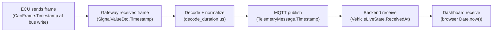

# Performance testing strategy

This document defines **what** is measured, **where** the measurement point is in the code, **how** the data
is collected and **how** the experiments are run for the thesis evaluation (research questions RQ1, RQ2
and RQ4, see [research-questions.md](research-questions.md)).

> The platform was built to be measurable: every live telemetry update carries its own timestamps and
> gateway statistics, the gateway and backend publish .NET `System.Diagnostics.Metrics` instruments, and
> diagnostic sessions and OTA deployments persist their durations and event timelines.

## 1. Measurement points



| Metric (requirement) | Definition | Measurement point / source |
|---|---|---|
| CAN processing latency | Time to decode, check E2E and normalize one frame | Histogram `autosphere.gateway.can.decode_duration` (µs, meter `AutoSphere.Gateway`); per-message `statistics.averageDecodeMicroseconds` / `maxDecodeMicroseconds`; BenchmarkDotNet `SignalCodecBenchmarks` |
| CAN-to-MQTT latency | Age of the newest CAN-sourced value when the telemetry message is published | `latency.canToGatewayPublishMs` in every live update; histogram `autosphere.gateway.can_to_mqtt_latency` |
| MQTT-to-backend latency | Gateway publish → backend receive | `latency.gatewayToBackendMs`; histogram `autosphere.backend.gateway_to_backend_latency` (meter `AutoSphere.Backend`) |
| End-to-end dashboard latency | Newest CAN frame → dashboard | `latency.canToBackendMs` + backend → dashboard (shown in the top bar and the *Edge pipeline* panel, `VehicleStore.dashboardLatencyMs`) |
| Messages per second | CAN frames/s at the gateway; MQTT messages/s | `statistics.framesPerSecond`; counters `autosphere.gateway.mqtt.messages_published`, `autosphere.backend.mqtt.messages_received` (meter `AutoSphere.Backend.Mqtt`) |
| CPU / memory usage | Process CPU %, working set, GC heap, allocation rate | `dotnet-counters monitor -p <pid> System.Runtime`; `docker stats` for containers |
| ECU failure detection time | Fault injected → ECU reported offline / alert raised | `FaultInjectionDto.requestedAt` → alert `communication-lost-<ECU>` `raisedAt` (`GET /api/vehicles/{id}/alerts`) |
| Diagnostic response time | Request → correlated response | `DiagnosticSessionDto.roundTripMs` (backend view) and `vehicleDurationMs` (gateway view), per-exchange `durationMs` |
| OTA deployment duration | First vehicle report → terminal state | `OtaDeploymentDto.durationSeconds`; per-stage timing from `events[].timestamp` |
| Rollback duration | `RollingBack` → `RolledBack` | difference of the two event timestamps; also in the final event message ("Rollback completed in x s") |

### Clock assumption

Cross-process latencies (gateway → backend → browser) compare wall clocks of different processes. On a
single host (the default set-up and Docker Compose on one machine) they share one clock. For distributed
set-ups, synchronize with NTP/PTP and report the clock offset as measurement uncertainty, or restrict the
analysis to same-process intervals (decode, diagnostic round trip, OTA stage durations).

### What the CAN-to-MQTT number means

The gateway publishes an aggregated snapshot every `Gateway:TelemetryPublishIntervalMs` (250 ms).
`canToGatewayPublishMs` is the age of the **newest** signal in that snapshot. The age of the *oldest*
signal is bounded by the publish interval plus the slowest message cycle (500 ms for `VCU_Trip`/`BCM_Status`).
Report both when discussing freshness; the snapshot design trades latency for bandwidth (≈94 frames/s on the
bus vs. 4 messages/s to the cloud).

## 2. Tooling

| Tool | Use |
|---|---|
| `dotnet-counters` | `dotnet-counters monitor -n AutoSphere.VehicleGateway --counters AutoSphere.Gateway,System.Runtime` (and `-n AutoSphere.Api --counters AutoSphere.Backend,AutoSphere.Backend.Mqtt,System.Runtime`) |
| `dotnet-counters collect` | Export the same counters to CSV for analysis: `--format csv -o gateway.csv` |
| BenchmarkDotNet | `dotnet run -c Release --project tests/AutoSphere.Benchmarks -- --filter "*"` — codec and OTA verification micro-benchmarks |
| REST API + `jq` | Diagnostic and OTA durations, fault/alert timestamps (see scripts below) |
| `docker stats` | CPU / memory of the containerized services |

Example: sampling the end-to-end latency breakdown 120 times (one per second):

```bash
for i in $(seq 1 120); do
  curl -s -H "Authorization: Bearer $TOKEN" http://localhost:8080/api/vehicles/AUTO-001/telemetry/latest \
    | jq -r '[.latency.canToGatewayPublishMs, .latency.gatewayToBackendMs, .latency.canToBackendMs] | @csv'
  sleep 1
done > latency.csv
```

Example: diagnostic response time over 50 full scans:

```bash
for i in $(seq 1 50); do
  curl -s -X POST -H "Authorization: Bearer $TOKEN" http://localhost:8080/api/vehicles/AUTO-001/diagnostics/scan \
    | jq -r '[.roundTripMs, .vehicleDurationMs] | @csv'
done > diagnostics.csv
```

## 3. Experiments

All experiments: Release build, warm-up of 60 s after start, at least 30 repetitions (or 10 minutes of
continuous sampling), report mean, median, p95, p99 and max. Record the environment (CPU, RAM, OS, .NET
version, transport, Docker vs. native).

| ID | Experiment | Variables | Collected metrics | RQ |
|---|---|---|---|---|
| E1 | Codec micro-benchmark | message type (Intel/Motorola), payload | ns/op, allocations | RQ1 |
| E2 | Steady-state telemetry pipeline | transport (InMemory, UDP, SocketCAN/vcan); publish interval 100/250/1000 ms | decode µs, frames/s, CAN→MQTT, MQTT→backend, backend→dashboard, CPU, memory | RQ1, RQ2 |
| E3 | Load scaling | number of simulated vehicles (1, 5, 10, 25 gateway instances with distinct `Gateway:VehicleId`) | backend CPU/memory, MQTT messages/s, ingestion lag, DB write rate | RQ1 |
| E4 | Failure detection | fault type (EcuCrash, CanMessageLoss, GatewayDisconnect, MqttDisconnect) | time to ECU offline / alert / vehicle offline | RQ3 |
| E5 | Diagnostic response | operation (TesterPresent, ReadDtcs, FullScan); ECU count | round trip, vehicle duration, per-exchange time | RQ3 |
| E6 | OTA success | payload size (16 KiB, 128 KiB, 512 KiB); `Ota:HealthCheckSeconds` | total duration, per-stage duration, CAN bus load during transfer | RQ4 |
| E7 | OTA failures | corrupted payload, tampered manifest, wrong target ECU, crash-loop build, self-test failure | detection stage, time to terminal state, rollback duration, final version correctness | RQ4 |

**Expected relationships** (hypotheses to test): decode cost is in the sub-microsecond range per frame and
negligible compared with the publish interval; transport latency on one host is a few milliseconds and
dominated by the aggregation interval; OTA duration is dominated by the configured health-check window;
every invalid package is rejected before installation (100 % in E7), and every failed post-install health
check ends with the previous version active.

## 4. Preliminary observations (single development run)

The following values were observed while developing the prototype on one Windows 11 laptop (in-memory
CAN bus, all services on one host). They are **indicative only** and are not a substitute for the
experiments above.

| Metric | Observed |
|---|---|
| Frame decode incl. E2E check (BenchmarkDotNet, short job) | ≈ 90 ns (Intel and Motorola layouts), CRC-8 ≈ 4 ns |
| Decode + normalization inside the gateway loop | ≈ 13–28 µs average per frame |
| CAN frames on the bus | ≈ 94–96 frames/s (four ECUs) |
| CAN → gateway publish (newest signal) | ≈ 15–20 ms |
| Gateway → backend (MQTT, local broker) | ≈ 1–3 ms |
| Backend → dashboard (SignalR) | ≈ 4–8 ms |
| Full diagnostic scan of 5 ECUs (≈ 45 UDS exchanges) | ≈ 40 ms on the vehicle, 100–280 ms HTTP round trip |
| OTA success, 16 KiB image, 8 s health check | ≈ 9.4–9.5 s |
| Rollback (crash-loop build) after failed health check | ≈ 1.3 s |
| Corrupted package rejection | < 1 s, before any UDS programming request |

## 5. Threats to validity

* **Simulated bus timing**: the in-memory bus has no arbitration or bit timing; results represent the
  software path, not physical CAN latency. Use SocketCAN with a real interface for physical-layer effects.
* **Timer resolution**: on Windows, timers have ~15 ms granularity, which affects cyclic transmission jitter;
  prefer Linux for timing experiments.
* **Single host**: shared CPU between simulator, gateway, broker, backend and browser.
* **Clock synchronization**: see § 1.
* **Simulated firmware**: OTA durations reflect the UDS transfer and health-check logic, not real flash
  erase/write times of an automotive microcontroller.
