<div align="center">

# 🎧 EchoSense AI
## Intelligent Audio Analytics & Spatial Sound Platform

### Upload a recording — get transcript, speakers, sound events, tone, anomalies, forecasts, semantic search and a 3D sound world

<p>
  
  
  
  
  
  
  
</p>

<p>
  
  
  
  
</p>

<br/>

**Five pretrained open-source models, classical signal processing and explainable machine learning,  
synchronized on one audio timeline in a polished React dashboard — no Docker, no cloud, no hard-coded results.**

<br/>

<a href="#-screenshots"><b>Screenshots</b></a> ·
<a href="#-results-on-the-demo-recording"><b>Measured Results</b></a> ·
<a href="#-setup"><b>Setup</b></a> ·
<a href="#-run-the-project"><b>Run It</b></a> ·
<a href="docs/architecture.md"><b>Architecture Notes</b></a> ·
<a href="docs/api.md"><b>API</b></a>

</div>

<br/>

<p align="center">
  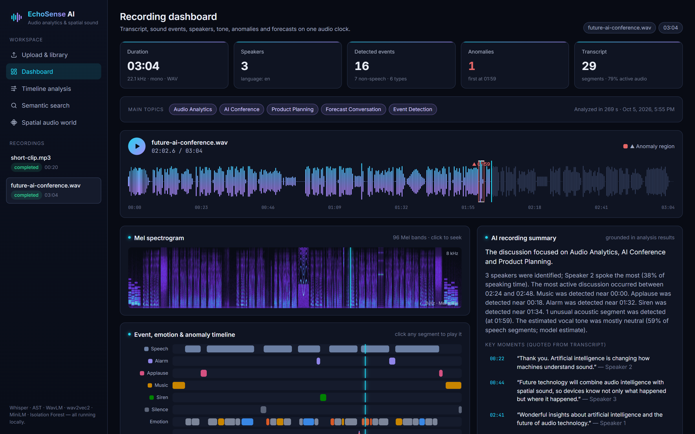
</p>

<p align="center"><sub><i>The dashboard after analyzing the 3-minute synthetic demo panel <code>future-ai-conference.wav</code>: 3 speakers, 16 events, the planted glass-shatter anomaly at 01:59 and topics extracted from the transcript — all computed live by the pipeline.</i></sub></p>

---

# 🏆 Results on the Demo Recording

The demo recording is **synthetic** (generated by `sample-data/generate_demo_audio.py`), so the exact timing of every utterance, sound and the planted anomaly is known. `scripts/evaluate_demo.py` scores the live API output against that ground truth ([full report](docs/results/demo-evaluation.md)).

<table>
<tr>
<td align="center" width="25%">

### 3.3%
**Word error rate**<br/>
<sub>Whisper-base, 333 reference words</sub>

</td>
<td align="center" width="25%">

### 3 / 3
**Speakers found**<br/>
<sub>100% of speech attributed correctly</sub>

</td>
<td align="center" width="25%">

### 1 / 1
**Planted anomaly flagged**<br/>
<sub>score 0.737 · 0 false regions</sub>

</td>
<td align="center" width="25%">

### 6 / 9
**Planted sound events**<br/>
<sub>0 detections without a source</sub>

</td>
</tr>
</table>

<p align="center">


</p>

> The three missed events are reported, not hidden: the AST classifier did not recognise the **synthesised** keyboard clicks or door slam, and scored the glass shatter too low to label it — that glass shatter is exactly the moment the **Isolation-Forest anomaly detector** flagged, which is the point of having both.

---

# 📌 Overview

EchoSense AI turns an ordinary audio file into an explorable, searchable, synchronized analysis:

- 🎙️ **What was said** — Whisper transcription with word-accurate timestamps and language detection
- 🧑‍🤝‍🧑 **Who said it** — speaker clustering from WavLM voice embeddings, speaking time, share and turns
- 🔊 **What else happened** — AudioSet sound events (speech, music, applause, siren, alarm, door, …)
- 🎭 **How it sounded** — emotion estimates plus measured prosody (pitch, variability, loudness, rate)
- 🚨 **What was unusual** — Isolation-Forest acoustic anomaly detection with per-feature explanations
- 📈 **Where it is heading** — next-interval forecasts of energy, conversation activity, anomaly likelihood and engagement
- 🔎 **Where was X discussed?** — local semantic search over transcript and sound events
- 🌐 **Where are the sounds?** — an interactive Three.js world with HRTF spatial playback
- 📝 **What was it about?** — a grounded summary with topics and quoted key moments

> **Honesty by design.** Speakers are anonymous clusters, emotions are labelled *model estimates*, forecasts are always shown next to a naive baseline, the summary contains only computed facts, and the spatial world says plainly that a mono file has no direction information.

---

# 🖼️ System Architecture

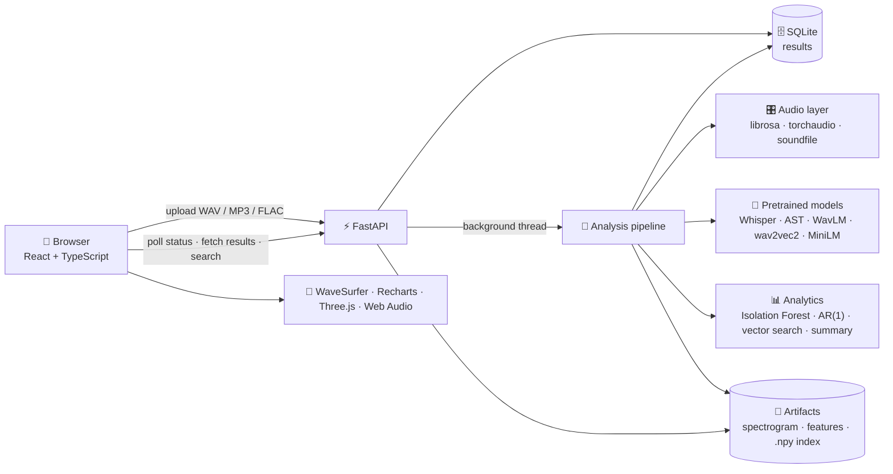
```mermaid
flowchart LR
    U["🧑 Browser<br/>React + TypeScript"] -->|"upload WAV / MP3 / FLAC"| API["⚡ FastAPI"]
    API --> DB[("🗄️ SQLite<br/>results")]
    API -->|"background thread"| P["🧠 Analysis pipeline"]
    P --> A["🎛️ Audio layer<br/>librosa · torchaudio · soundfile"]
    P --> M["🤗 Pretrained models<br/>Whisper · AST · WavLM · wav2vec2 · MiniLM"]
    P --> AN["📊 Analytics<br/>Isolation Forest · AR(1) · vector search · summary"]
    P --> DB
    P --> FS[("📁 Artifacts<br/>spectrogram · features · .npy index")]
    API --> FS
    U -->|"poll status · fetch results · search"| API
    U --> V["🎨 WaveSurfer · Recharts · Three.js · Web Audio"]
```

Everything runs in **one Python process and one Vite dev server**. There is no Docker, Redis, message queue or vector database — models are loaded lazily once, analysis runs in a FastAPI background thread, and the vector index is a NumPy array.

---

# ✨ Key Features

<table>
<tr>
<td width="50%">

### 🎛️ Audio Processing
- WAV / MP3 / FLAC via libsndfile, original never modified
- Resampling (torchaudio), mono mix, peak normalisation
- Silence detection & segmentation
- Waveform peaks, log-Mel spectrogram, MFCCs
- 1 s / 0.5 s-hop window features

</td>
<td width="50%">

### 🤖 AI Analysis
- Whisper transcription + word timestamps
- AST AudioSet sound-event detection
- WavLM x-vector speaker clustering
- wav2vec2 emotion + YIN prosody
- MiniLM sentence embeddings

</td>
</tr>
<tr>
<td width="50%">

### 📊 Analytics
- Isolation-Forest anomaly scores with explanations
- Mean-reverting AR(1) forecasts + walk-forward backtest
- Local cosine-similarity semantic search
- KeyBERT-style topics, extractive highlights

</td>
<td width="50%">

### 🖥️ Experience
- Dark dashboard with KPI tiles and topics
- One shared audio clock for every view
- Click any segment, event, anomaly or result to play it
- Three.js sound world with HRTF panning

</td>
</tr>
</table>

---

# 🧠 AI Pipeline

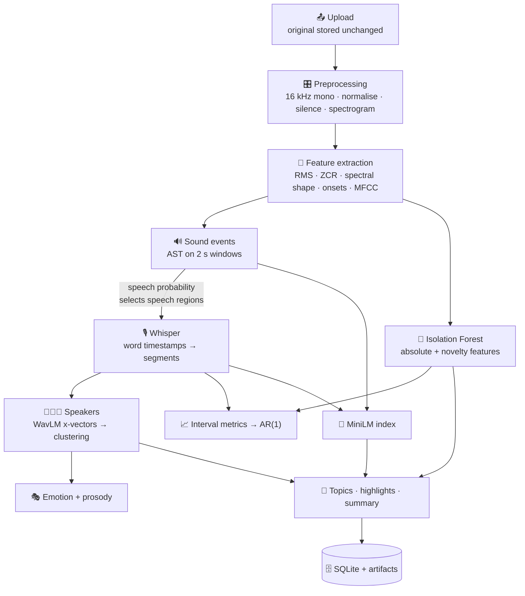
```mermaid
flowchart TD
    UP["📤 Upload<br/>original stored unchanged"] --> PRE["🎛️ Preprocessing<br/>16 kHz mono · normalise · silence · spectrogram"]
    PRE --> FE["🧮 Feature extraction<br/>RMS · ZCR · spectral shape · onsets · MFCC"]
    FE --> SED["🔊 Sound events<br/>AST on 2 s windows"]
    SED -->|"speech probability<br/>selects speech regions"| ASR["🎙️ Whisper<br/>word timestamps → segments"]
    ASR --> SPK["🧑‍🤝‍🧑 Speakers<br/>WavLM x-vectors → clustering"]
    SPK --> EMO["🎭 Emotion + prosody"]
    FE --> ANO["🚨 Isolation Forest<br/>absolute + novelty features"]
    ASR --> PRED["📈 Interval metrics → AR(1)"]
    ANO --> PRED
    ASR --> IDX["🔎 MiniLM index"]
    SED --> IDX
    IDX --> SUM["📝 Topics · highlights · summary"]
    SPK --> SUM
    ANO --> SUM
    SUM --> DB[("🗄️ SQLite + artifacts")]
```

| Stage | Model / method | Output |
|---|---|---|
| Transcription | [`openai/whisper-base`](https://huggingface.co/openai/whisper-base) | segments, word-level timing, language |
| Sound events | [`MIT/ast-finetuned-audioset-10-10-0.4593`](https://huggingface.co/MIT/ast-finetuned-audioset-10-10-0.4593) | 527 AudioSet classes → 13 dashboard categories |
| Speakers | [`microsoft/wavlm-base-plus-sv`](https://huggingface.co/microsoft/wavlm-base-plus-sv) | anonymous speaker clusters, time, share, turns |
| Emotion | [`superb/wav2vec2-base-superb-er`](https://huggingface.co/superb/wav2vec2-base-superb-er) | neutral / happy / angry / sad + confidence |
| Embeddings | [`sentence-transformers/all-MiniLM-L6-v2`](https://huggingface.co/sentence-transformers/all-MiniLM-L6-v2) | 384-d vectors for search and topics |
| Anomalies | scikit-learn `IsolationForest` | window scores, regions, top deviating features |
| Forecasts | AR(1), NumPy | next-interval value, trend, MAE vs baseline |

**Why sound events run before transcription.** The AST speech probability decides which activity regions Whisper sees. On the first version Whisper was fed music + speech together and its first segment started at 0.0 s instead of 8.2 s; routing only speech regions brought the mean start offset to **0.06 s** and removes hallucinated text over music and silence.

**Speaker clustering.** Each segment's WavLM x-vector is clustered agglomeratively (cosine, average linkage). The speaker count is chosen by silhouette score, and a split is only accepted when every pair of cluster centroids is below the model's recommended **0.86** same-speaker cosine threshold — a unit test proved silhouette alone could split a single voice into two.

---

# 🎛️ Audio Analytics

| Step | Implementation |
|---|---|
| Decode | `soundfile` (libsndfile ≥ 1.1: WAV, FLAC, MP3) |
| Resample | `torchaudio.functional.resample` → 16 kHz |
| Mono / normalise | channel mean, peak normalisation to −1 dBFS |
| Silence detection | `librosa.effects.split` at −35 dB re peak, gaps < 0.4 s bridged |
| Segmentation | activity intervals packed into ≤ 28 s chunks for Whisper |
| Visuals | 2,400-bucket waveform peaks; 96-band log-Mel spectrogram quantised to uint8 |
| Window features | n_fft 1024, hop 16 ms, aggregated to 1 s windows / 0.5 s hop: RMS dB (mean, std), ZCR, spectral centroid / rolloff / bandwidth / flatness, onset strength (mean, peak), MFCC 1-13 |

---

# 🚨 Anomaly Detection

<p align="center">
  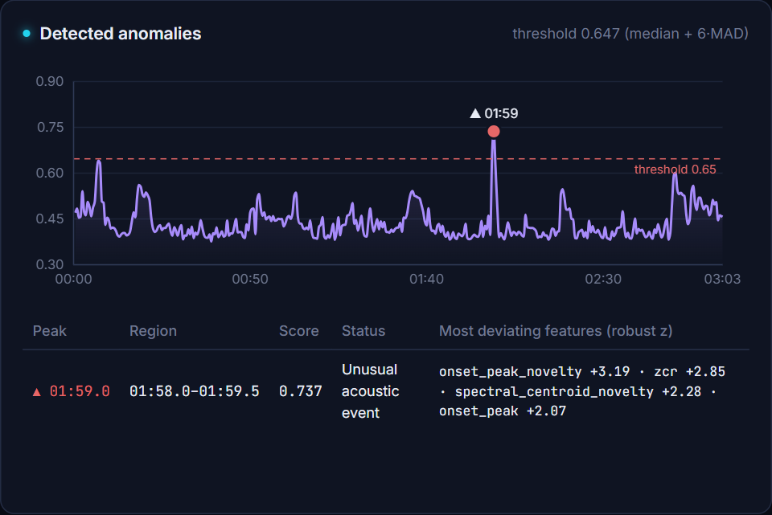
</p>

**Model.** An Isolation Forest (300 trees) is fit on the recording's own windows. The score shown is the original Isolation-Forest anomaly score `s(x) = 2^(−E[h(x)]/c(n))` ∈ [0, 1]: ordinary windows sit near 0.4–0.5, windows that random splits isolate quickly score higher.

**Features (15 per window).**

| Absolute (10) | Contextual novelty (5) |
|---|---|
| RMS dB, RMS std, ZCR, spectral centroid, rolloff, flatness, onset peak, MFCC 1-3 | deviation of RMS, centroid, flatness, onset peak and MFCC 2 from the **median of the previous 10 s**, scaled by that context's inter-decile range |

Novelty is what makes *sudden* events stand out rather than merely rare-but-steady sounds. Measured on the demo:

| Feature set | Glass-shatter score | Rank |
|---|---|---|
| 22 absolute features only | 0.605 | 3rd — below the siren and the music intro |
| **10 absolute + 5 novelty (one-sided energy)** | **0.739** | **1st — the only region above threshold** |

**Threshold.** Recording-relative and robust: `median + 6 · MAD` of the scores, never below 0.6. Consecutive flagged windows merge into one region; each region reports its peak, score, overlapping sound events and the four most deviating features (e.g. `onset_peak_novelty +3.19 · zcr +2.85 · spectral_centroid_novelty +2.28`).

---

# 📈 Predictive Analytics

<p align="center">
  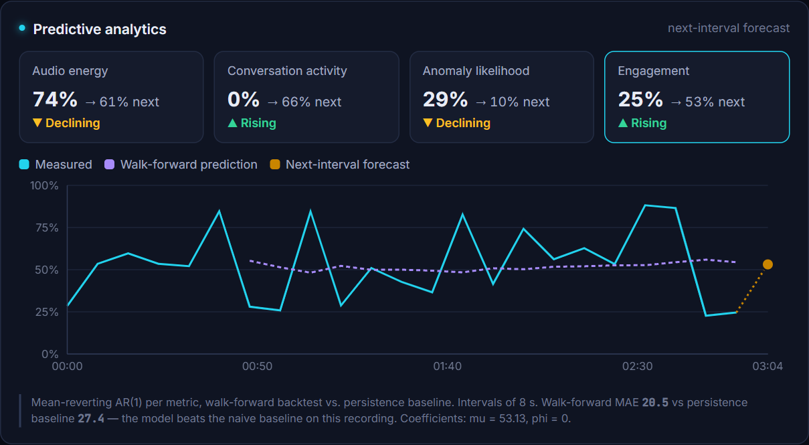
</p>

The recording is split into ~24 intervals (5–60 s). Four 0–100 metrics are **measured** per interval:

| Metric | Definition |
|---|---|
| Audio energy | mean window loudness, scaled to the recording's 5th–95th percentile dB range |
| Conversation activity | % of the interval covered by transcribed speech |
| Anomaly likelihood | mean anomaly score, scaled between the recording median and the threshold |
| Engagement | mean of conversation activity, speaker-turn rate (scaled) and energy |

**Model:** a mean-reverting AR(1) per metric — `next = μ + φ · (current − μ)` — fit by least squares on the intervals seen so far. It is fully explainable (two numbers) and its accuracy is measured with a **walk-forward backtest** (each interval predicted only from earlier ones) against the naive *persistence* baseline ("same as last interval"):

| Metric | Walk-forward MAE | Persistence MAE | μ | φ |
|---|---|---|---|---|
| Audio energy | **11.9** | 13.6 | 58.8 | 0.15 |
| Conversation activity | **28.2** | 32.9 | 65.9 | 0.00 |
| Anomaly likelihood | **9.5** | 10.3 | 10.1 | 0.00 |
| Engagement | **20.5** | 27.4 | 53.1 | 0.00 |

A ridge model with three lags and cross-metric terms was tried first and **lost to persistence on all four metrics** (it overfits ~23 points), so it was replaced. With fewer than 7 intervals the API returns a labelled persistence forecast and claims no accuracy.

---

# 🔎 Semantic Search

<p align="center">
  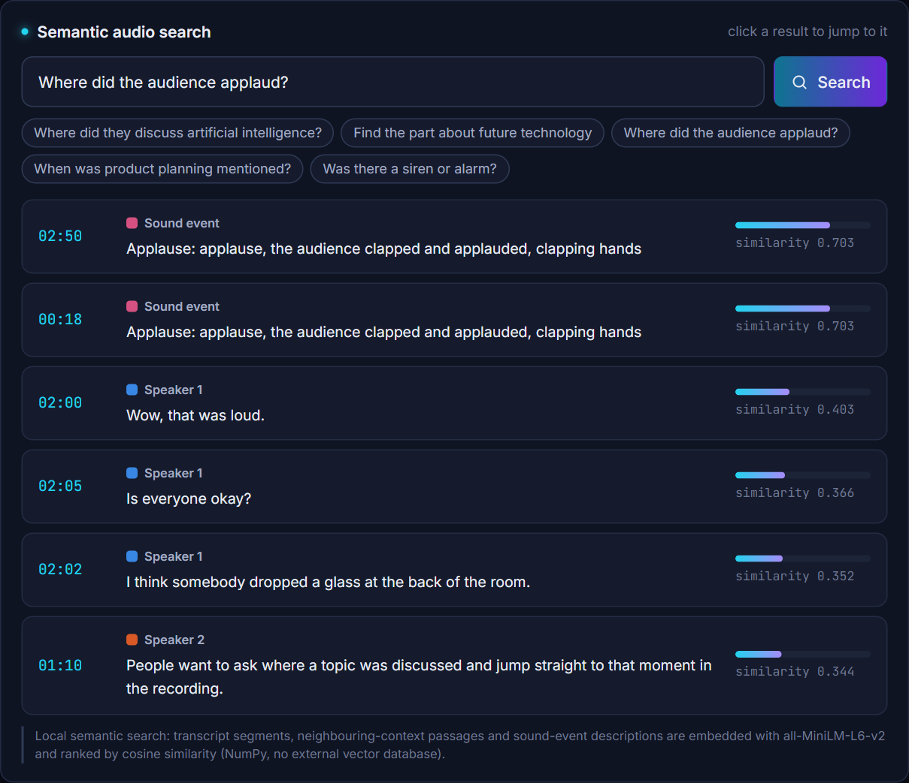
</p>

- Index = every transcript segment + a context passage (segment with neighbours) + one natural-language description per detected sound event, embedded with MiniLM and stored as `search_index.npy`.
- Query → embedding → cosine similarity with NumPy → results de-duplicated by time and returned with **timestamp, text, speaker and similarity score**.
- Because events are indexed too, *"Where did the audience applaud?"* returns the applause at **00:18** and **02:50**, while *"Where did they discuss artificial intelligence?"* returns transcript lines. Clicking any result plays the recording from that moment.

---

# 🌐 Spatial Audio World

<p align="center">
  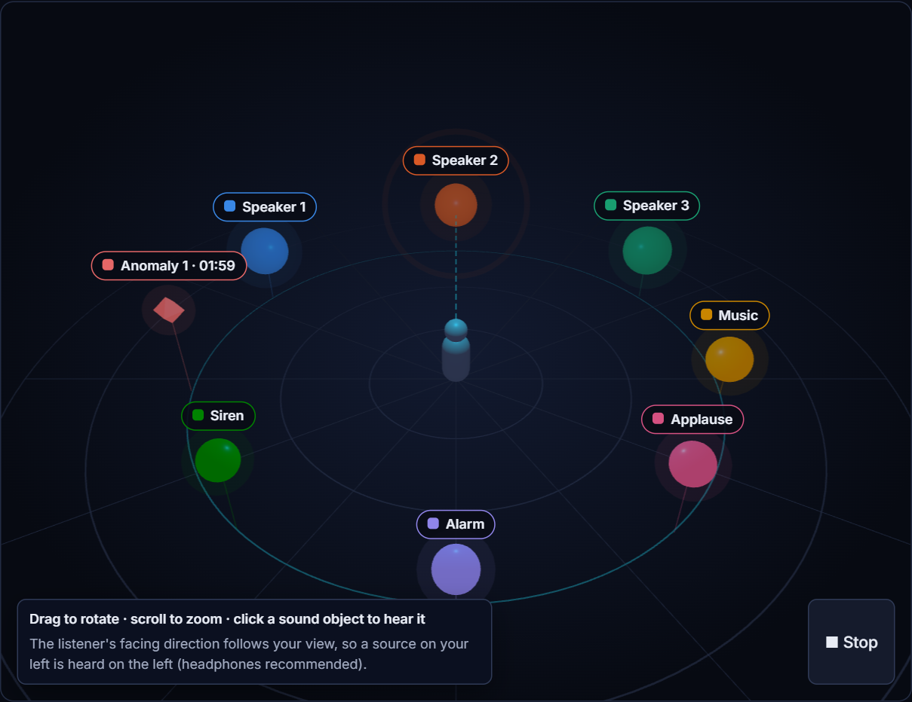
</p>

- Speakers are arranged on the front arc, other sound sources and anomalies around the sides and back; sphere size reflects total activity time.
- **Drag** to rotate, **scroll** to zoom, **click** a source (or a row in the side panel) to hear its most representative clip.
- Playback uses a Web Audio **`PannerNode` with the HRTF model** at the object's 3D position; the listener's orientation follows the camera, so a source on the left of your view is heard on the left (use headphones).

> ⚠️ **No sound-source localisation is claimed.** The demo file is mono — a single channel carries no direction-of-arrival information — so positions are an interactive *layout*, and the page says so next to the scene.

---

# 🖥️ Dashboard

| View | What it shows |
|---|---|
| **Upload & library** | drag-and-drop upload, filename / duration / sample rate / size, live 9-stage processing pipeline |
| **Dashboard** | KPIs, topics, player + waveform with anomaly markers, spectrogram, event/emotion/anomaly tracks, speaker chart, anomaly graph, forecasts, AI summary, synced transcript, tone distribution |
| **Timeline analysis** | spectrogram, per-speaker lanes, per-event-type lanes, emotion lane and anomaly-score lane on one time axis, with tables of events and anomalies |
| **Semantic search** | natural-language queries with suggested prompts, clickable ranked results |
| **Spatial audio world** | Three.js scene, source list, clip details and the mono disclaimer |

Every view shares **one `<audio>` element**: the playhead moves across the waveform, spectrogram and all lanes together, the active transcript line is highlighted and scrolled into view, and every segment, event, anomaly marker and search result is clickable.

---

# 📝 AI Audio Summary

<p align="center">
  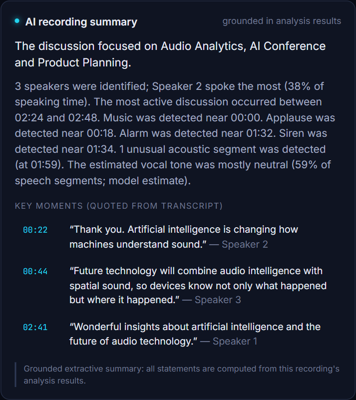
</p>

The summary is **grounded and extractive** — no free-text generation, so nothing can be hallucinated:

- **Topics:** KeyBERT-style — 1-2-word phrases taken from the raw transcript word sequence (no stop-words inside, so no fake phrases like "talk product"), ranked by embedding similarity to the whole transcript and diversified with Maximal Marginal Relevance → *Audio Analytics, AI Conference, Product Planning, Forecast Conversation, Event Detection*.
- **Facts:** speaker count and the most active speaker, the most active 3-interval span, the first time of each non-speech event, anomaly count and times, dominant estimated tone.
- **Key moments:** the transcript segments closest to the transcript centroid, quoted verbatim with timestamps.

---

# 🛠️ Technology Stack

| Area | Technologies |
|---|---|
| Backend | Python 3.12, FastAPI, Uvicorn, SQLAlchemy 2, Pydantic 2 |
| AI | PyTorch, Hugging Face Transformers (Whisper, AST, WavLM, wav2vec2, MiniLM) |
| Audio / ML | librosa, torchaudio, soundfile, scikit-learn, NumPy, pandas |
| Database | SQLite (+ JSON / `.npy` artifacts) |
| Frontend | React 19, TypeScript, Vite |
| Visualisation | WaveSurfer.js (waveform), Recharts (charts), Canvas (spectrogram), Three.js (3D) |
| Audio in browser | Web Audio API (`AudioBuffer`, HRTF `PannerNode`) |
| Testing | pytest, FastAPI TestClient |

---

# 📁 Project Structure

```
EchoSense-AI/
├── backend/app/
│   ├── main.py                 FastAPI app, lifespan, CORS
│   ├── config.py               paths, model names, window sizes (env-overridable)
│   ├── api/routes.py           REST endpoints
│   ├── models/                 SQLAlchemy tables (AudioFile, TranscriptSegment, SoundEvent, ...)
│   ├── schemas/                Pydantic response models
│   ├── services/pipeline.py    end-to-end analysis orchestration + progress
│   ├── audio/                  io.py · preprocessing.py · features.py
│   ├── ai/                     models.py · transcription.py · sound_events.py · speakers.py · emotion.py · embeddings.py
│   ├── analytics/              anomaly.py · prediction.py · search.py · summary.py
│   └── database/db.py          engine, session, init
├── frontend/src/
│   ├── App.tsx                 shell, navigation, polling, hash routing
│   ├── pages/                  dashboard, timeline analysis, search, spatial, library
│   ├── components/             player + waveform, transcript, summary, search, KPIs, status
│   ├── visualization/          spectrogram canvas, timeline lanes, Recharts charts, colours
│   ├── spatial/                Three.js scene + Web Audio HRTF player
│   └── services/               typed API client, shared playback context, formatting
├── sample-data/                generate_demo_audio.py · future-ai-conference.wav · demo_ground_truth.json
├── scripts/                    evaluate_demo.py · capture_screenshots.py
├── tests/                      34 focused tests
├── docs/                       architecture.md · api.md · results/ · screenshots/
├── requirements.txt
├── LICENSE
└── README.md
```

---

# ⚙️ Setup

**Prerequisites:** Python 3.10–3.12, Node.js 20+, ~3 GB free disk for the model cache. A GPU is used automatically if PyTorch sees one; CPU works fine.

```bash
cd EchoSense-AI

# Backend
python -m venv .venv
.venv\Scripts\activate                     # macOS / Linux: source .venv/bin/activate
pip install torch torchaudio --index-url https://download.pytorch.org/whl/cpu   # or the CUDA build
pip install -r requirements.txt

# Frontend
cd frontend
npm install
```

The five models (~2.3 GB in the Hugging Face cache) are downloaded from Hugging Face on the first analysis and cached afterwards. No API keys or gated models are required.

---

# ▶️ Run the Project

```bash
# Terminal 1 — API on http://localhost:8000  (OpenAPI docs at /docs)
cd backend
uvicorn app.main:app --port 8000

# Terminal 2 — dashboard on http://localhost:5173  (proxies /api to the backend)
cd frontend
npm run dev
```

Open **http://localhost:5173**, drop `sample-data/future-ai-conference.wav` onto the upload area and watch the pipeline run. On a laptop CPU (Intel i5-1235U) the 3-minute demo takes about **4.5 minutes**; the sound-event classifier dominates (≈160 s), followed by Whisper (≈70 s).

```bash
# Regenerate the demo recording (offline TTS + synthesised sounds; writes ground-truth timings)
python sample-data/generate_demo_audio.py

# Score the analysis against the ground truth  ->  docs/results/demo-evaluation.md
python scripts/evaluate_demo.py --id 1

# Tests (no model downloads needed)
pytest

# Re-capture README screenshots from the running app (Playwright)
python scripts/capture_screenshots.py --id 1
```

---

# 📸 Screenshots

All screenshots are real captures of the running application after analyzing the demo recording (`scripts/capture_screenshots.py`).

## 📊 Recording Dashboard

KPIs, extracted topics, player and waveform (playing just after the anomaly), spectrogram, event / emotion / anomaly lanes, speaker share, anomaly graph, forecasts, grounded summary, synchronized transcript and tone distribution.

<p align="center">
  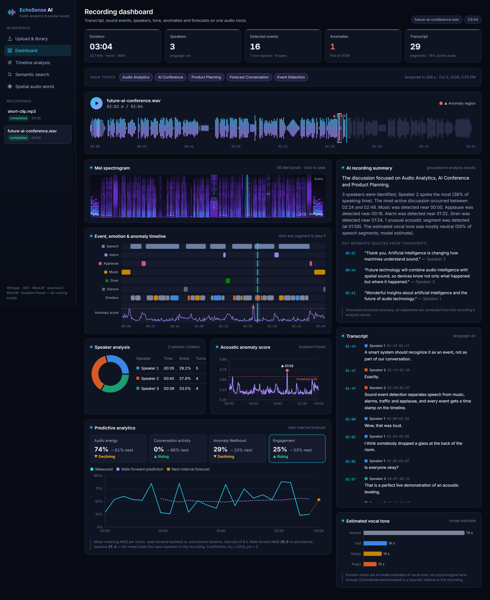
</p>

## 🕒 Synchronized Timeline Analysis

Spectrogram, one lane per speaker, one lane per sound-event type, emotion and anomaly score on a single time axis; the transcript follows playback.

<p align="center">
  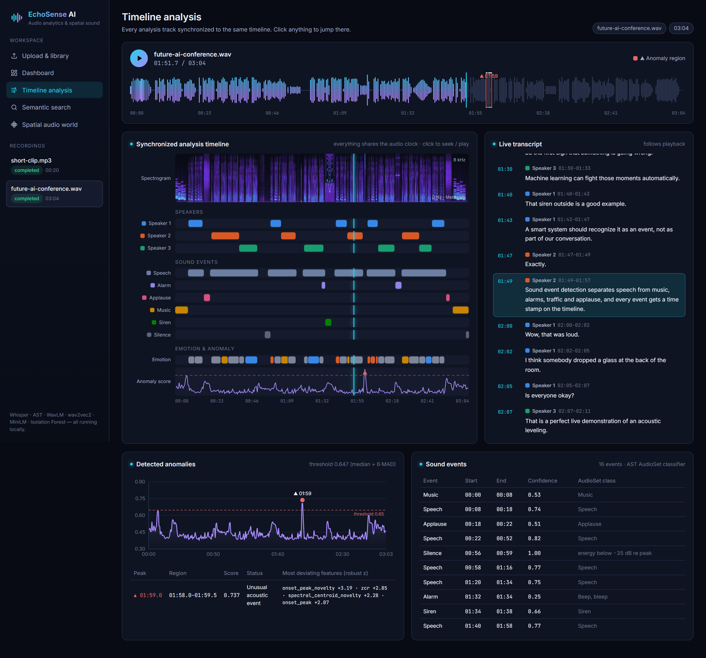
</p>

## 🔎 Semantic Search

*"Where did they discuss artificial intelligence?"* — ranked transcript moments with speaker, timestamp and cosine similarity.

<p align="center">
  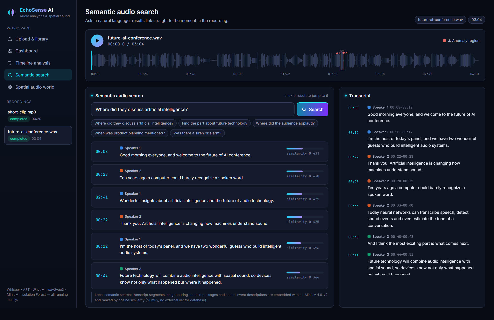
</p>

## 🌐 Spatial Audio World

Speaker 2 is playing through an HRTF panner; the dashed line links the listener to the active source.

<p align="center">
  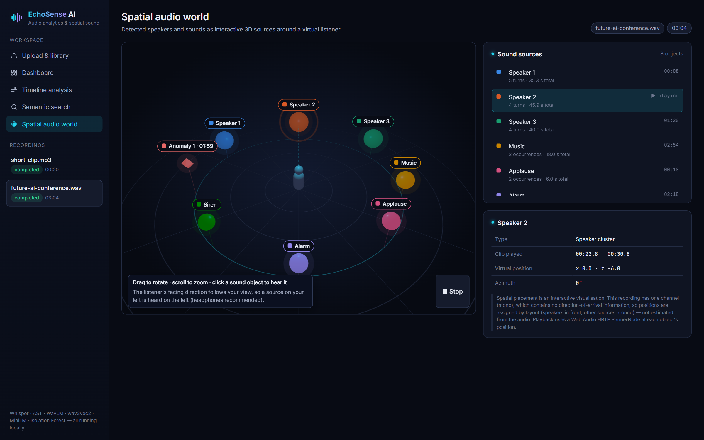
</p>

## 📤 Upload & Live Processing

A second recording (an MP3) mid-analysis: the 9-stage pipeline, progress and the SQLite-backed library.

<p align="center">
  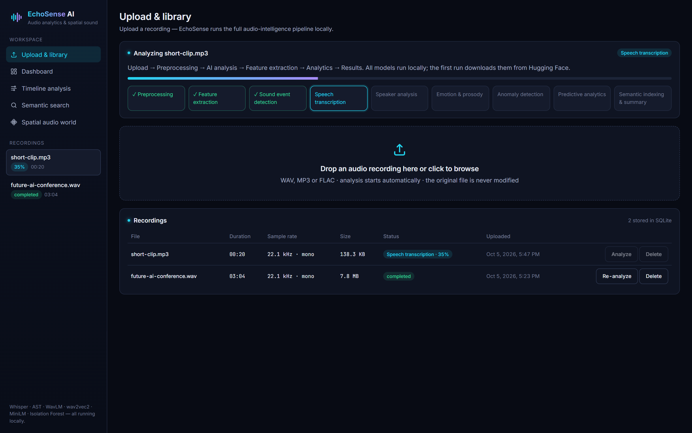
</p>

## 🧩 Components

<table>
<tr>
<td width="50%">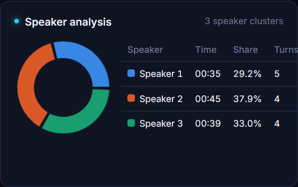<p align="center"><sub>Speaker share, time and turns</sub></p></td>
<td width="50%">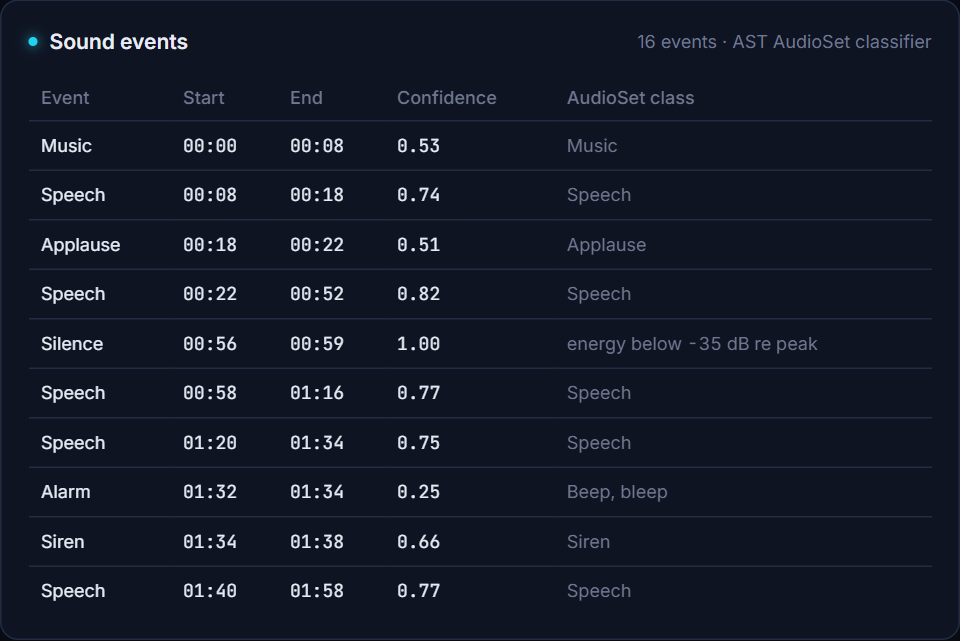<p align="center"><sub>Sound events with AudioSet source class</sub></p></td>
</tr>
<tr>
<td colspan="2">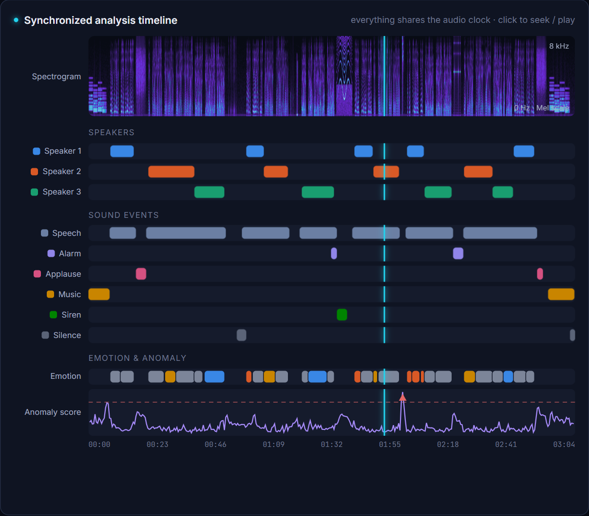<p align="center"><sub>Every lane shares the audio clock — click to seek or play</sub></p></td>
</tr>
</table>

---

# ⚠️ Limitations

- **Speaker analysis is clustering, not identification** — one speaker per transcript segment, overlapping speech is not separated, and very short segments inherit the previous speaker. A full diarization model (e.g. pyannote) would handle overlaps but requires a gated model and an access token, so it was deliberately not used.
- **Emotion labels are model estimates** from a 4-class model trained on acted English speech (IEMOCAP); they are not psychological facts. The Calm / Moderate / Animated arousal label is a heuristic relative to the same recording.
- **Sound-event recall depends on the sound.** On the demo, synthesised keyboard clicks and a door slam were not recognised and the siren onset was briefly labelled *Alarm*. Real recordings of those sounds are classified far more reliably than procedural synthesis.
- **CPU speed.** The AST classifier pads every 2 s window to its 10.24 s input; truncating positional embeddings was 7× faster but lost too much recall on short events, so accuracy was kept. Expect roughly 1.5× real-time on a laptop CPU, much faster on a GPU.
- **Forecasts are short-horizon and recording-local.** With ~24 intervals per file the AR(1) mostly learns mean reversion; it is a trend indicator, not a long-range predictor.
- **Spatial positions are a visualisation** for mono / stereo input — no direction-of-arrival estimation is performed.
- **The demo is synthetic.** The evaluation numbers measure the pipeline on clean TTS speech; real meetings with noise, accents and cross-talk will score lower.
- Single-user local application: no authentication, one analysis runs at a time.

---

# 🚀 Future Improvements

- Overlap-aware diarization and speaker-change detection inside segments
- Multichannel input with real direction-of-arrival estimation (GCC-PHAT / SRP-PHAT) to place sources from data
- Batched GPU inference and a lighter event model (e.g. distilled AST / PANNs) for long recordings
- Live microphone streaming with incremental analysis
- Cross-recording search and comparison
- Optional local LLM for abstractive summaries, constrained to cite timestamps

---

# 📄 License

Released under the [MIT License](LICENSE). The pretrained models are downloaded from Hugging Face under their own licences. The demo recording contains only locally synthesised speech and procedurally generated sounds — no copyrighted material.
