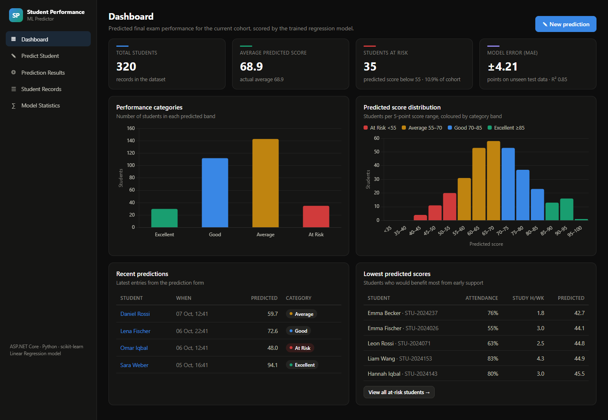
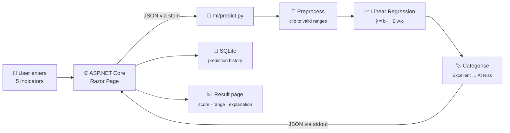
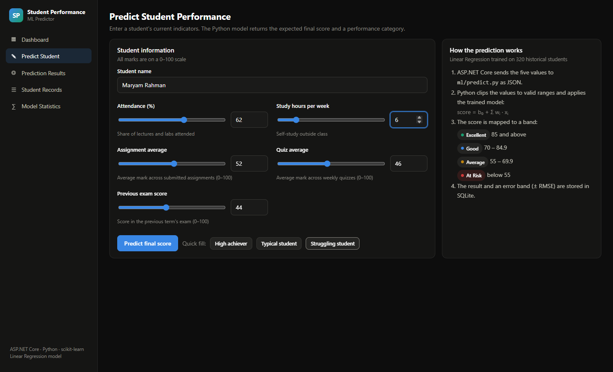
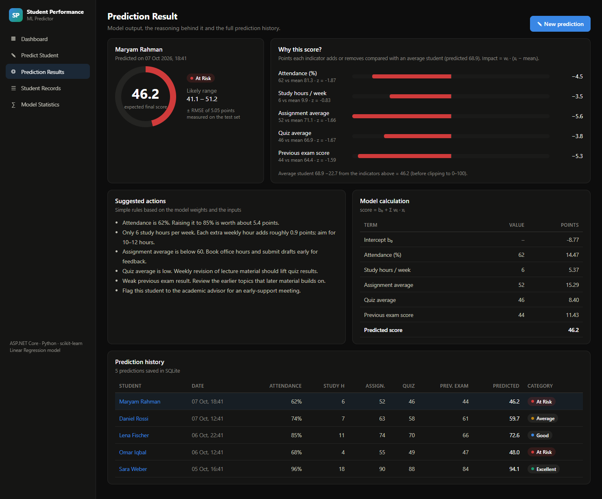
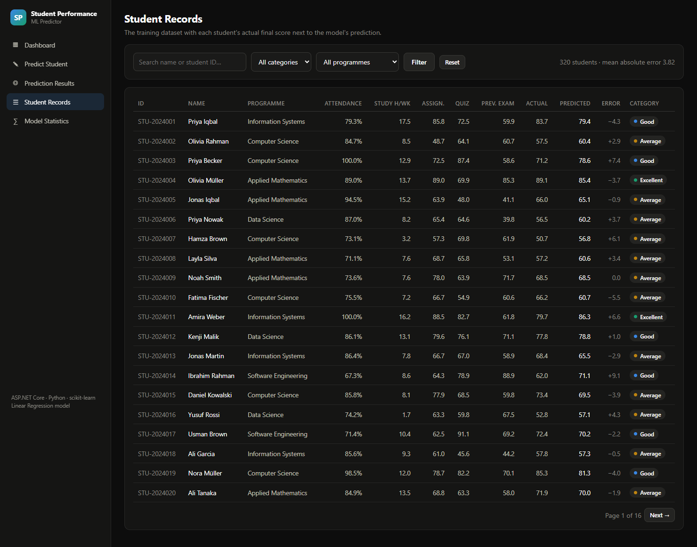
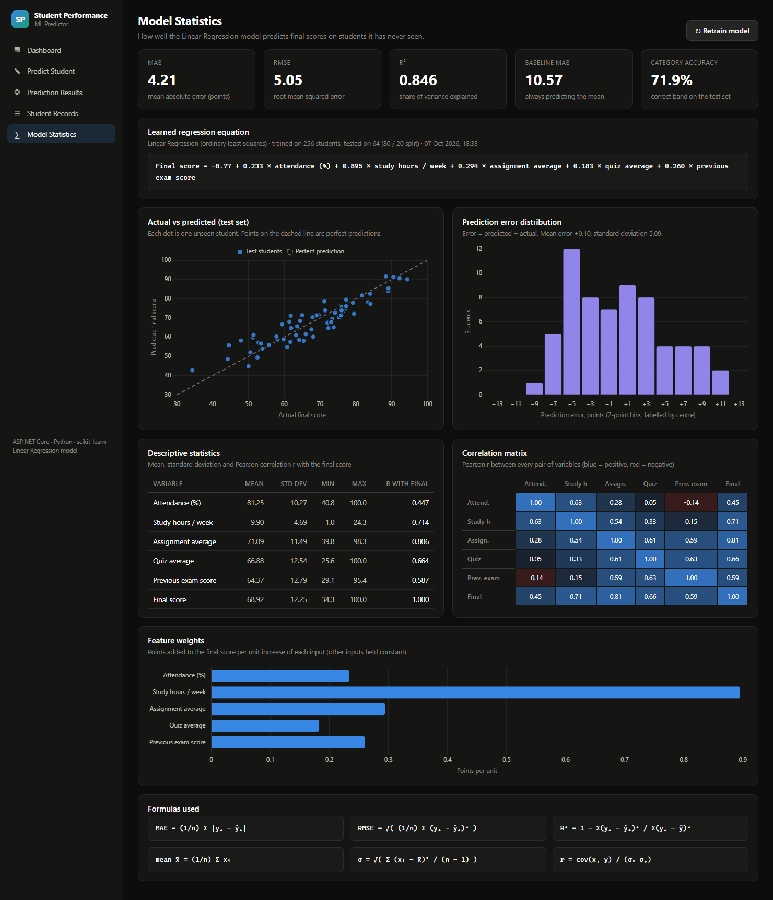

<div align="center">

# 🎓 Student Performance Predictor
## Machine Learning AI for Early Academic Support

### Predict final exam scores · Classify performance · Explain every prediction

<p>
  
  
  
  
  
  
</p>

<p>
  
  
  
  
</p>

<br/>

**Lecturers usually find out a student is struggling when the final exam is marked.**<br/>
**This application predicts the final score weeks earlier from five everyday indicators,
sorts students into performance bands and shows exactly why the model reached its answer.**

<br/>

<a href="#-screenshots"><b>Screenshots</b></a> ·
<a href="#-machine-learning"><b>Machine Learning</b></a> ·
<a href="#-mathematics"><b>Mathematics</b></a> ·
<a href="#-how-to-run-locally"><b>Run It</b></a>

</div>

<br/>

<p align="center">
  
</p>

---

# 🏆 Results at a Glance

<table>
<tr>
<td align="center" width="25%">

### 4.21 points
**Mean absolute error**<br/>
<sub>64 unseen test students</sub>

</td>
<td align="center" width="25%">

### 0.846
**R²**<br/>
<sub>85 % of score variance explained</sub>

</td>
<td align="center" width="25%">

### 10.57 → 4.21
**MAE vs baseline**<br/>
<sub>"always predict the mean" → model</sub>

</td>
<td align="center" width="25%">

### 71.9 %
**Correct performance band**<br/>
<sub>Excellent · Good · Average · At Risk</sub>

</td>
</tr>
</table>

> All numbers come from `ml/model/metrics.json`, written by `python ml/train_model.py` on an 80 / 20 train–test split with a fixed random seed. The same values appear on the **Model Statistics** page.

---

# 📌 Overview

The Student Performance Predictor is a small web application that combines an **ASP.NET Core** front end with a **Python machine learning model**. A user enters five indicators for a student:

| Indicator | Range |
|---|---|
| Attendance percentage | 0–100 % |
| Study hours per week | 0–40 h |
| Assignment average | 0–100 |
| Quiz average | 0–100 |
| Previous exam score | 0–100 |

The system returns:

- 🎯 the **expected final exam score**, with a typical error band (± RMSE)
- 🏷️ a **performance category**: Excellent (≥ 85), Good (70–84.9), Average (55–69.9) or **At Risk** (< 55)
- 🔍 an **explanation**: how many points each indicator adds or removes compared with an average student
- 💡 simple **suggested actions** derived from the model weights

---

# ❓ Problem Statement

Universities collect attendance, quiz and assignment data all term, but it is rarely used to look ahead. Students who are on track to fail are often identified only after the final exam, when it is too late to help.

The goal of this project is to show that a **simple, transparent regression model** trained on historical student records can:

1. predict a student's final score early enough to act on it,
2. flag **at-risk** students automatically, and
3. explain its prediction in terms a lecturer or student understands, instead of acting as a black box.

---

# ✨ Key Features

| Feature | Description |
|---|---|
| 📊 **Dashboard** | Total students, average predicted score, number of students at risk, model MAE / R², category bar chart, score distribution histogram, recent predictions and the lowest predicted scores |
| ✎ **Prediction form** | Sliders and number inputs for the five indicators, validation, and quick-fill profiles (high achiever, typical, struggling) |
| ◎ **Prediction result** | Score ring, category badge, likely range, per-feature impact chart, the full regression calculation and suggested actions |
| ☰ **Student records** | The 320-student dataset with actual vs predicted score and error, search, category and programme filters, paging |
| ∑ **Model statistics** | MAE, RMSE, R², baseline MAE, category accuracy, the learned equation, actual-vs-predicted scatter, error histogram, descriptive statistics, correlation matrix and feature weights |
| ↻ **Retrain** | One click retrains the model from the CSV and re-scores every student |
| 💾 **Persistence** | Students and every prediction are stored in SQLite through Entity Framework Core |

---

# 🔄 System Workflow



On first start the application:

1. creates the SQLite database and imports `ml/data/students.csv`,
2. trains the model if `ml/model/model.joblib` does not exist yet,
3. scores all 320 students so the dashboard and records pages are filled,
4. adds a few sample predictions to the history.

---

# 🏗️ Architecture Overview

```text
┌────────────────────────────── ASP.NET Core (C#) ──────────────────────────────┐
│  Razor Pages            Dashboard · Predict · Result · Students · Model        │
│  DataSeeder             CSV import, first training, batch scoring              │
│  MlService              starts Python, sends JSON on stdin, reads JSON stdout  │
│  AppDbContext (EF Core) Students · Predictions  ──►  App_Data/students.db      │
└───────────────────────────────────────┬───────────────────────────────────────┘
                                        │ short-lived process per request
┌───────────────────────────────────────▼───────────────────────────────────────┐
│  Python (ml/)           train_model.py · predict.py · generate_dataset.py      │
│  scikit-learn           LinearRegression, train_test_split, metrics            │
│  Artefacts              model/model.joblib · model/metrics.json                │
└────────────────────────────────────────────────────────────────────────────────┘
```

**Why a process call instead of a second web server?** The model is tiny and predicts in milliseconds, so starting `python predict.py` per request keeps the project to **one command to run**, with no ports, CORS or service discovery. The contract between the two languages is plain JSON, so the Python side could be moved behind an HTTP API later without changing the C# pages.

---

# 🛠️ Technologies Used

<div align="center">


</div>

<br/>

| Layer | Technology |
|---|---|
| Web application | ASP.NET Core Razor Pages, C# |
| Persistence | Entity Framework Core + SQLite |
| Machine learning | Python, scikit-learn, pandas, NumPy, joblib |
| Charts | Chart.js (served locally from `wwwroot/lib`) |
| Styling | Hand-written CSS, dark dashboard theme shared with the other portfolio projects |
| Screenshots | Python Playwright driving Chrome against the running app |

---

# 🧠 Machine Learning

### Dataset

`ml/generate_dataset.py` creates **320 realistic student records**. Each student has two hidden traits, *academic ability* and *motivation*, which drive the five observable indicators, so the features are correlated with each other the way real data would be. The final score is a weighted sum of the indicators plus random noise (σ = 4.5 points). The model never sees the true weights; it has to learn them from the data.

### Pipeline (`ml/train_model.py`)

| Step | What happens |
|---|---|
| 1. Load | Read `ml/data/students.csv` with pandas |
| 2. Preprocess | Drop incomplete rows, clip every feature to its valid range |
| 3. Describe | Mean, standard deviation, min, max and Pearson correlation with the final score |
| 4. Split | 80 % training (256 students) / 20 % test (64 students), fixed seed |
| 5. Train | `LinearRegression` (ordinary least squares) |
| 6. Evaluate | MAE, RMSE, R², baseline MAE, category accuracy, error mean and spread, on the **test set only** |
| 7. Save | `model/model.joblib` and `model/metrics.json` (read by the web app) |

### Why Linear Regression?

Random Forest Regression was considered. Linear Regression was chosen because:

- the relationship between the indicators and the final score is close to linear,
- every weight is directly interpretable as *"points per unit"*, which powers the explanation on the result page,
- it trains instantly and needs no hyper-parameter tuning.

### What the model learned

The learned weights are close to the weights used to generate the data, which shows the model recovered the real relationship rather than memorising noise:

| Feature | Learned weight | True weight | Meaning |
|---|---:|---:|---|
| Attendance (%) | 0.233 | 0.20 | +2.3 points per 10 % more attendance |
| Study hours / week | 0.895 | 0.85 | +0.9 points per extra weekly hour |
| Assignment average | 0.294 | 0.25 | +2.9 points per 10 assignment marks |
| Quiz average | 0.183 | 0.18 | +1.8 points per 10 quiz marks |
| Previous exam score | 0.260 | 0.30 | +2.6 points per 10 previous-exam marks |

```text
Final score = −8.77 + 0.233·attendance + 0.895·study_hours + 0.294·assignment_avg + 0.183·quiz_avg + 0.260·previous_exam
```

### Explaining a single prediction

For each indicator the result page shows its **impact compared with an average student**:

```text
impactᵢ = wᵢ · (xᵢ − meanᵢ)
predicted score = average student's score + Σ impactᵢ
```

It also shows the z-score of each input, `z = (x − mean) / σ`, so the user can see how unusual each value is.

---

# 📐 Mathematics

| Concept | Formula | Where it appears |
|---|---|---|
| **Regression** | ŷ = b₀ + w₁x₁ + … + w₅x₅, weights chosen to minimise Σ(yᵢ − ŷᵢ)² | Model, result page calculation table |
| **Mean** | x̄ = (1/n) Σ xᵢ | Descriptive statistics, impact vs average student |
| **Standard deviation** | σ = √( Σ (xᵢ − x̄)² / (n − 1) ) | Descriptive statistics, z-scores, error spread |
| **Correlation** | r = cov(x, y) / (σₓ σᵧ) | Correlation with final score and full correlation matrix |
| **Prediction error** | eᵢ = ŷᵢ − yᵢ | Error column in student records, error histogram |
| **MAE** | (1/n) Σ \|yᵢ − ŷᵢ\| | Dashboard KPI, model statistics |
| **RMSE** | √( (1/n) Σ (yᵢ − ŷᵢ)² ) | Model statistics, ± error band on each prediction |
| **R²** | 1 − Σ(yᵢ − ŷᵢ)² / Σ(yᵢ − ȳ)² | Model statistics |

Descriptive statistics of the dataset (from `metrics.json`):

| Variable | Mean | Std dev | r with final score |
|---|---:|---:|---:|
| Attendance (%) | 81.25 | 10.27 | 0.447 |
| Study hours / week | 9.90 | 4.69 | 0.714 |
| Assignment average | 71.09 | 11.49 | 0.806 |
| Quiz average | 66.88 | 12.54 | 0.664 |
| Previous exam score | 64.37 | 12.79 | 0.587 |
| **Final score** | **68.92** | **12.25** | 1.000 |

> RMSE (5.05) is larger than MAE (4.21) because squaring punishes the few larger misses more. On test data the mean error is +0.10, so the model is essentially unbiased.

---

# 📁 Project Structure

```text
ML-Student-Performance-Predictor/
├── ml/
│   ├── data/students.csv            # 320 generated student records
│   ├── model/
│   │   ├── metrics.json             # evaluation output, read by the web app
│   │   └── model.joblib             # trained model (created by train_model.py)
│   ├── common.py                    # feature list, ranges, category bands
│   ├── generate_dataset.py          # creates the synthetic dataset
│   ├── train_model.py               # preprocessing, training, evaluation
│   ├── predict.py                   # JSON in → predictions + explanations out
│   └── requirements.txt
├── src/StudentPredictor.Web/
│   ├── Data/                        # AppDbContext, DataSeeder
│   ├── Models/                      # entities and ML contracts
│   ├── Services/MlService.cs        # bridge to the Python scripts
│   ├── Pages/                       # Dashboard, Predict, Result, Students, Model
│   ├── wwwroot/                     # CSS, Chart.js, chart defaults
│   └── Program.cs
├── scripts/capture_screenshots.py   # README screenshots via Playwright
├── docs/screenshots/
└── README.md
```

---

# 🚀 How to Run Locally

### Prerequisites

- .NET SDK
- Python, available on the PATH as `python`

### 1. Clone

```bash
git clone https://github.com/AbuHurairaPhenologix/AbuHuraira.git
cd AbuHuraira/ML-Student-Performance-Predictor
```

### 2. Install the Python packages

```bash
pip install -r ml/requirements.txt
```

### 3. (Optional) Train the model from the command line

```bash
python ml/train_model.py
```

The web app does this automatically on first start if no trained model exists.

### 4. Start the web application

```bash
dotnet run --project src/StudentPredictor.Web
```

Open **http://localhost:5210**.

On first start the app creates `src/StudentPredictor.Web/App_Data/students.db`, imports the dataset, trains the model if needed and scores every student. Delete the `App_Data` folder to start again from a clean database.

> If Python is installed under another name (for example `py` or `python3`), change `MachineLearning:PythonExecutable` in `src/StudentPredictor.Web/appsettings.json`.

### Useful commands

```bash
# Regenerate the dataset (optionally with another size or seed)
python ml/generate_dataset.py --rows 320 --seed 42

# Predict from the command line
echo '[{"attendance":92,"study_hours":14,"assignment_avg":81,"quiz_avg":77,"previous_exam":72}]' | python ml/predict.py

# Re-capture the README screenshots (app must be running; uses Playwright + Chrome)
python scripts/capture_screenshots.py
```

---

# 🎮 Sample Usage

1. Open **Predict Student** and enter a name, or click a quick-fill profile.
2. Example input: attendance **62 %**, **6** study hours per week, assignments **52**, quizzes **46**, previous exam **44**.
3. Click **Predict final score**. The model returns **46.2 → At Risk**, likely range 41.1–51.2.
4. The result page shows why: every indicator is below the cohort average. Assignments (−5.6 points) and the previous exam (−5.3) pull the score down the most.
5. Suggested actions include *"Raising attendance to 85 % is worth about 5.4 points"*. That figure is computed from the learned attendance weight.
6. The prediction is saved and appears in the history and on the dashboard.

---

# 📸 Screenshots

All screenshots are real captures of the running application ([`scripts/capture_screenshots.py`](scripts/capture_screenshots.py)). The prediction shown was submitted through the form during capture.

## 📊 Dashboard

<p align="center"></p>

## ✎ Student Prediction Form

<p align="center"></p>

## ◎ Prediction Result

Score, category and likely range on the left. On the right, the points each indicator adds or removes compared with an average student. Below: suggested actions, the full regression calculation and the prediction history.

<p align="center"></p>

## ☰ Dataset / Student Records

<p align="center"></p>

## ∑ Model Statistics

<p align="center"></p>

---

# ⚠️ Limitations

- **Synthetic data.** The dataset is generated, not collected from a real university, so the weights describe the simulation. The pipeline would work unchanged on a real CSV with the same columns.
- **Category accuracy is lower than score accuracy.** A student whose real score is 69 and predicted score is 71 is "wrong" by band but only 2 points off. Predictions near a band boundary should be read together with the ± RMSE range.
- **Linear model.** Interactions (for example, study hours mattering more for students with low attendance) are not modelled.
- **Process per request.** Fine for a demo. A high-traffic deployment would keep the model loaded in a long-running service.

# 🔮 Future Improvements

- 🌲 Compare Linear Regression with Random Forest and Gradient Boosting on the Model Statistics page
- 🔁 k-fold cross-validation instead of a single train/test split
- 📥 CSV upload so a lecturer can score a whole class at once
- 📉 Track the same student over several weeks and show the trend of the prediction
- 🔐 Lecturer accounts and per-course datasets

---

# 👨‍💻 Author

<div align="center">

## Abu Huraira

**Software Engineer**

.NET • C# • Python • Machine Learning • Data Analysis

<a href="https://github.com/AbuHurairaPhenologix">

</a>

</div>

---

<div align="center">

## ⭐ Student Indicators → Regression → Prediction → Explanation → Early Support

### Built with C#, ASP.NET Core, Python & scikit-learn

</div>
