<div align="center">

# 🤖 Machine Learning-Based Anomaly Detection
## for Distributed Web Application Logs

### An End-to-End Observability & Machine Learning Platform

<p>
  
  
  
  
  
  
  
</p>

<p>
  
  
  
  
</p>

<br/>

**Detect abnormal operational behavior in distributed applications using structured telemetry,  
window-based feature engineering, unsupervised machine learning, and engineering review.**

<br/>

<a href="#-application-screenshots"><b>Screenshots</b></a> ·
<a href="#-benchmark-results"><b>Benchmark Results</b></a> ·
<a href="#-running-the-project"><b>Run It</b></a> ·
<a href="project_Report/Abu_Huraira_Project_Report.pdf"><b>Project Report (PDF)</b></a>

</div>

<br/>

<p align="center">
  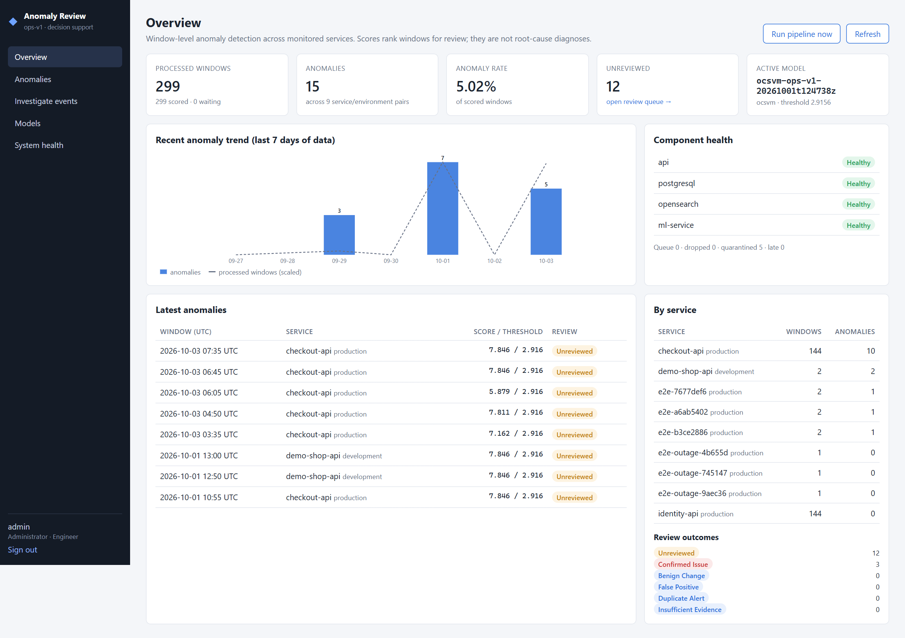
</p>

<p align="center"><sub><i>Live dashboard running on the full Docker stack — 6 hours of backfilled telemetry for two services, with five injected incidents all flagged by the active One-Class SVM model.</i></sub></p>

---

# 🏆 Results at a Glance

<table>
<tr>
<td align="center" width="25%">

### 0.678
**F1-score**<br/>
<sub>One-Class SVM, untouched test set</sub>

</td>
<td align="center" width="25%">

### 0.66%
**False-positive rate**<br/>
<sub>53 false alerts in 8,000 normal windows</sub>

</td>
<td align="center" width="25%">

### 5 / 5
**Injected incidents flagged**<br/>
<sub>live demo, 144 windows, zero false alerts</sub>

</td>
<td align="center" width="25%">

### 4
**Models compared**<br/>
<sub>IF · LOF · OCSVM · RF reference</sub>

</td>
</tr>
</table>

<p align="center">


</p>

---

# 📌 Overview

Modern distributed applications generate large amounts of telemetry from APIs, authentication systems, databases, background jobs, integrations, and external dependencies.

Traditional monitoring based on fixed rules is essential, but individual weak signals may look normal while their combined behavior indicates a developing incident.

This project implements an **end-to-end machine-learning-assisted anomaly detection platform** that:

- 📥 collects structured application events
- 🧹 validates and normalizes telemetry
- 🪟 aggregates events into observation windows
- 🧮 generates operational feature vectors
- 🤖 scores them using multiple ML models
- 🎯 applies validation-selected thresholds
- 💾 persists anomaly context and model information
- 🔍 retrieves related application events
- 👨‍💻 allows engineers to review flagged behavior

> **Machine learning in this project is used as decision support.**
>
> An anomaly score indicates unusual operational behavior that should be investigated.  
> It does not automatically represent a confirmed incident, security breach, or root cause.

---

# 🖼️ System at a Glance

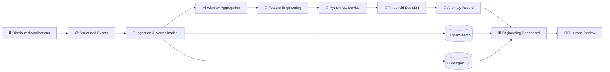

---

# ✨ Key Features

<table>
<tr>
<td width="50%">

### 📊 Structured Observability

- Canonical event schema
- Correlation IDs
- Service and environment tracking
- Request duration
- Status codes
- Dependency results
- Authentication events
- Background job telemetry

</td>
<td width="50%">

### 🤖 Machine Learning

- Isolation Forest
- Local Outlier Factor
- One-Class SVM
- Random Forest reference
- Validation-based thresholds
- Versioned model artifacts
- Reproducible experiments

</td>
</tr>

<tr>
<td width="50%">

### 🔍 Investigation

- Related raw events
- Feature-window context
- Model score
- Active threshold
- Model version
- Reason summary
- Review history

</td>
<td width="50%">

### 🛡️ Production-Oriented Design

- Background ML processing
- Failure isolation
- Secret sanitization
- Model registry
- Authorization
- Audit logging
- Health checks

</td>
</tr>
</table>

---

# 🧠 Machine Learning Pipeline

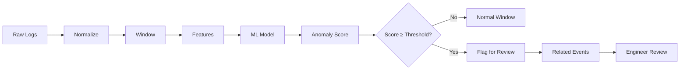

The model operates on **window-level numerical features**, rather than raw natural-language log messages.

This makes the system less dependent on vendor-specific log formats and makes the feature space easier to explain.

---

# 🧮 Feature Engineering

The initial feature schema is versioned as:

```text
ops-v1
```

Eight operational features are calculated for every observation window.

| # | Feature | Purpose |
|---:|---|---|
| 1 | `request_count` | Traffic volume during the observation window |
| 2 | `error_rate` | Fraction of application requests resulting in errors |
| 3 | `avg_duration_ms` | Mean request latency |
| 4 | `p95_duration_ms` | 95th-percentile request latency |
| 5 | `auth_failure_rate` | Authentication/authorization failure ratio |
| 6 | `dependency_failure_count` | Failed database/external service calls |
| 7 | `retry_count` | Retry attempts from jobs or integrations |
| 8 | `endpoint_entropy` | Diversity of endpoint activity |

### Feature Categories

```text
Traffic
 └── request_count

Reliability
 └── error_rate

Performance
 ├── avg_duration_ms
 └── p95_duration_ms

Security / Access
 └── auth_failure_rate

Dependencies
 └── dependency_failure_count

Resilience
 └── retry_count

Traffic Diversity
 └── endpoint_entropy
```

---

# 🪟 Observation Windows

Operational events are aggregated into configurable time windows.

### Default

```text
5 Minutes
```

### Supported

```text
1 Minute
5 Minutes
15 Minutes
```

Feature windows are separated by:

```text
Service
   +
Environment
   +
Time Window
```

This prevents unrelated services from being mixed into the same feature vector.

---

# 🤖 Machine Learning Models

## 🌲 Isolation Forest

Used as a transparent anomaly-detection baseline.

**Advantages**

- No anomaly labels required
- Handles nonlinear relationships
- Efficient for tabular operational data
- Good baseline for anomaly isolation

---

## 📍 Local Outlier Factor

Implemented using novelty detection.

```python
LocalOutlierFactor(
    novelty=True
)
```

LOF compares each observation with the density of neighboring observations, making it useful when normal operational behavior contains multiple local patterns.

---

## 🧠 One-Class SVM

Learns a nonlinear boundary representing normal operational behavior.

```text
Feature Vector
      ↓
StandardScaler
      ↓
One-Class SVM
      ↓
Anomaly Score
```

Typical configuration:

```python
OneClassSVM(
    kernel="rbf",
    nu=0.04,
    gamma="scale"
)
```

---

## 🌳 Random Forest

Random Forest is included as a **supervised reference model**.

It demonstrates how access to reliable anomaly labels changes the learning problem.

It is **not treated as the primary unsupervised production detector**.

---

# 🎯 Unified Anomaly Score

Different Scikit-learn algorithms expose different score conventions.

The scoring layer normalizes these differences.

The application uses one consistent rule:

<div align="center">

## 🔺 Higher Score = More Anomalous

</div>

This keeps model-specific scoring behavior hidden behind a stable API contract.

---

# ⚖️ Threshold Selection

Anomaly detection models generate continuous scores.

Operational systems require a decision:

```text
Should this window generate an alert?
```

Instead of relying solely on model defaults, candidate thresholds are evaluated on validation data.

Metrics include:

- Precision
- Recall
- F1-score
- False Positive Rate
- Confusion Matrix
- Review burden

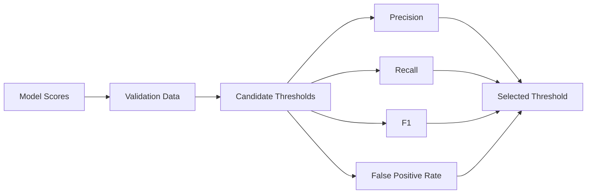

The selected threshold is stored with the corresponding model version.

Historical anomaly records preserve the **exact threshold used at scoring time**.

---

# 🧪 Synthetic Benchmark

To evaluate the system without exposing real production telemetry, the project includes a reproducible synthetic benchmark.

### Dataset

```text
Normal Windows      ≈ 32,000
Anomaly Windows     ≈ 1,800
```

Synthetic normal behavior includes distributions representing:

| Signal | Distribution |
|---|---|
| Request count | Poisson |
| Average latency | Log-normal |
| P95 latency | Correlated latency distribution |
| Error rate | Low-probability Beta |
| Authentication failures | Low-probability Beta |
| Dependency failures | Zero-inflated Poisson |
| Retries | Zero-inflated Poisson |
| Endpoint entropy | Bounded distribution |

---

# 🚨 Controlled Anomaly Scenarios

The benchmark generates several abnormal operational patterns.

<p align="center">


</p>

Controlled anomalies intentionally overlap with normal behavior.

The objective is not to create an artificially perfect classifier, but to evaluate realistic threshold trade-offs.

---

# 🧪 Training Strategy

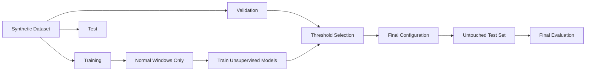

For unsupervised models:

> **Only normal training windows are used during model fitting.**

Validation data is used for threshold selection.

The final test set remains untouched until model and threshold selection are complete.

---

# 📊 Evaluation Metrics

The evaluation framework measures:

<p align="center">


</p>

Every evaluation run writes a self-contained, versioned folder under `artifacts/evaluations/`:

```text
eval-<training-run>-<timestamp>/
├── benchmark.yaml            # exact config used
├── environment.json          # library versions, seed, config hash
├── metrics.json / .csv       # test-set metrics per model
├── per_type_recall.csv       # recall per anomaly scenario
├── threshold_sensitivity_*.csv
├── report.md                 # human-readable summary
└── plots/                    # comparison, confusion, distributions, sensitivity
```

---

# 📈 Benchmark Results

Results below come from the committed run
[`eval-20261001t124738z-20261001t124752z`](artifacts/evaluations/eval-20261001t124738z-20261001t124752z/report.md):
**8,000 normal + 450 anomaly test windows**, seed `20220215`, thresholds selected on the validation split and applied once to the untouched test set.

| Model | Precision | Recall | F1 | FPR | ROC-AUC | PR-AUC |
|---|---:|---:|---:|---:|---:|---:|
| Isolation Forest | 0.318 | 0.411 | 0.359 | 4.95% | 0.825 | 0.312 |
| Local Outlier Factor | **0.859** | 0.529 | 0.655 | **0.49%** | 0.827 | 0.642 |
| **One-Class SVM** ⭐ | 0.830 | **0.573** | **0.678** | 0.66% | **0.830** | **0.662** |
| Random Forest *(supervised reference)* | 0.854 | 0.584 | 0.694 | 0.56% | 0.858 | 0.680 |

⭐ **One-Class SVM** is the recommended production model (best validation F1 among unsupervised models) and is activated automatically on first start. It gets within **0.016 F1** of the supervised Random Forest — **without using a single anomaly label during training**.

<p align="center">
  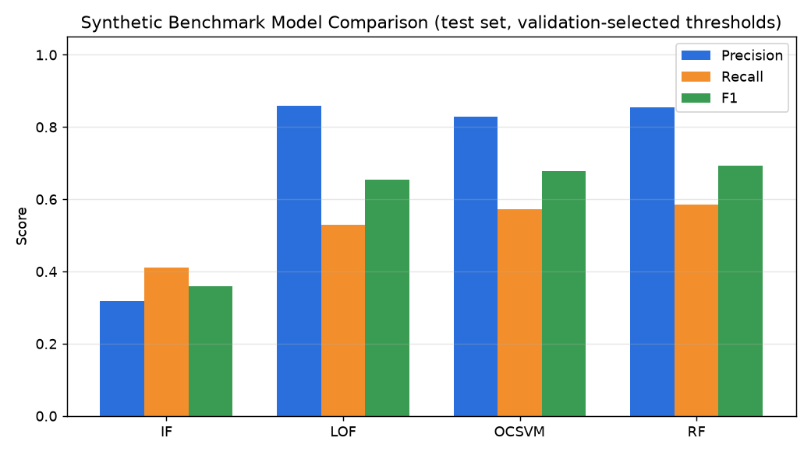
</p>

<table>
<tr>
<td width="50%">
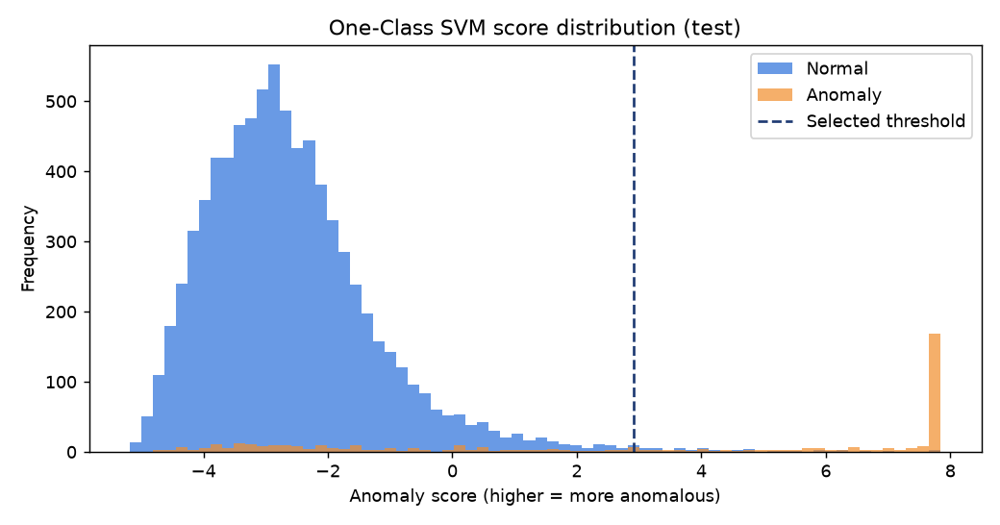
<p align="center"><sub><b>Score separation</b> — normal windows (blue) sit well below the validation-selected threshold; anomalies (orange) pile up at the top of the scale.</sub></p>
</td>
<td width="50%">
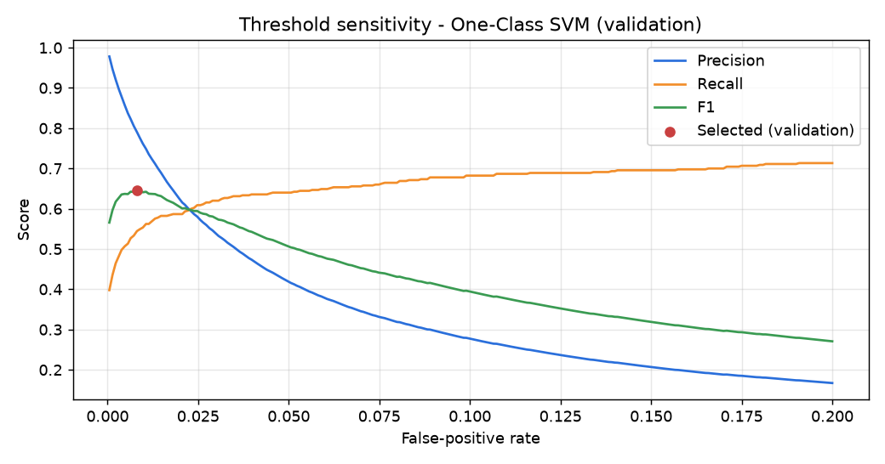
<p align="center"><sub><b>Threshold sensitivity</b> — the precision / recall / FPR trade-off that drives threshold selection.</sub></p>
</td>
</tr>
</table>

<p align="center">
  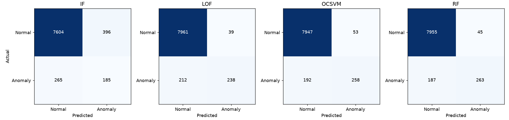
</p>

### Recall by Anomaly Scenario

| Model | Latency spike | Traffic surge | Error burst | Auth-failure burst | Dependency instability | Retry burst |
|---|---:|---:|---:|---:|---:|---:|
| Isolation Forest | 0.95 | 0.36 | 0.41 | 0.37 | 0.20 | 0.17 |
| Local Outlier Factor | 0.85 | 1.00 | 0.68 | 0.55 | 0.04 | 0.05 |
| **One-Class SVM** | 0.87 | 1.00 | 0.77 | 0.57 | 0.12 | 0.11 |
| Random Forest *(ref.)* | 0.92 | 1.00 | 0.95 | 0.61 | 0.01 | 0.01 |

<p align="center">
  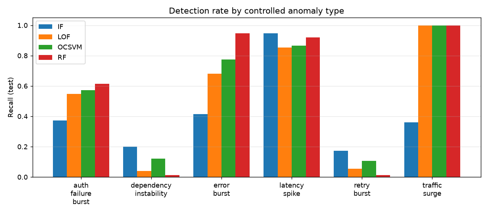
</p>

> **Honest reading of the numbers:** latency, traffic and error anomalies are caught reliably, while low-intensity dependency and retry anomalies are deliberately generated to overlap with normal behaviour and remain hard for every model — including the supervised one. That is exactly the trade-off the threshold-selection and human-review workflow exist to manage.

---

# 🏗️ Backend Architecture

The backend uses **ASP.NET Core** and is separated into four main layers.

```text
AnomalyDetection.Api
        │
        ▼
AnomalyDetection.Application
        │
        ▼
AnomalyDetection.Domain
        ▲
        │
AnomalyDetection.Infrastructure
```

### Responsibilities

#### API

- HTTP endpoints
- Authentication
- Authorization
- Swagger
- Request validation

#### Application

- Use cases
- Feature processing
- Scoring orchestration
- Review workflows

#### Domain

- Entities
- Business rules
- Core abstractions

#### Infrastructure

- PostgreSQL
- OpenSearch
- ML API client
- External services

---

# 🐍 Python ML Service

The machine-learning component is implemented as an independent Python service.

### Technologies

<p>

</p>

Core responsibilities:

- Dataset generation
- Model training
- Model evaluation
- Model artifact loading
- Schema validation
- Single-window scoring
- Batch scoring
- Model registry integration

Example structure:

```text
src/ml-service/app/

├── api/
├── core/
├── datasets/
├── evaluation/
├── models/
├── registry/
├── scoring/
├── schemas/
└── training/
```

---

# 🔌 Internal ML API

Example endpoint:

```http
POST /internal/anomaly/score
```

### Request

```json
{
  "windowId": "5c7151f0-7f65-4d34-bf80-2bfa6507b66c",
  "service": "identity-api",
  "environment": "production",
  "windowStartUtc": "2022-02-15T14:30:00Z",
  "windowEndUtc": "2022-02-15T14:35:00Z",
  "modelVersion": "ocsvm-demo-v1",
  "schemaVersion": "ops-v1",
  "features": {
    "request_count": 142,
    "error_rate": 0.031,
    "avg_duration_ms": 248.4,
    "p95_duration_ms": 681.7,
    "auth_failure_rate": 0.017,
    "dependency_failure_count": 1,
    "retry_count": 0,
    "endpoint_entropy": 2.31
  }
}
```

### Response

```json
{
  "score": 6.84,
  "threshold": 6.28,
  "isAnomaly": true,
  "modelVersion": "ocsvm-demo-v1",
  "schemaVersion": "ops-v1"
}
```

---

# 📋 Canonical Event Schema

The structured event model includes fields such as:

```text
EventTimestamp
ServiceName
Environment
EventType
EndpointGroup

StatusCode
DurationMs
ErrorFlag

AuthenticationResult
DependencyName
RetryCount

CorrelationId
```

These fields provide both:

```text
Feature Inputs
      +
Investigation Context
```

---

# 🧹 Event Processing

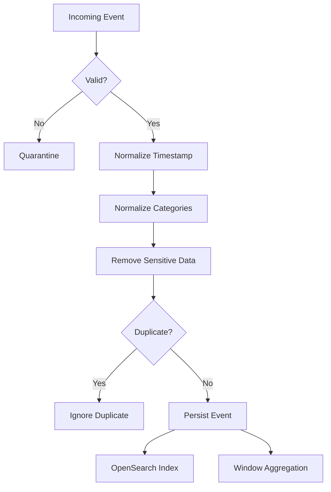

The normalization layer handles:

- malformed timestamps
- timezone normalization
- duplicate events
- missing optional values
- invalid numerical values
- categorical normalization
- negative durations
- quarantine of malformed records

---

# 🔐 Security & Privacy

Operational logs can accidentally contain sensitive information.

The analytical pipeline therefore prevents secrets from entering the ML dataset.

### Excluded Data

```text
❌ Passwords
❌ Access Tokens
❌ API Keys
❌ Authorization Headers
❌ Client Secrets
❌ Session Cookies
❌ Raw Credentials
```

Sensitive values are removed or sanitized before analytical processing.

---

# 🛡️ Failure Isolation

Machine learning is deliberately kept outside the critical user-request path.

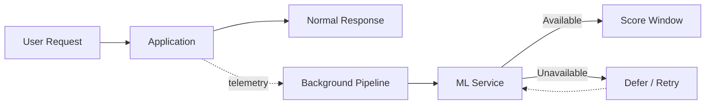

If the ML service becomes unavailable:

```text
✅ Normal application processing continues

⏳ Anomaly scoring is delayed/retried
```

This prevents the analytics platform from becoming a source of application downtime.

---

# 🐘 PostgreSQL

PostgreSQL stores durable operational state.

Important entities include:

```text
ServiceDefinition
OperationalEvent
QuarantinedEvent

FeatureWindow
ModelVersion
ScoringRecord

AnomalyRecord
AnomalyReview
AuditEvent
```

---

# 🔎 OpenSearch

OpenSearch provides high-cardinality event investigation.

Engineers can retrieve context using:

- Service
- Environment
- Time range
- Correlation ID
- Event type

The frontend does not receive unrestricted OpenSearch query access.

Search queries are constructed and constrained by the backend.

---

# 👨‍💻 Human Review Workflow

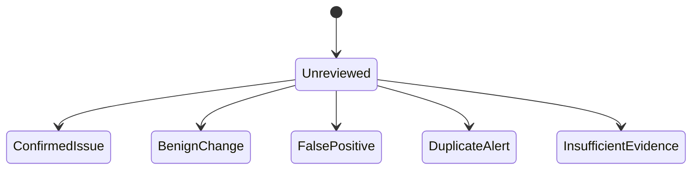

Possible review outcomes:

| Outcome | Meaning |
|---|---|
| `ConfirmedIssue` | Engineer confirmed abnormal system behavior |
| `BenignChange` | Unusual behavior was legitimate |
| `FalsePositive` | Model incorrectly flagged normal behavior |
| `DuplicateAlert` | Same underlying incident already represented |
| `InsufficientEvidence` | Available context was not enough |

Reviewer feedback is preserved for future tuning and analysis.

---

# 🖥️ Engineering Dashboard

The frontend provides an investigation-focused dashboard.

### 📊 Overview

Displays:

- Total processed windows
- Anomaly count
- Anomaly rate
- Unreviewed alerts
- Active model
- Recent trends
- System health

### 🚨 Anomalies

Filter anomalies by:

- Service
- Environment
- Time range
- Model
- Review state

### 🔍 Anomaly Details

Displays:

- Score
- Threshold
- Model version
- Observation window
- Eight feature values
- Reason summary
- Related events
- Correlation IDs
- Review history

### 🤖 Models

Displays:

- Algorithm
- Version
- Feature schema
- Threshold
- Training metadata
- Activation status

### ❤️ System Health

Monitors:

```text
ASP.NET Core Backend
PostgreSQL
OpenSearch
Python ML Service
```

---

# 📸 Application Screenshots

All screenshots were captured from the running Docker Compose stack (Angular → ASP.NET Core → PostgreSQL / OpenSearch / Python ML service) after replaying 6 hours of telemetry with `scripts/seed/backfill_events.py`.

## 🔍 Anomaly Investigation

A flagged `checkout-api` latency-spike window. The page shows **why** it was flagged (non-causal reason summary), the **score vs. the exact threshold used**, the model version that produced it, all eight `ops-v1` features with **z-scores against the training baseline** (average and p95 latency light up at 7.46σ and 7.07σ), the raw related events pulled from OpenSearch, correlation IDs, and the review form.

<p align="center">
  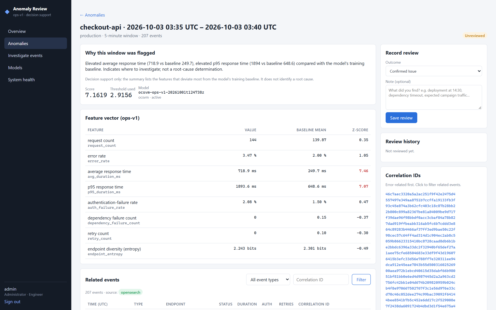
</p>

## 🚨 Anomaly Queue

Ranked windows whose score met the model's validated threshold, with a score-vs-threshold bar, model version and review state. Filterable by service, environment, review state and time range.

<p align="center">
  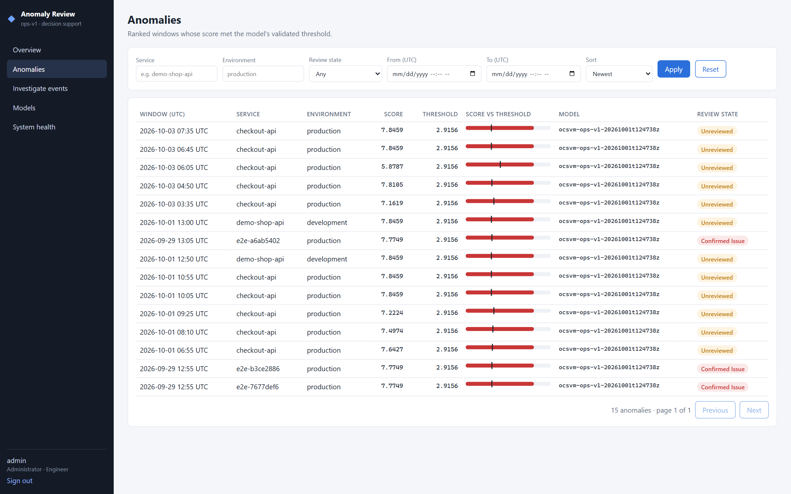
</p>

## 🤖 Model Governance

Four registered model versions with seed, training period, validated threshold and validation P / R / F1 / FPR. The supervised Random Forest is marked **reference only** and cannot be activated. Activation is admin-only and audited; retraining is an explicit action and always registers new versions as *inactive*.

<p align="center">
  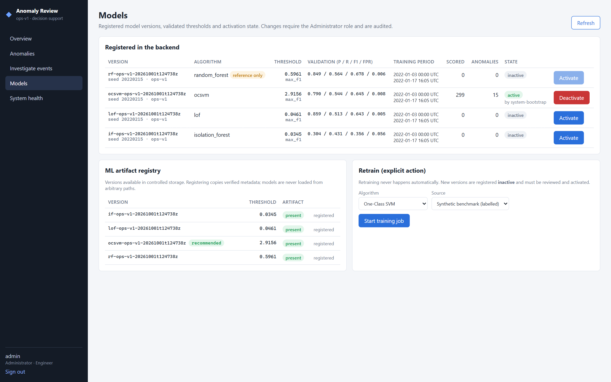
</p>

<table>
<tr>
<td width="50%">

### 🔎 Event Investigation

Backend-constrained OpenSearch search across ~60,000 normalized events by service, environment, time range, correlation ID and event type.

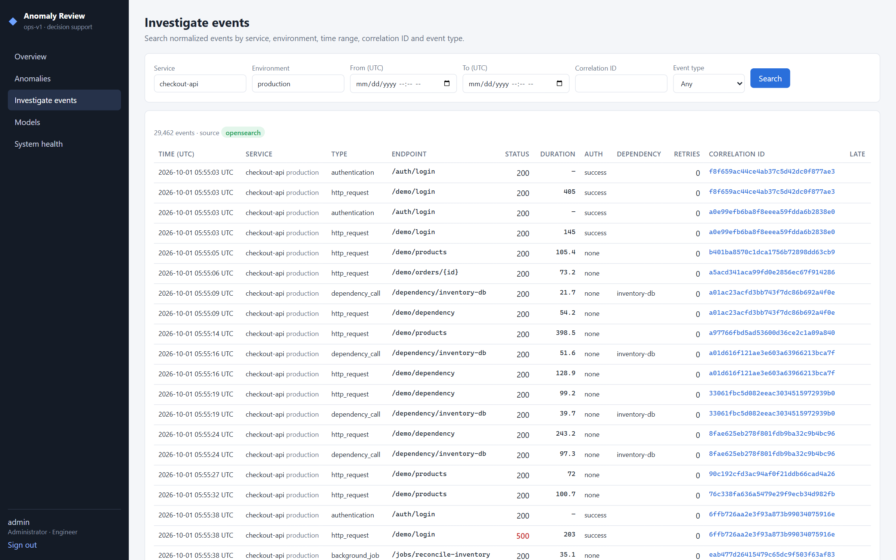

</td>
<td width="50%">

### ❤️ System Health

Live health of the API, PostgreSQL, OpenSearch and the ML service, plus pipeline counters and background-worker run / failure history.

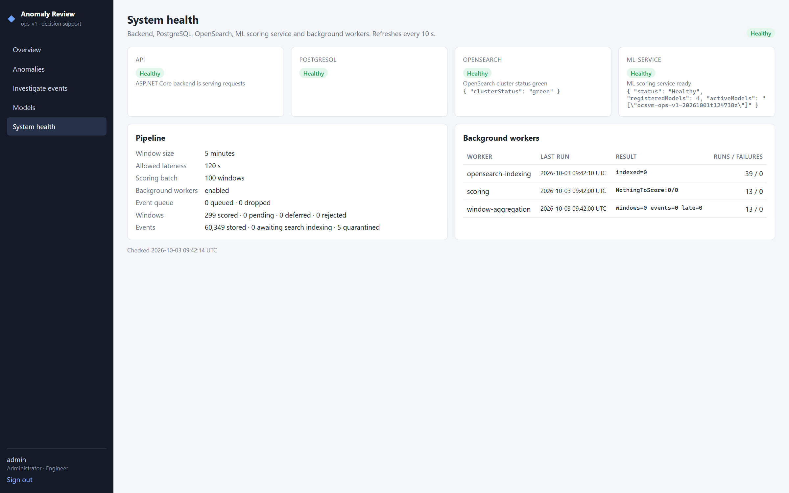

</td>
</tr>
</table>

---

# 🛠️ Technology Stack

<div align="center">

### Backend


### Machine Learning


### Frontend


### Databases & Search


### DevOps


</div>

<br/>

| Layer | Technology |
|---|---|
| Backend | ASP.NET Core / C# |
| Machine Learning API | Python / FastAPI |
| ML | Scikit-learn |
| Data Processing | Pandas / NumPy |
| Frontend | Angular / TypeScript |
| Database | PostgreSQL |
| Search | OpenSearch |
| Containerization | Docker / Docker Compose |
| API Documentation | Swagger / OpenAPI |
| Backend Testing | xUnit |
| Python Testing | Pytest |
| Source Control | Git / GitHub |

---

# 📁 Repository Structure

```text
.
├── src/
│   │
│   ├── backend/
│   │   ├── AnomalyDetection.Api/
│   │   ├── AnomalyDetection.Application/
│   │   ├── AnomalyDetection.Domain/
│   │   └── AnomalyDetection.Infrastructure/
│   │
│   ├── ml-service/
│   │   └── app/
│   │
│   └── frontend/
│
├── tests/
│   ├── integration/
│   └── e2e/
│
├── artifacts/
│   ├── models/
│   └── evaluations/
│
├── config/
├── data/
├── docs/
│   └── images/             # dashboard screenshots
├── project_Report/
│   └── Abu_Huraira_Project_Report.pdf
├── scripts/
│
├── docker-compose.yml
├── .env.example
└── README.md
```

---

# 🚀 Running the Project

## 1. Clone

```bash
git clone https://github.com/AbuHurairaPhenologix/AbuHuraira.git
cd AbuHuraira/Ml-Log-Anomaly-Detection
```

---

## 2. Generate Local Configuration

```bash
python scripts/setup/generate_env.py
```

---

## 3. Start Complete Stack

```bash
docker compose up -d --build
```

---

## 4. Open Dashboard

```text
http://localhost:8081
```

---

## 5. Swagger

```text
http://localhost:5080/swagger
```

---

# 🎮 Demo

Generate representative application telemetry:

```bash
python scripts/seed/backfill_events.py --hours 6
```

The demo workload can simulate:

```text
Normal Traffic

Latency Spike
Authentication Failure Burst
Dependency Failure
Retry Storm
Traffic Surge
Error Burst
```

This enables the complete pipeline to be demonstrated without requiring sensitive enterprise production logs.

---

# 🧠 Model Training

From the ML service environment:

```bash
python -m app.training.train
```

Training includes:

```text
Dataset Loading
      ↓
Preprocessing
      ↓
Model Training
      ↓
Validation Scoring
      ↓
Threshold Selection
      ↓
Artifact Creation
      ↓
Model Registration
```

---

# 📊 Model Evaluation

```bash
python -m app.evaluation.evaluate
```

Or:

```powershell
scripts\benchmark\run_benchmark.ps1
```

---

# 🧪 Tests

### .NET

```bash
dotnet test
```

### Python

```bash
pytest
```

### Angular

```bash
npm test
```

### Docker

```bash
docker compose config
```

---

# ✅ Functional Requirements

| ID | Requirement |
|---|---|
| FR-01 | Ingest structured operational events |
| FR-02 | Validate and normalize events |
| FR-03 | Aggregate events into configurable observation windows |
| FR-04 | Generate versioned feature vectors |
| FR-05 | Score windows using a registered ML model |
| FR-06 | Persist score, threshold, model version and context |
| FR-07 | Retrieve related events for investigation |
| FR-08 | Record review outcomes and reviewer notes |
| FR-09 | Register, activate and deactivate model versions |

---

# ⚙️ Non-Functional Requirements

### 🔐 Security

Sensitive authentication material must not enter the analytical feature dataset.

### ⚡ Performance

Machine-learning inference remains outside the critical user-request path.

### 🔎 Traceability

Each alert preserves:

```text
Feature Window
Model Version
Anomaly Score
Threshold
Source Context
```

### 🔄 Reproducibility

The project versions:

```text
Random Seed
Feature Schema
Model Configuration
Threshold Configuration
Evaluation Procedure
```

### 🛡️ Resilience

ML service failure must not interrupt ordinary application processing.

### 🧩 Maintainability

.NET and Python communicate through a stable, versioned service contract.

---

# 🧪 Project Test Cases

| Test | Scenario | Expected Behavior |
|---|---|---|
| TC-01 | Normal feature window | Score returned without unnecessary alert |
| TC-02 | Feature schema mismatch | Request rejected |
| TC-03 | Missing model version | Request rejected |
| TC-04 | ML service timeout | Application continues; scoring deferred |
| TC-05 | High latency | Anomaly score increases |
| TC-06 | Authentication burst | Authentication failure feature increases |
| TC-07 | Unauthorized activation | Administrative operation rejected |
| TC-08 | Secret-like field | Removed/rejected before training |
| TC-09 | Duplicate event | Event not counted twice |
| TC-10 | Late event | Defined aggregation policy applied |

---

# 🎯 Design Philosophy

## ML is not the incident responder

The platform does **not automatically**:

```text
❌ Block users
❌ Restart services
❌ Disable integrations
❌ Declare security incidents
❌ Claim root cause
```

Instead:

```text
ML Detection
     ↓
Operational Context
     ↓
Engineer Investigation
     ↓
Human Decision
```

---

# 🔬 Project Scope

### Included

✅ Structured application telemetry  
✅ API logs  
✅ Authentication activity  
✅ Dependencies  
✅ Background jobs  
✅ Integration telemetry  
✅ Window-based features  
✅ Machine-learning scoring  
✅ Anomaly investigation  
✅ Human review  

### Outside Scope

❌ Network packet inspection  
❌ Malware detection  
❌ Source-code vulnerability scanning  
❌ Automated root-cause diagnosis  

---

# ⚠️ Limitations

The benchmark uses controlled synthetic anomaly scenarios.

Real-world production systems may introduce:

- concept drift
- traffic seasonality
- changing infrastructure
- application releases
- unseen anomaly patterns
- incomplete incident labels
- operational workflow differences

Therefore, benchmark performance should not be interpreted as guaranteed production performance.

Production deployment would require additional shadow-mode validation and operational acceptance testing.

---

# 🔮 Future Work

Possible extensions include:

- 📈 Concept drift monitoring
- 🎯 Adaptive service-specific thresholds
- 🧠 Sequence-based models
- 🕸️ Dependency graph analysis
- 🔗 OpenTelemetry integration
- 🔄 Semi-supervised learning
- 👨‍💻 Reviewer-feedback learning
- 📊 Feature attribution
- 🚦 Canary model deployment
- ⏪ Model rollback

---

# 🎓 Academic Context

This project was developed as a two-semester **Senior Design Project** for the:

**Bachelor of Science in Computer Science**

at:

**COMSATS University Islamabad — Vehari Campus**

The project combines concepts from:

```text
Software Engineering
Machine Learning
Statistics & Probability
Database Systems
Algorithms
Computer Networks
Distributed Systems
Application Security
Observability
```

---

# 👨‍💻 Author

<div align="center">

## Abu Huraira

**Software Engineer**

.NET • C# • Angular • Distributed Systems • Machine Learning

<a href="https://github.com/AbuHurairaPhenologix">

</a>

</div>

---

# 📄 Project Report

The detailed academic report covering the project's motivation, architecture, methodology, feature engineering, machine-learning models, benchmark evaluation and conclusions is included with this repository.

<p align="center">
  <a href="project_Report/Abu_Huraira_Project_Report.pdf">
    
  </a>
</p>

```text
project_Report/Abu_Huraira_Project_Report.pdf
```

---

# ⚠️ Disclaimer

This project is intended for academic, research and engineering demonstration purposes.

Anomaly scores represent unusual operational behavior and should be interpreted alongside traditional monitoring, application logs, and engineering context.

They are not automatic root-cause diagnoses or security decisions.

---

<div align="center">

## ⭐ Structured Logs → Features → Machine Learning → Investigation → Human Review

### Built with .NET, Python, Machine Learning & Distributed Systems

</div>