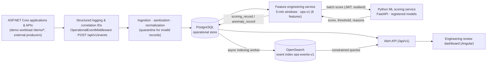
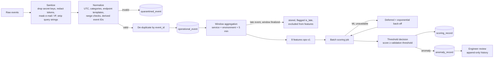
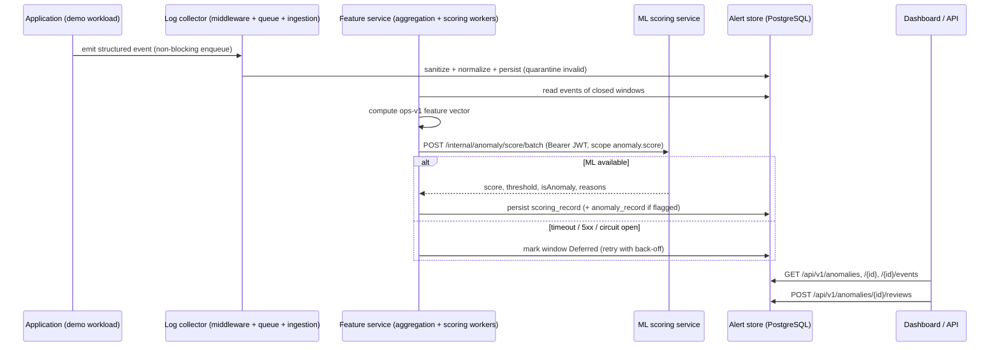
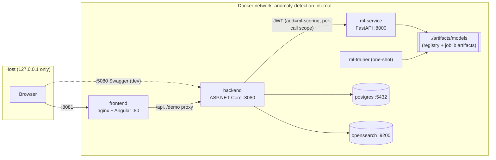

# Architecture

Aligned with the report's Figure 3.2 (high-level architecture), Figure 3.3 (ERD), Figure 3.4 (runtime sequence),
Figure 3.1/4.1 (ML processing pipeline), use-case diagram, and Figure 4.3 (deployment topology).

## 1. High-level architecture (Figure 3.2)



The ML service is reachable only from the backend, on the internal network. Machine learning is never in the
end-user request path: the demo endpoints only enqueue an event into a bounded in-process channel.

## 2. Event pipeline (Figure 3.1 "Machine-learning processing pipeline")



## 3. Runtime scoring sequence (Figure 3.4)



## 4. Data model / ERD (Figure 3.3, extended)

```mermaid
erDiagram
    SERVICE_DEFINITION ||--o{ OPERATIONAL_EVENT : emits
    SERVICE_DEFINITION ||--o{ FEATURE_WINDOW : "aggregated into"
    FEATURE_WINDOW ||--o{ OPERATIONAL_EVENT : "contains (or late)"
    FEATURE_WINDOW ||--o{ SCORING_RECORD : "scored as"
    MODEL_VERSION ||--o{ SCORING_RECORD : produces
    SCORING_RECORD ||--o| ANOMALY_RECORD : "flags"
    MODEL_VERSION ||--o{ ANOMALY_RECORD : "originally produced"
    FEATURE_WINDOW ||--o{ ANOMALY_RECORD : "source window"
    ANOMALY_RECORD ||--o{ ANOMALY_REVIEW : "review history"

    SERVICE_DEFINITION { uuid id PK; string name; string environment }
    OPERATIONAL_EVENT { uuid id PK; string event_id UK; uuid service_definition_id FK; timestamptz event_timestamp_utc; string event_type; string endpoint_group; int status_code; float duration_ms; bool error_flag; string authentication_result; string dependency_name; int retry_count; string correlation_id; jsonb attributes_json; uuid feature_window_id FK; bool is_late }
    QUARANTINED_EVENT { uuid id PK; string reason_codes; jsonb sanitized_payload_json }
    FEATURE_WINDOW { uuid window_id PK; uuid service_definition_id FK; timestamptz window_start_utc; timestamptz window_end_utc; string feature_schema_version; int request_count; float error_rate; float avg_duration_ms; float p95_duration_ms; float auth_failure_rate; int dependency_failure_count; int retry_count; float endpoint_entropy; int event_count; string scoring_status }
    MODEL_VERSION { uuid model_id PK; string model_version UK; string algorithm; string feature_schema_version; float validation_threshold; string artifact_sha256; bool production_eligible; bool is_active }
    SCORING_RECORD { uuid id PK; uuid window_id FK; uuid model_id FK; float score; float threshold; bool is_anomaly; string reason_summary }
    ANOMALY_RECORD { uuid anomaly_id PK; uuid window_id FK; uuid model_id FK; float score; float threshold; bool is_anomaly; string review_state; string reason_summary; timestamptz created_at_utc }
    ANOMALY_REVIEW { uuid id PK; uuid anomaly_id FK; string previous_state; string outcome; string note; string reviewer }
    AUDIT_EVENT { uuid id PK; string action; string actor; string target_id; string result; jsonb metadata_json }
```

## 5. Deployment topology (Figure 4.3)



*Deviation from Figure 4.3:* the report's deployment sketch draws an arrow from the ML scoring API to OpenSearch.
In this implementation the backend owns all OpenSearch access (indexing and constrained queries) and the ML service
has no search credentials — least privilege, and the ML service stays a pure scoring component. The model artifact
store sits beside the ML service exactly as in the figure.

## 6. Use cases (report "Primary use cases")

| Actor | Use case | Implementation |
|---|---|---|
| Software engineer | Review anomaly | Anomaly list + detail pages, `GET /api/v1/anomalies[/{id}]` |
| Software engineer | Inspect event context | Related events (OpenSearch), correlation IDs, Investigate page |
| Software engineer | Mark false positive | Review form → `POST /api/v1/anomalies/{id}/reviews` (`FalsePositive`, …) |
| Administrator | Retrain / activate model | Models page → register / activate / deactivate / retrain (audited) |

## 7. Layering (backend)

| Project | Responsibility | Depends on |
|---|---|---|
| `AnomalyDetection.Domain` | Entities, enums, `FeatureSchema`, `FeatureCalculator`, `WindowAligner` — no EF Core | – |
| `AnomalyDetection.Application` | Services (ingestion, aggregation, scoring, lifecycle, reviews, queries), ports | Domain, EF Core abstractions |
| `AnomalyDetection.Infrastructure` | PostgreSQL DbContext + migrations, ML HTTP client (resilience, service JWT), OpenSearch client, workers, health checks | Application |
| `AnomalyDetection.Api` | Thin controllers, auth, middleware, demo workload, Swagger | Infrastructure |

## 8. Security architecture

* **Users:** JWT bearer, roles `Engineer` / `Administrator`. Development issuer for demo identities; `Auth:Mode=Oidc`
  validates tokens from an external OpenID Connect authority (SSO) in production.
* **Producers:** `X-Api-Key` service credential on `POST /api/v1/events` (constant-time comparison).
* **Backend → ML:** short-lived (5 min) HS256 JWT, `iss=anomaly-backend`, `aud=ml-scoring`, one scope per call
  (`anomaly.score`, `models.read`, `models.admin`, `training.run`). Compatible with OIDC client-credentials /
  workload identity (swap the issuer, keep audience/scope checks).
* **Data:** secrets never persisted (sanitizer), training data validated (only the eight operational features).
* **Production hardening (not enabled in the dev compose file):** OpenSearch security plugin with TLS + auth, TLS
  termination at the edge, secrets from a vault, OIDC instead of demo users.
