<div align="center">

# 🔋 ThermoTwin.NET
## Battery Thermal Digital Twin

### Inverse Heat-Source Reconstruction · Thermal Prediction · Optimal Cooling Control

<p>
  
  
  
  
  
  
</p>

<p>
  
  
  
  
  
</p>

<br/>

**Twelve noisy temperature sensors cannot see inside a battery cell.**<br/>
**ThermoTwin.NET solves the heat equation backwards to find the hidden heat source, predicts where the temperature is heading,
and computes the cheapest cooling schedule that keeps the cell below its safety limit.**

<br/>

<a href="#-application-screenshots"><b>Screenshots</b></a> ·
<a href="#-mathematical-formulation"><b>Mathematics</b></a> ·
<a href="#-experimental-results"><b>Results</b></a> ·
<a href="#-numerical-validation"><b>Validation</b></a> ·
<a href="#-running-the-project"><b>Run It</b></a> ·
<a href="docs/mathematics.md"><b>Full Derivations</b></a>

</div>

<br/>

<p align="center">
  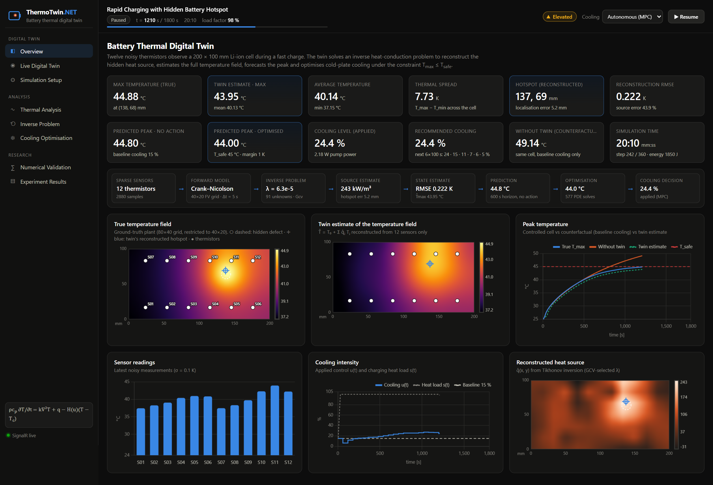
</p>

<p align="center"><sub><i>Live dashboard at t = 20 min into a fast charge. The hidden defect (dashed ring) lies between the thermistors. The twin's reconstruction (blue crosshair) is 5 mm away, and model-predictive cooling holds T<sub>max</sub> at 44.9 °C while the identical uncontrolled cell is already at 49 °C.</i></sub></p>

---

# 🏆 Results at a Glance

<table>
<tr>
<td align="center" width="25%">

### 2.3 mm
**Hotspot localisation error**<br/>
<sub>hidden defect, 12 sensors, σ = 0.1 K</sub>

</td>
<td align="center" width="25%">

### 0.053 K
**Full-field temperature RMSE**<br/>
<sub>800 cells reconstructed from 12 points</sub>

</td>
<td align="center" width="25%">

### 49.3 → 44.9 °C
**Peak temperature**<br/>
<sub>baseline cooling → closed-loop MPC</sub>

</td>
<td align="center" width="25%">

### −43 %
**Cooling energy**<br/>
<sub>MPC vs cheapest safe constant cooling</sub>

</td>
</tr>
</table>

<p align="center">


</p>

> Every number in this README comes from the committed experiment output in [`docs/results/`](docs/results/summary.md),
> produced by `dotnet run --project src/backend/ThermoTwin.Cli -c Release`. The same experiments run inside the application and are shown on the dashboard.

---

# 📌 Overview

During fast charging, a lithium-ion cell produces Joule heat. A **local defect** such as a degraded tab weld, lithium plating, or a high-resistance region produces *extra* heat in one small area. That hotspot can drive the cell towards thermal runaway long before the surface sensors notice it.

A battery management system only has a **handful of thermistors**. It cannot measure the temperature field, and it cannot measure heat generation at all. ThermoTwin.NET is a digital twin that fills this gap with applied mathematics:

- 🧮 a **finite-volume model** of the 2-D heat equation (explicit, implicit and Crank–Nicolson time integration)
- 📡 a **sparse, noisy sensor model** that observes only 12 of 800 grid cells
- 🔄 an **inverse heat-source solver**: Tikhonov regularisation with GCV / L-curve / discrepancy parameter choice
- 🎯 **hotspot localisation** from the reconstructed source
- 🔮 **thermal forecasting** from the estimated state and source
- ❄️ **constrained cooling optimisation** that minimises pump energy subject to T<sub>max</sub> ≤ T<sub>safe</sub>, run as receding-horizon **MPC**

These pieces are wrapped in an ASP.NET Core platform: background simulation, SignalR streaming, EF Core persistence, validation, Swagger and an Angular scientific dashboard.

> **The mathematics is written by hand.** `ThermoTwin.Numerics` has **no third-party dependencies**. The discrete Laplacian, the banded Cholesky factorisation, the θ-scheme, the Tikhonov normal equations, GCV, the L-curve curvature and the penalty / projected-gradient optimiser are all plain, documented C#.

---

# 🧭 The Mathematical Story

Sparse sensors cannot observe the whole battery, so the problem has to be solved *backwards*:

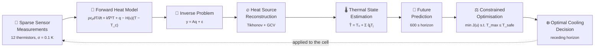

| Stage | Question it answers | Method |
|---|---|---|
| Forward model | *Given a heat source, how does temperature evolve?* | 5-point finite volumes + θ-method, banded Cholesky |
| Inverse problem | *Which heat source explains the 12 sensor histories?* | Linear superposition, recursive normal equations, Tikhonov |
| Regularisation | *How much smoothing separates the signal from the noise?* | GCV (default), L-curve corner, discrepancy principle |
| State estimation | *What is the temperature everywhere, right now?* | T̂ = T₀ + Σ q̂ⱼTⱼ from the identified source |
| Prediction | *Will the cell exceed 45 °C in the next 10 minutes?* | Crank–Nicolson forecast from (T̂, q̂, known load) |
| Optimisation | *What is the cheapest cooling that keeps it safe?* | Exterior penalty + projected gradient, MPC |

---

# 🎬 Demonstration Scenario — *Rapid Charging with a Hidden Battery Hotspot*

```text
Cell                200 × 100 × 10 mm Li-ion pouch cell, ρ = 2500 kg/m³, cₚ = 1000 J/(kg·K), k = 20 W/(m·K)
Initial state       25 °C everywhere, ambient 25 °C, convective edges h = 10 W/(m²·K)
Charging            30-min CC–CV fast charge: s(t) ramps to 1, holds until 20 min, tapers to 0.25
Joule heating       55 kW/m³ uniform at full load
Hidden defect       Gaussian source, 450 kW/m³ peak, σ = 12 mm, at (138, 64) mm — between the sensors
Sensors             12 thermistors on a 6 × 2 lattice, Gaussian noise σ = 0.1 K, every 5 s
Cooling             cold plate h(u) = 5 + 115·u W/(m²·K), coolant 22 °C, pump P(u) = 150·u³ W
Safety              T_safe = 45 °C (optimiser target 44 °C), T_critical = 55 °C
```

What the twin demonstrates, in order:

1. **Heat propagation.** The defect's heat diffuses through the cell. The plant runs on an **80×40 grid**, twice as fine as the twin's 40×20 model, so the twin is not checking against its own model (no "inverse crime").
2. **Rising sensor readings.** S11, the sensor nearest the defect, warms fastest, but no sensor sits on the hotspot.
3. **Source reconstruction.** Every 30 s the twin solves the regularised inverse problem.
4. **Hotspot localisation.** After about 3 minutes the reconstructed hotspot is within ~6 mm of the true defect, and within 2.6 mm by the end of the charge.
5. **Prediction.** A 600 s Crank–Nicolson forecast from the estimated state.
6. **Thermal warning.** The risk badge moves Normal → Elevated → Warning when the forecast crosses 45 °C.
7. **Cooling optimisation.** Every 60 s the twin solves the constrained cooling problem.
8. **Cooling recommendation / MPC.** The first segment of the optimal plan is applied to the cell.
9. **Reduced peak temperature.** A **counterfactual plant** with the default 15 % cooling runs alongside, so the benefit is *measured*: **49.29 °C → 44.90 °C**.

---

# 📸 Application Screenshots

All screenshots are real captures of the running application (ASP.NET Core API + Angular dev server, Playwright + Chrome, [`scripts/capture_screenshots.py`](scripts/capture_screenshots.py)). The script starts the demo scenario, lets it run to t ≈ 1200 s (the end of the constant-current phase, when thermal stress is highest), pauses the twin so every page shows the same state, and captures each page.

## 🔋 Live Battery Thermal Digital Twin

The left column shows what really happens inside the cell, which no real system can see. The middle column shows what the twin infers from 12 noisy sensors. The right column shows the discrepancy and the forward prediction. The reconstructed source (bottom-middle) recovers the defect's location from the sensor data alone. The estimation-error field stays within about ±1 K, and its largest values sit on the hotspot peak, which the smooth source basis cannot fully resolve.

<p align="center">
  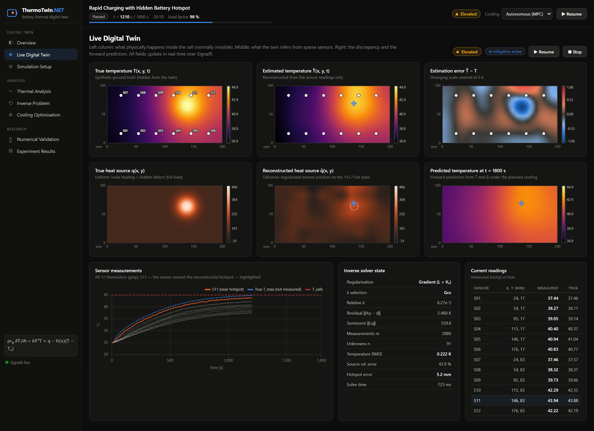
</p>

<details>
<summary><b>🌡️ Heatmap close-up</b> — all six fields at t = 1220 s</summary>
<br/>
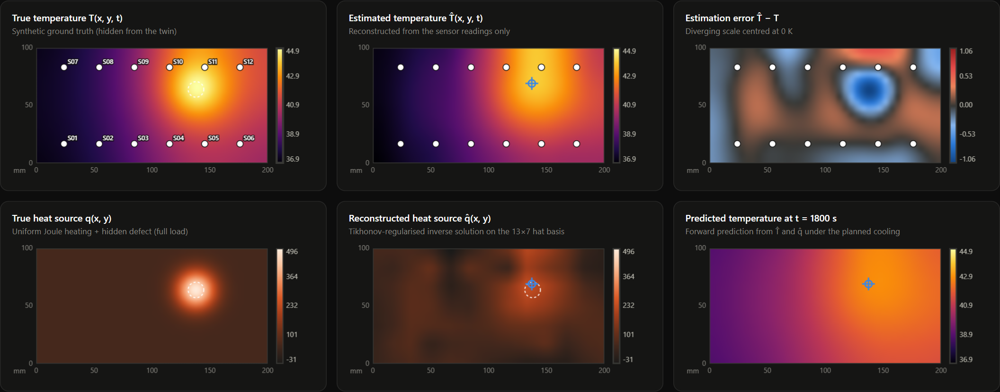
</details>

## 🔄 Inverse Heat-Source Reconstruction

The true source (left) next to the live Tikhonov reconstruction (middle). On the right, the hotspot localisation error and source error over the run: the hotspot is found within ~3 minutes and the estimate stabilises as information accumulates.

<p align="center">
  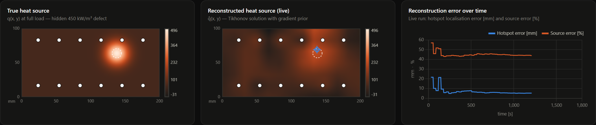
</p>

The regularisation analysis compares three priors (L = I, ∇ₕ, Δₕ). It shows the L-curve with its corners and GCV choices, the source error as a function of λ (GCV lands on the minimum), and the GCV function itself:

<p align="center">
  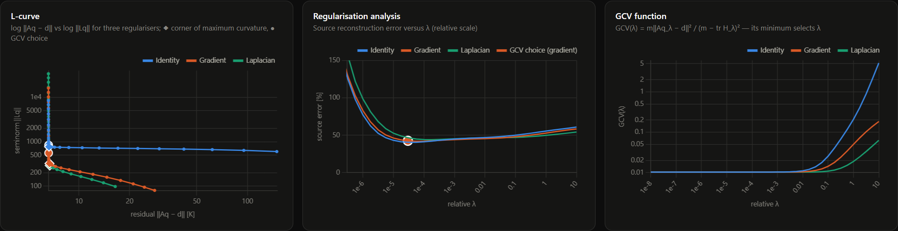
</p>

The same data inverted with three values of λ. Too little regularisation amplifies noise into ±1600 kW/m³ oscillations. Too much smears the defect into a broad bump. The GCV choice recovers it.

<p align="center">
  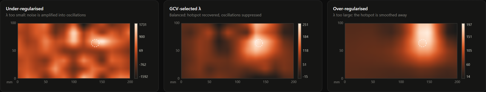
</p>

<details>
<summary><b>Full inverse-problem page</b></summary>
<br/>
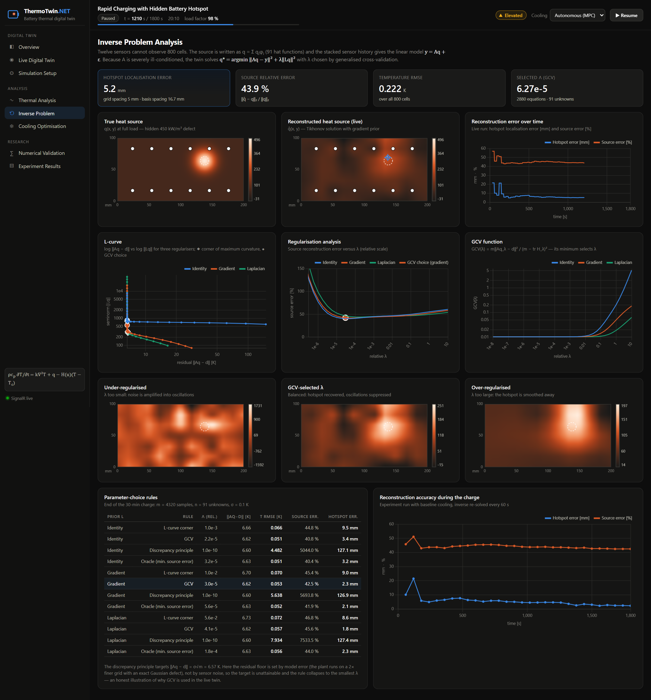
</details>

## ❄️ Cooling Optimisation

The controlled cell (blue) follows the uncontrolled counterfactual until the forecast reaches the limit. MPC then raises cooling gradually and holds T<sub>max</sub> just below 45 °C. During the CV taper it backs cooling off towards zero. The bar chart is the plan currently recommended for the next 600 s.

<p align="center">
  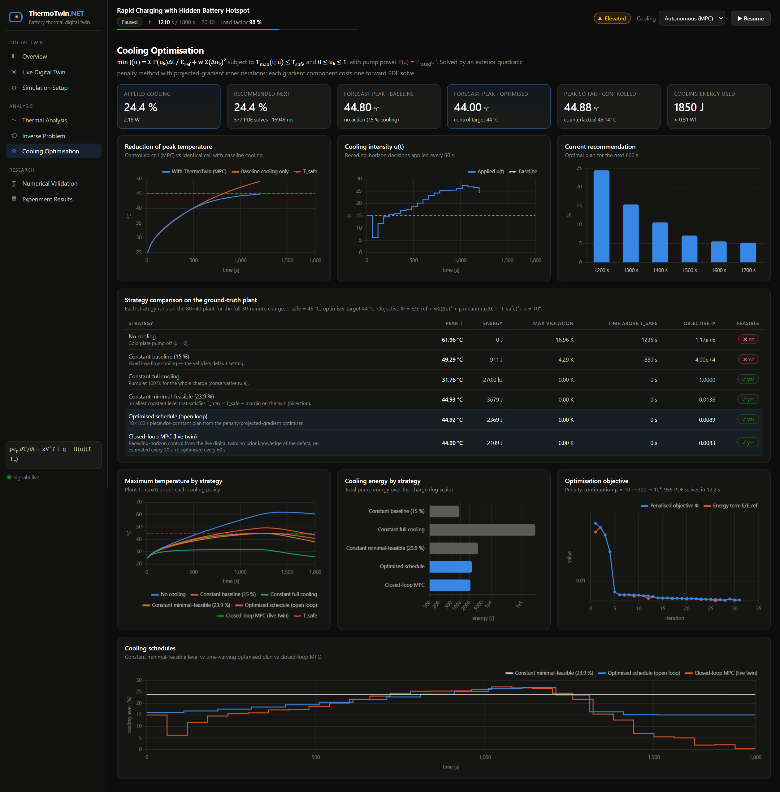
</p>

<p align="center">
  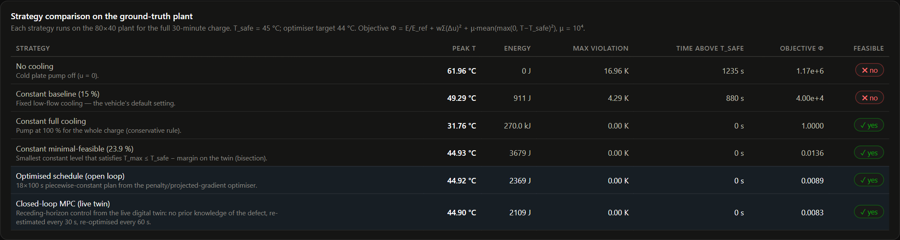
</p>

## 🌡️ Thermal Analysis

Temperature statistics, a 300 s lead-time forecast against the measured truth, the current forecast with and without optimised cooling, a cross-section through the hotspot (true / estimated / predicted), and the forecast-accuracy experiment.

<p align="center">
  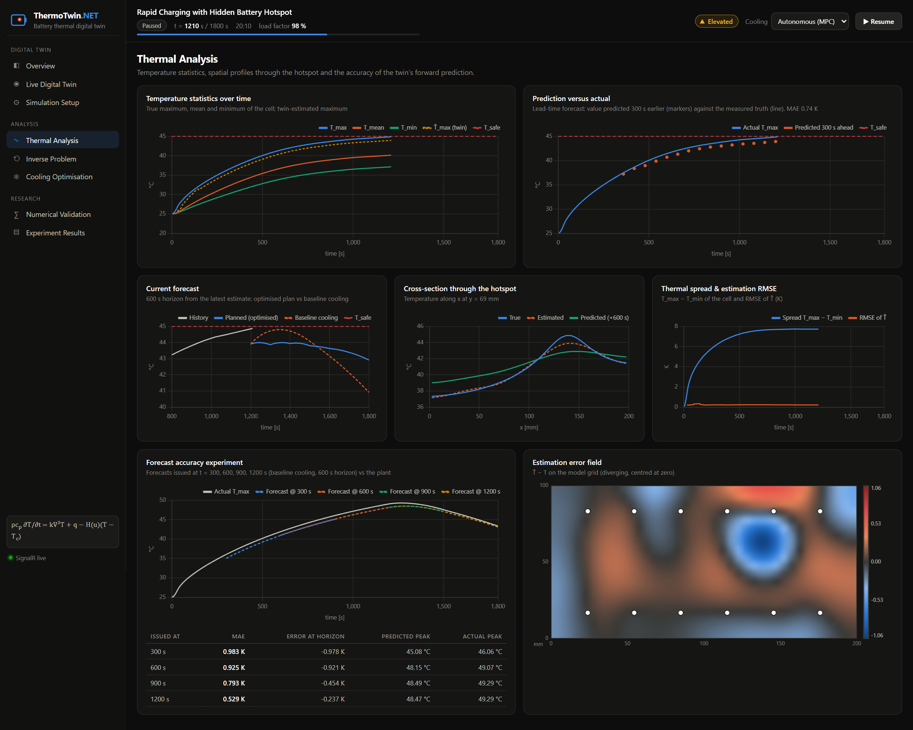
</p>

## ∑ Numerical Validation

Grid and time-step refinement against exact solutions, the explicit stability limit, the stability of the demo configuration, energy conservation and solver timings.

<p align="center">
  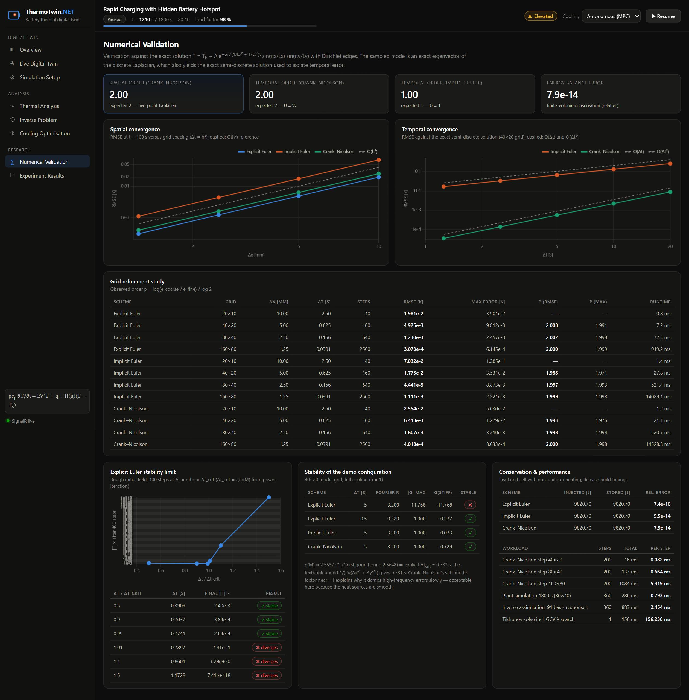
</p>

<table>
<tr>
<td width="50%">

### ⚙️ Simulation Setup

Every physical and numerical parameter is editable. The API computes stability for all three schemes on both grids as you type, and FluentValidation rejects an unstable explicit configuration before it runs.

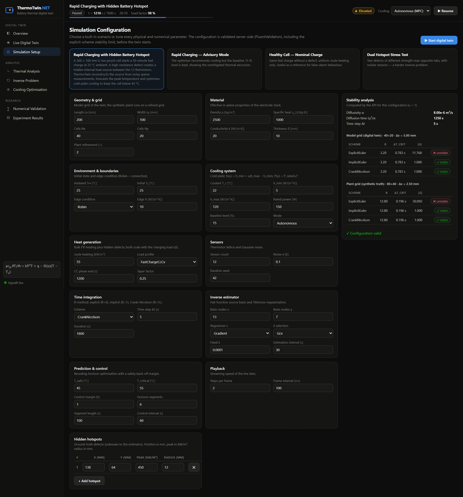

</td>
<td width="50%">

### ▤ Experiment Results

Registry of the stored experiment runs (re-runnable on the background worker), the sensor-density and noise studies, and the persisted simulation sessions.

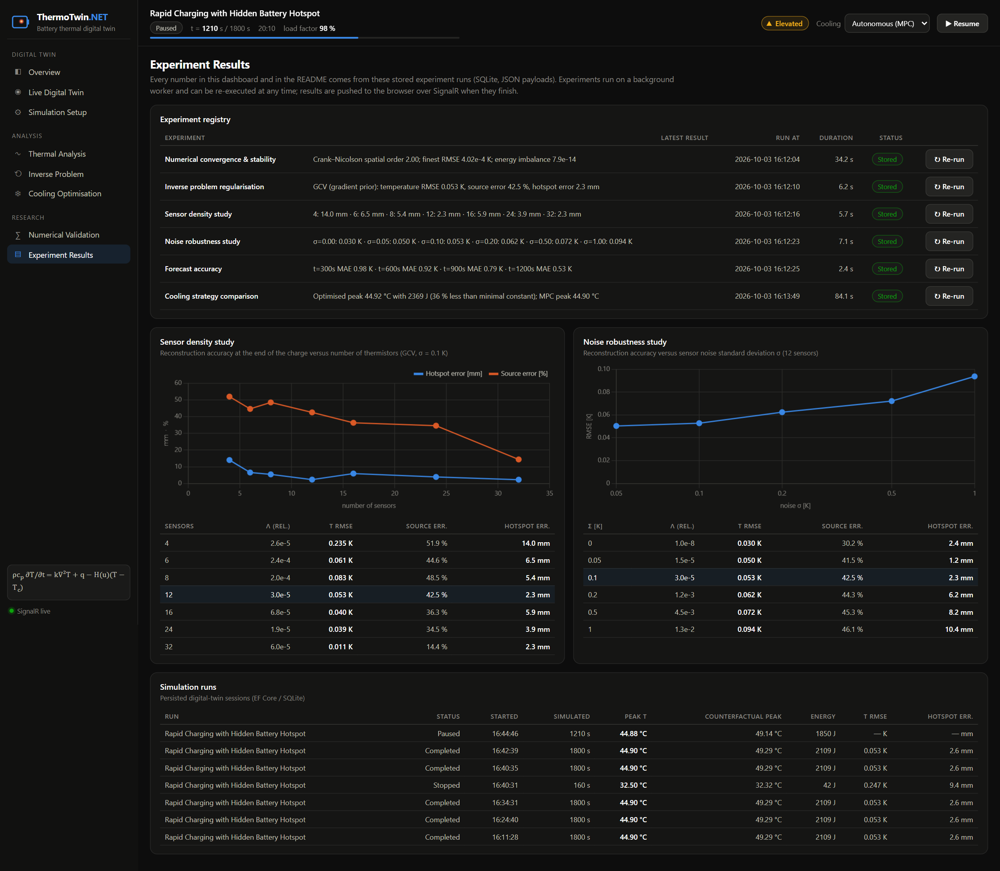

</td>
</tr>
</table>

---

# 📐 Mathematical Formulation

The full derivations are in **[docs/mathematics.md](docs/mathematics.md)**. This section gives the essentials.

## 1. Governing PDE

The cell is thin (δ = 10 mm) compared with its in-plane size, so the temperature is depth-averaged and the cold plate on its face becomes a volumetric sink:

$$
\rho c_p \frac{\partial T}{\partial t} \;=\; k\,\nabla^2 T \;+\; q(x,y,t) \;-\; \frac{h(u)}{\delta}\,\bigl(T - T_c\bigr)
$$

| Symbol | Meaning | Demo value |
|---|---|---|
| $T(x,y,t)$ | temperature field | °C |
| $\rho\,c_p$ | volumetric heat capacity | 2.5 MJ/(m³·K) |
| $k$ | effective in-plane conductivity | 20 W/(m·K) → α = k/ρcₚ = 8·10⁻⁶ m²/s |
| $q$ | volumetric heat generation (**unknown**) | W/m³ |
| $h(u)$ | cold-plate heat-transfer coefficient, $h_{min} + u\,(h_{max}-h_{min})$ | 5 – 120 W/(m²·K) |
| $u \in [0,1]$ | cooling control (pump level) | decision variable |
| $T_c$ | coolant temperature | 22 °C |

Edges use Robin conditions $-k\,\partial T/\partial n = h_e (T - T_\infty)$. Dirichlet and Neumann conditions are also implemented.

## 2. Discretisation

A cell-centred **finite-volume** grid with the five-point Laplacian. Boundary conditions enter through ghost cells (for Robin edges: β = h_e Δ/k, γ = β/(1 + β/2)):

$$
(\nabla^2 T)_{ij} \approx \frac{T_{i+1,j}-2T_{ij}+T_{i-1,j}}{\Delta x^2} + \frac{T_{i,j+1}-2T_{ij}+T_{i,j-1}}{\Delta y^2}
\quad\Longrightarrow\quad
\frac{d\mathbf T}{dt} = M(u)\,\mathbf T + \mathbf f(t)
$$

Time integration uses the **θ-method**: θ = 0 explicit Euler, θ = 1 implicit Euler, θ = ½ Crank–Nicolson.

$$
\bigl(I - \theta\Delta t\,M\bigr)\,\mathbf T^{n+1} = \bigl(I + (1-\theta)\Delta t\,M\bigr)\,\mathbf T^{n} + \Delta t\,\bigl[\theta\,\mathbf f^{n+1} + (1-\theta)\,\mathbf f^{n}\bigr]
$$

The left-hand matrix is symmetric positive definite and banded. Numbering unknowns along the short side gives half-bandwidth $N_y$. It is factorised once per cooling level by a **banded Cholesky** decomposition (O(n·p²)), and each step costs only O(n·p). Explicit Euler is stable only for $\Delta t \le 2/\rho(M)$. The spectral radius ρ(M) is computed by power iteration and checked against the Gershgorin bound.

## 3. Why sparse sensors create an inverse problem

The sensors measure $\mathbf y = C\mathbf T + \boldsymbol\varepsilon$, where $C$ is a 12 × 800 bilinear-interpolation operator. The source is the unknown. Expanding it in 91 bilinear hat functions, $q = s(t)\sum_j q_j\varphi_j(x,y)$, where $s(t) = (I(t)/I_{ref})^2$ is the charging load known to the BMS, the PDE's linearity gives

$$
\mathbf T(t) = \mathbf T_0(t) + \sum_j q_j\,\mathbf T_j(t)
\qquad\Longrightarrow\qquad
\boxed{\;\mathbf y = A\,\mathbf q + \boldsymbol\varepsilon\;}
$$

Here $\mathbf T_0$ is the response to known data (initial state, boundary, coolant, cooling history), $\mathbf T_j$ is the response to basis source $j$, and $A_{(t,s),j} = (C\,\mathbf T_j(t))_s$. Diffusion smooths every spatial detail of $q$ before it reaches a sensor, so $A$ is **severely ill-conditioned**. Plain least squares amplifies the 0.1 K noise into sources of thousands of kW/m³, as the *under-regularised* panel above shows.

## 4. Tikhonov regularisation

$$
\mathbf q^\* = \arg\min_{\mathbf q}\; \lVert A\mathbf q - \mathbf y\rVert^2 + \lambda\,\lVert L\mathbf q\rVert^2
\qquad\Longleftrightarrow\qquad
\bigl(A^\top A + \lambda L^\top L\bigr)\,\mathbf q^\* = A^\top \mathbf y
$$

- $L \in \{I,\ \nabla_h,\ \Delta_h\}$ — zeroth-, first- (default) or second-order smoothness prior.
- $A^\top A$, $A^\top \mathbf y$ and $\mathbf y^\top\mathbf y$ are **accumulated recursively** as each sensor sample arrives, so the cost per solve is independent of history length. The basis responses $\mathbf T_j$ are advanced alongside the plant.
- **λ selection:** generalised cross-validation $\mathrm{GCV}(\lambda) = m\lVert A\mathbf q_\lambda - \mathbf y\rVert^2/(m - \operatorname{tr}H_\lambda)^2$ (default), the L-curve corner (maximum Menger curvature), or Morozov's discrepancy principle.

## 5. Prediction and constrained cooling optimisation

From the estimated state $\hat{\mathbf T}$, source $\hat q$ and the known future load, a Crank–Nicolson forecast is integrated. Cooling is chosen by solving

$$
\min_{\mathbf u}\; J(\mathbf u) = \frac{1}{E_{ref}}\sum_k P(u_k)\,\Delta t_k + w\sum_k (u_{k+1}-u_k)^2,
\qquad P(u) = P_{rated}\,u^3
$$

$$
\text{subject to}\qquad \max_{x}\,T(x,t;\mathbf u) \le T_{safe}\quad \forall t \in \text{horizon},\qquad 0 \le u_k \le 1
$$

The constraint is handled by a **quadratic exterior penalty** with continuation μ = 10 → 300 → 10⁴. Each sub-problem is solved by **projected gradient descent** with Armijo backtracking. The gradient comes from finite differences, at one forward PDE solve per component, evaluated in parallel. A final bisection repair restores feasibility if the penalty solution still violates the constraint. In the live twin this runs as **model-predictive control**: a 6 × 100 s horizon is re-optimised every 60 s and the first segment is applied. A 1 K back-off (target 44 °C) absorbs model mismatch.

---

# 📊 Experimental Results

All values below come from [`docs/results/summary.md`](docs/results/summary.md), the output of the CLI run on the demo scenario. Temperatures are measured on the **ground-truth plant**, not on the twin's model.

## Headline metrics

| Metric | Result |
|---|---:|
| Temperature RMSE (full field, end of charge, GCV) | **0.053 K** |
| Temperature RMSE at t = 1200 s (live run) | 0.222 K |
| Hotspot localisation error (end of charge) | **2.3 mm** (live run: 2.6 mm) |
| Heat-source reconstruction error ‖q̂ − q‖₂/‖q‖₂ | 42.5 % |
| Reconstructed defect peak / true peak | 251 / 496 kW/m³ |
| Maximum temperature, no cooling | 61.96 °C |
| Maximum temperature without optimised cooling (15 % baseline) | **49.29 °C** |
| Maximum temperature with optimised cooling (open-loop plan) | 44.92 °C |
| Maximum temperature with closed-loop MPC (live twin) | **44.90 °C** |
| Cooling energy reduction vs cheapest safe constant cooling | **35.6 %** (open loop) · **42.7 %** (MPC) |
| Cooling energy reduction vs constant full cooling | 99.2 % |
| Crank–Nicolson step, 40×20 / 80×40 grid | 0.059 ms / 0.518 ms |
| 30-min plant simulation (80×40, 360 steps) | 317 ms |
| Inverse assimilation (91 basis responses) per step | 3.4 ms |
| Tikhonov solve incl. GCV λ search | 227 ms |

> **Reading the source error honestly.** The relative L² error stays near 40 %. The defect is a 12 mm Gaussian, while the hat basis has 16.7 mm spacing and is smoothed by regularisation, so the reconstruction finds the defect's **location** to within 2–3 mm but spreads its **peak** over a wider area (251 vs 496 kW/m³). Temperature, the quantity that matters for safety, is reconstructed to 0.05 K RMSE because diffusion is insensitive to exactly this kind of detail. That same insensitivity is why the inverse problem is ill-posed.

## Cooling strategies (evaluated on the plant, 30-minute charge)

| Strategy | Peak T | Energy | Max violation | Time above 45 °C | Objective Φ | Feasible |
|---|---:|---:|---:|---:|---:|:---:|
| No cooling | 61.96 °C | 0 J | 16.96 K | 1235 s | 1.17·10⁶ | ❌ |
| Constant baseline (15 %) | 49.29 °C | 911 J | 4.29 K | 880 s | 4.00·10⁴ | ❌ |
| Constant full cooling (100 %) | 31.76 °C | 270 000 J | 0 | 0 s | 1.0000 | ✅ |
| Constant minimal-feasible (23.9 %) | 44.93 °C | 3 679 J | 0 | 0 s | 0.0136 | ✅ |
| **Optimised schedule** (18 × 100 s, open loop) | 44.92 °C | **2 369 J** | 0 | 0 s | 0.0089 | ✅ |
| **Closed-loop MPC** (live twin) | 44.90 °C | **2 109 J** | 0 | 0 s | **0.0083** | ✅ |

Φ = E/E<sub>ref</sub> + wΣ(Δu)² + μ·mean(max(0, T − T<sub>safe</sub>)²) with μ = 10⁴. The optimised plan raises cooling smoothly during the constant-current phase (16 % → 27 %) and lowers it in the CV taper. Because pump power grows with u³, spreading cooling over time is cheaper than a constant level. The open-loop plan is computed on the twin's model, using the source identified from a previous charge cycle, and then evaluated on the plant. The MPC run starts with **no prior knowledge** of the defect.

## Regularisation parameter choice (end of charge, m = 4320 samples, n = 91 unknowns)

| Prior | Rule | λ (rel.) | T RMSE | Source error | Hotspot error |
|---|---|---:|---:|---:|---:|
| ∇ₕ (gradient) | **GCV** | 3.0·10⁻⁵ | **0.053 K** | 42.5 % | **2.3 mm** |
| ∇ₕ | L-curve corner | 1.0·10⁻² | 0.070 K | 45.4 % | 9.0 mm |
| ∇ₕ | Oracle (min. source error) | 5.6·10⁻⁵ | 0.052 K | 41.9 % | 2.1 mm |
| ∇ₕ | Discrepancy principle | 1.0·10⁻¹⁰ | 5.638 K | 5694 % | 126.9 mm |
| I (identity) | GCV | 2.2·10⁻⁵ | 0.051 K | 40.8 % | 3.4 mm |
| Δₕ (Laplacian) | GCV | 4.1·10⁻⁵ | 0.057 K | 45.6 % | 1.8 mm |

GCV lands within a factor of 2–5 of the oracle λ for every prior and matches its accuracy. The L-curve corner over-regularises by about 300×. The **discrepancy principle fails, and the failure is informative**: its target ‖Aq − y‖ = σ√m = 6.57 K lies *below* the residual floor of 6.60 K, because the plant's finer grid and exact Gaussian defect add model error on top of sensor noise. The rule then collapses to the smallest λ. This is why the live twin uses GCV.

## Sensitivity studies

| Sensors | 4 | 6 | 8 | **12** | 16 | 24 | 32 |
|---|---:|---:|---:|---:|---:|---:|---:|
| Hotspot error [mm] | 14.0 | 6.5 | 5.4 | **2.3** | 5.9 | 3.9 | 2.3 |
| Temperature RMSE [K] | 0.235 | 0.061 | 0.083 | **0.053** | 0.040 | 0.039 | 0.011 |

| Noise σ [K] | 0 | 0.05 | **0.1** | 0.2 | 0.5 | 1.0 |
|---|---:|---:|---:|---:|---:|---:|
| Hotspot error [mm] | 2.4 | 1.2 | **2.3** | 6.2 | 8.2 | 10.4 |
| Temperature RMSE [K] | 0.030 | 0.050 | **0.053** | 0.062 | 0.072 | 0.094 |

The temperature RMSE falls steadily as sensors are added. Hotspot localisation is *not* monotone: with 16 sensors the lattice geometry leaves the defect further from its nearest sensor than with 12. **Placement matters as much as count**, which motivates optimal sensor placement as future work. As noise grows, GCV raises λ automatically, so the error degrades gracefully (0.053 → 0.094 K for a 10× noise increase).

## Forecast accuracy (600 s horizon)

| Forecast issued at | 300 s | 600 s | 900 s | 1200 s |
|---|---:|---:|---:|---:|
| Mean absolute error of T<sub>max</sub> | 0.98 K | 0.93 K | 0.79 K | 0.53 K |

Forecasts are biased slightly low, by about 1 K, because the smoothed source reconstruction under-estimates the defect's peak. The 1 K control margin compensates for exactly this bias.

---

# ∑ Numerical Validation

The exact solution $T = T_b + A\,e^{-\alpha\pi^2(L_x^{-2}+L_y^{-2})t}\sin(\pi x/L_x)\sin(\pi y/L_y)$ on Dirichlet edges is used for verification. The sampled sine mode is an **exact eigenvector** of the ghost-cell discrete Laplacian. This gives a second exact reference, the semi-discrete solution $e^{\mu_h t}\mathbf v$, which isolates the time-integration error.

<p align="center">
  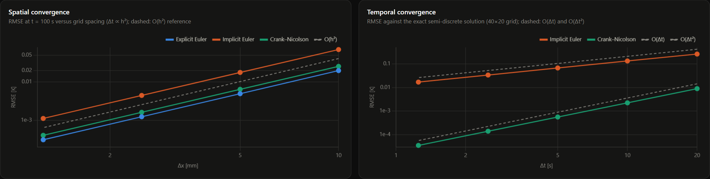
</p>

### Spatial refinement (t = 100 s, Δt ∝ h²) — Crank–Nicolson

| Grid | Δx | RMSE | Max error | Observed order | Runtime |
|---|---:|---:|---:|---:|---:|
| 20×10 | 10.00 mm | 2.554·10⁻² K | 5.030·10⁻² K | — | 0.6 ms |
| 40×20 | 5.00 mm | 6.418·10⁻³ K | 1.279·10⁻² K | **1.993** | 10.9 ms |
| 80×40 | 2.50 mm | 1.607·10⁻³ K | 3.210·10⁻³ K | **1.998** | 317.9 ms |
| 160×80 | 1.25 mm | 4.018·10⁻⁴ K | 8.033·10⁻⁴ K | **2.000** | 11.4 s* |

<sub>*2560 steps at Δt = 0.039 s: the Δt ∝ h² refinement makes the finest level the most expensive. Explicit and implicit Euler show the same spatial order (2.000 / 1.999); see [`convergence.csv`](docs/results/convergence.csv).</sub>

### Temporal refinement (40×20, against the exact semi-discrete solution)

| Δt [s] | Implicit Euler RMSE | order | Crank–Nicolson RMSE | order |
|---:|---:|---:|---:|---:|
| 20 | 2.614·10⁻¹ | — | 8.911·10⁻³ | — |
| 10 | 1.330·10⁻¹ | 0.975 | 2.223·10⁻³ | 2.003 |
| 5 | 6.707·10⁻² | 0.988 | 5.555·10⁻⁴ | 2.001 |
| 2.5 | 3.368·10⁻² | 0.994 | 1.389·10⁻⁴ | 2.000 |
| 1.25 | 1.688·10⁻² | 0.997 | 3.472·10⁻⁵ | **2.000** |

### Stability and conservation

| Check | Result |
|---|---|
| Explicit Euler at 0.99 · Δt<sub>crit</sub> (Δt<sub>crit</sub> = 2/ρ(M) = 0.783 s) | stable, ‖T‖∞ = 2.6·10⁻⁴ after 400 steps |
| Explicit Euler at 1.01 · Δt<sub>crit</sub> | **diverges**, ‖T‖∞ = 7.4·10¹ |
| Explicit Euler at 1.5 · Δt<sub>crit</sub> | diverges, ‖T‖∞ = 7.4·10¹¹⁸ |
| Power-iteration ρ(M) vs Gershgorin bound | 2.5537 vs 2.5648 s⁻¹ |
| Demo configuration (Δt = 5 s, r = 3.2) | explicit **unstable** (\|G\| = 11.8) · implicit and CN stable — enforced by validation |
| Energy balance, insulated cell, non-uniform heating | relative imbalance **7.4·10⁻¹⁶ / 5.5·10⁻¹⁴ / 7.9·10⁻¹⁴** (EE / IE / CN) |

---

# 🏗️ Architecture

The full description is in **[docs/architecture.md](docs/architecture.md)**.

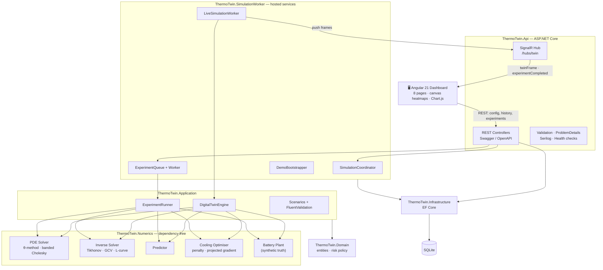

| Project | Responsibility |
|---|---|
| **ThermoTwin.Numerics** | Grid, sparse/banded/dense linear algebra, discrete Laplacian, θ-scheme solver, stability analysis, sensors & noise, source basis, inverse estimator, hotspot detection, predictor, optimiser, synthetic plant, convergence study. **No NuGet dependencies.** |
| **ThermoTwin.Domain** | `SimulationRun` (lifecycle rules), `SimulationSnapshot`, `ExperimentRecord`, `ThermalRiskPolicy`, enums |
| **ThermoTwin.Application** | Scenario model and catalogue, FluentValidation (including the stability check), `DigitalTwinEngine`, `ExperimentRunner`/`ExperimentService`, repository and notifier ports, DTOs |
| **ThermoTwin.Infrastructure** | EF Core `DbContext` (SQLite), repositories, schema initialisation |
| **ThermoTwin.SimulationWorker** | `LiveSimulationWorker` (background loop → SignalR + snapshots), `ExperimentQueue` (Channel-based job queue), `DemoBootstrapper` |
| **ThermoTwin.Api** | Controllers, SignalR hub, global exception handler (RFC 7807), Serilog, Swagger, health checks, CORS |
| **ThermoTwin.Cli** | Headless experiment runner → `docs/results/*.json, *.csv, summary.md` |
| **ThermoTwin.Tests** | 46 tests: numerics, application, API + SignalR integration (`WebApplicationFactory`) |

### Real-time data flow

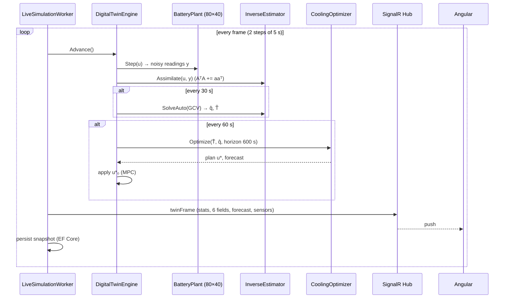

---

# 🛠️ Technology Stack

<div align="center">


</div>

<br/>

| Layer | Technology |
|---|---|
| Numerical engine | C# 14 / .NET 10, hand-written linear algebra (CSR, banded & dense Cholesky, CG) |
| Backend | ASP.NET Core 10 Web API, hosted `BackgroundService`s, `System.Threading.Channels` |
| Real-time | ASP.NET Core SignalR (JSON protocol, automatic reconnect) |
| Persistence | Entity Framework Core 10 + SQLite |
| Validation | FluentValidation 12 (including numerical stability rules) |
| Errors / logs | `IExceptionHandler` + RFC 7807 ProblemDetails · Serilog |
| API docs | Swashbuckle / OpenAPI (Swagger UI) |
| Frontend | Angular 21 (standalone components, signals, zoneless), Chart.js 4, Canvas 2D heatmaps |
| Testing | xUnit, `Microsoft.AspNetCore.Mvc.Testing`, SignalR client · Vitest |
| Screenshots | Python Playwright driving Chrome against the running app |

---

# 📁 Repository Structure

```text
ThermoTwin-Battery-Digital-Twin/
├── src/
│   ├── backend/
│   │   ├── ThermoTwin.Numerics/          # PDE, inverse problem, prediction, optimisation (no dependencies)
│   │   │   ├── LinearAlgebra/            # SparseMatrix, BandedCholesky, DenseMatrix/DenseCholesky, CG
│   │   │   ├── Grid/  Physics/  Pde/     # Grid2D, material/BC/cooling/source, Laplacian, θ-solver, stability
│   │   │   ├── Sensors/  Inverse/        # SensorNetwork, GaussianNoise, SourceBasis, Tikhonov/GCV/L-curve
│   │   │   ├── Analysis/  Prediction/    # error metrics, hotspot detection, forecaster
│   │   │   ├── Optimization/             # penalty + projected-gradient cooling optimiser
│   │   │   └── Simulation/  Validation/  # synthetic plant, convergence/stability/conservation studies
│   │   ├── ThermoTwin.Domain/
│   │   ├── ThermoTwin.Application/       # Scenarios, Twin engine, Experiments
│   │   ├── ThermoTwin.Infrastructure/    # EF Core + SQLite
│   │   ├── ThermoTwin.SimulationWorker/  # hosted services
│   │   ├── ThermoTwin.Api/               # REST + SignalR + Swagger
│   │   └── ThermoTwin.Cli/               # experiment exporter
│   └── frontend/thermotwin-web/          # Angular 21 dashboard
├── tests/ThermoTwin.Tests/               # Numerics · Application · Integration
├── docs/
│   ├── mathematics.md  architecture.md  experiments.md  api.md
│   ├── results/                          # JSON/CSV/summary.md from the CLI
│   └── screenshots/                      # real application captures
├── scripts/
│   ├── capture_screenshots.py
│   └── run-dev.ps1
├── ThermoTwin.sln
└── README.md
```

---

# 🚀 Running the Project

### Prerequisites

- .NET SDK 10.0
- Node.js 22+ and npm
- *(optional, screenshots only)* Python 3 with `playwright`, plus Chrome

### 1. Clone

```bash
git clone https://github.com/AbuHurairaPhenologix/AbuHuraira.git
cd AbuHuraira/ThermoTwin-Battery-Digital-Twin
```

### 2. Start the API

```bash
dotnet run -c Release --project src/backend/ThermoTwin.Api
```

The API listens on **http://localhost:5180**. On first start it creates `App_Data/thermotwin.db`, **starts the demo scenario automatically** and queues all six experiments on the background worker (≈ 2 minutes in total).

### 3. Start the dashboard

```bash
cd src/frontend/thermotwin-web
npm install
npm start
```

Open **http://localhost:4200**. The dev server proxies `/api` and `/hubs` to the API.

On Windows, `scripts/run-dev.ps1` starts both processes.

### 4. Explore

| URL | |
|---|---|
| http://localhost:4200 | Dashboard |
| http://localhost:5180/swagger | Swagger UI |
| http://localhost:5180/health | Health check (SQLite) |

---

# 🎮 Demo & Experiments

```bash
# Re-run every experiment headless and regenerate docs/results/
dotnet run -c Release --project src/backend/ThermoTwin.Cli -- docs/results

# Only selected experiments
dotnet run -c Release --project src/backend/ThermoTwin.Cli -- docs/results --only Regularization,CoolingComparison

# Start a scenario through the API
curl -X POST http://localhost:5180/api/simulations -H "Content-Type: application/json" \
     -d '{"scenarioKey":"rapid-charge-hidden-hotspot"}'

# Re-capture the README screenshots (API + dashboard must be running)
python scripts/capture_screenshots.py --pause-at 1200
```

Built-in scenarios: **Rapid Charging with Hidden Battery Hotspot** (MPC), **Advisory mode** (recommendations only, so the unmitigated excursion is visible), **Healthy cell** (false-alarm reference), and **Dual hotspot stress test** (two defects, σ = 0.2 K). See [docs/experiments.md](docs/experiments.md) and [docs/api.md](docs/api.md).

---

# 🧪 Tests

```bash
dotnet test                                     # 46 tests
cd src/frontend/thermotwin-web && npx ng test --watch=false   # 4 Vitest tests
```

| Area | What is verified |
|---|---|
| Linear algebra | banded Cholesky = dense Cholesky; indefinite matrices rejected; implicit step = conjugate-gradient solution |
| Discretisation | symmetric, negative-definite Laplacian with half-bandwidth N<sub>y</sub>; exact on quadratics; constants in the null space for Neumann edges |
| Convergence | spatial order 2 for all schemes; temporal order 1 (implicit Euler) and 2 (Crank–Nicolson) |
| Stability | explicit Euler stable at 0.95 Δt<sub>crit</sub>, divergent at 1.05 Δt<sub>crit</sub>; ρ(M) ≤ Gershgorin bound; CN stiff-mode factor < 0 |
| Conservation | discrete energy balance to < 10⁻¹⁰ for every scheme |
| Inverse problem | exact recovery from noise-free model data; residual/seminorm monotone in λ; GCV localises the hotspot from noisy fine-grid data to < 20 mm |
| Optimisation | feasible plan, bounds respected, energy ≤ best constant level |
| Application | scenario validation (incl. stability rule), risk policy, run lifecycle, end-to-end engine, experiment execution |
| Integration | health, scenarios, 400 ProblemDetails with field errors, stability endpoint, **full run streamed over SignalR**, persisted run + snapshots, 409 on invalid state transition |

---

# ⚠️ Limitations

- **Synthetic plant.** The "physical" battery is a finer-grid simulation with an exact Gaussian defect. That avoids the inverse crime but is not measured data. Real cells add anisotropic conductivity, temperature-dependent properties and electrochemical heat (entropic, reaction terms).
- **2-D, depth-averaged model.** Through-thickness gradients are lumped into the cold-plate sink term.
- **Source temporal shape.** The estimator assumes every heat source scales with the measured load s(t) = (I/I<sub>ref</sub>)². A defect that *grows* over time would need a time-resolved basis or a state-space (Kalman) formulation.
- **Peak under-estimation.** Smoothing regularisation and the 16.7 mm basis halve the reconstructed defect peak. Forecasts are biased about 1 K low, which the 1 K control margin absorbs. A sparsity-promoting prior (L1/TV) would sharpen the source.
- **Gradient by finite differences.** Each optimiser iteration costs K + 1 PDE solves. An adjoint gradient would make the cost independent of the number of control segments.
- **Single live session.** The coordinator runs one live twin at a time. Experiments run in parallel on their own worker.

# 🔮 Future Work

- 📍 Optimal sensor placement (D-/A-optimal design on AᵀA). The sensor study shows placement matters as much as count.
- 🧭 Kalman / ensemble filtering for time-varying sources and online uncertainty bands
- ✂️ Total-variation and L1 priors for sharper defect reconstruction
- 🔁 Adjoint-based gradients for the optimiser
- 🔬 3-D model with anisotropic conductivity and an electrochemical (ECM) heat source
- 🔌 MQTT/BMS ingestion of real thermistor and current data

---

# 👨‍💻 Author

<div align="center">

## Abu Huraira

**Software Engineer**

.NET • C# • Angular • Applied Mathematics • Scientific Computing

<a href="https://github.com/AbuHurairaPhenologix">

</a>

</div>

---

<div align="center">

## ⭐ Sparse Sensors → Heat Equation → Inverse Problem → Prediction → Optimal Cooling

### Built with C#, .NET, Angular, Numerical Analysis & Optimisation

</div>
