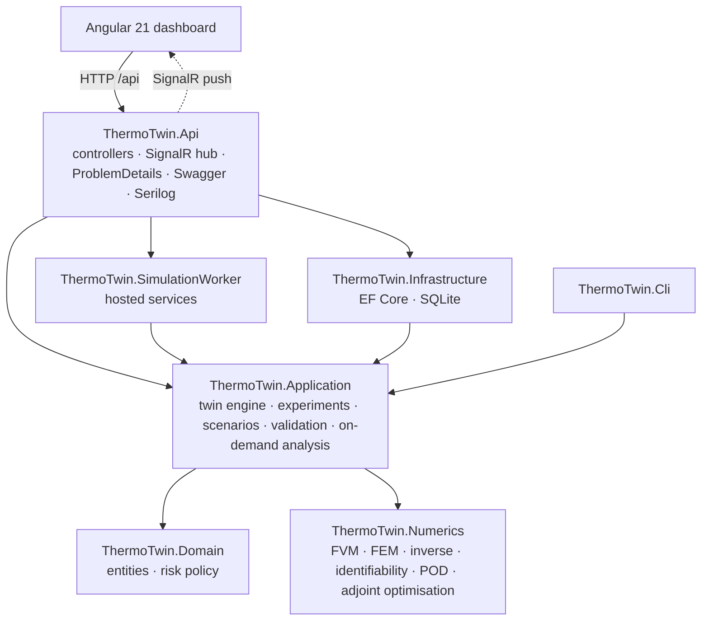
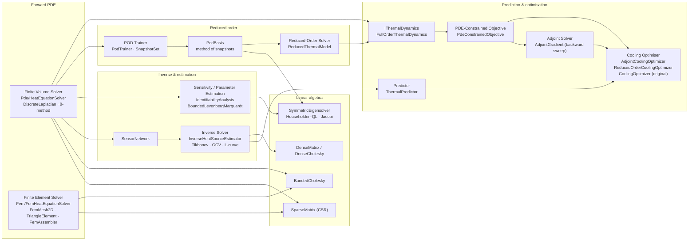
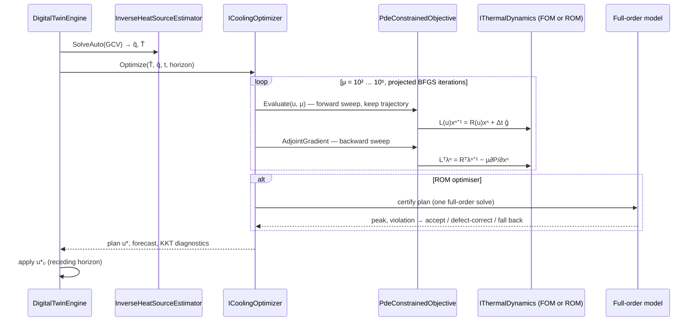
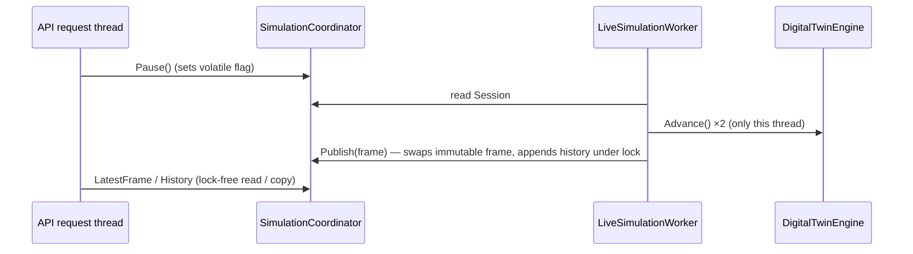

# Architecture

ThermoTwin.NET is a layered .NET 10 solution with an Angular 21 front end. The scientific core, `ThermoTwin.Numerics`, is a **dependency-free** library: every discretisation, solver, eigensolver, inverse method and optimiser is plain C#. Everything else (hosting, persistence, streaming, UI) depends on the core, never the other way round.

## The numerical layers

The mathematical pipeline maps one-to-one onto namespaces of `ThermoTwin.Numerics`:

`IThermalDynamics` is the key abstraction. The full-order finite-volume model and the POD reduced model share the affine θ-scheme form L(u)xn+1 = R(u)xn + Δt ĝn(u), with symmetric L and R. A single implementation of the objective, the forward solve and the **discrete adjoint** therefore serves both, and the same optimiser runs on either model.

## Projects

### ThermoTwin.Numerics — scientific computing core

No package references.

| Folder | Types |
|---|---|
| `LinearAlgebra` | `SparseMatrix` (CSR builder, linear combinations, Dirichlet-aware banded factorisation, symmetry check), `BandedSymmetricMatrix`, `BandedCholesky`, `DenseMatrix`, `DenseCholesky`, `SymmetricEigensolver` (Householder tridiagonalisation + implicit QL; cyclic Jacobi), `ConjugateGradient`, `Vector` |
| `Grid` | `Grid2D`: cell-centred grid, x-major / y-fast ordering, restriction, bilinear interpolation |
| `Physics` | `MaterialProperties`, `BoundaryCondition(s)`, `CoolingModel`, `ThermalModel`, `LoadProfile`, `GaussianHotspot`, `HeatSourceModel` |
| `Pde` | `DiscreteLaplacian` (finite volumes, ghost cells), `HeatEquationSolver` (θ-method, bounded factorisation cache, adjoint primitives `SolveImplicitInPlace`/`ApplyExplicitOperator`), `StabilityAnalyzer` |
| `Fem` | `FemMesh2D`, `FemNode`, `TriangleElement` (Jacobian, barycentric gradients, exact element matrices), `FemAssembler`/`FemMatrices` (mass, stiffness, Robin terms, Dirichlet elimination), `FemHeatEquationSolver`, `FemErrorNorms` (L², H¹ by Dunavant quadrature) |
| `Sensors` | `Sensor`, `SensorNetwork` (observation operator, layouts), `GaussianNoise` |
| `Inverse` | `SourceBasis` (hat functions, regularisation operators), `InverseHeatSourceEstimator` (recursive normal equations, Tikhonov, GCV, L-curve, discrepancy) |
| `Sensitivity` | `SensorResponseModel` (θ ↦ y), `IdentifiabilityAnalysis` (sensitivities, Fisher information, Cramér–Rao, collinearity), `BoundedLevenbergMarquardt` |
| `ReducedOrder` | `SnapshotSet`, `PodTrainer` (training families, geometric sampling), `ThermalTrajectorySimulator`, `PodBasis` (method of snapshots), `ReducedThermalModel` (Galerkin projection, diagonalised reduced operator, screened output), `ReducedOrderCoolingOptimizer` (ROM optimisation, certification, defect correction, fallback) |
| `Analysis` | `ErrorMetrics`, `HotspotDetector` |
| `Prediction` | `CoolingPlan`, `ThermalForecast`, `ThermalPredictor` |
| `Optimization` | `IThermalDynamics`, `FullOrderThermalDynamics`, `PdeConstrainedObjective` (Moreau–Yosida penalty, forward + adjoint sweeps, finite-difference reference), `AdjointCoolingOptimizer` (projected BFGS / projected gradient, continuation, KKT diagnostics), `CoolingOptimizer` (original max-penalty method), `ICoolingOptimizer` |
| `Simulation` | `BatteryPlant`: the synthetic ground truth on a refined grid |
| `Validation` | `ConvergenceStudy` (FVM), `FemVerificationStudy` (FEM convergence, FVM–FEM cross-validation) |

### ThermoTwin.Domain

- `SimulationRun`: aggregate with an explicit lifecycle (Pending → Running ⇄ Paused → Completed/Stopped/Failed). Invalid transitions throw `DomainException` → HTTP 409.
- `SimulationSnapshot`, `ExperimentRecord`, `ThermalRiskPolicy`, enums (`ExperimentKind` has twelve kinds, stored as strings).

### ThermoTwin.Application

- **Scenarios:** `ScenarioDefinition` (immutable records with demo defaults; `ControlSettings` selects the MPC optimiser and ROM size), `ScenarioCatalog`, `ScenarioFactory` (builds solvers, estimator, predictor, trains the POD basis, builds the selected `ICoolingOptimizer`) and `ScenarioDefinitionValidator`. The validator enforces physical ranges and **numerical admissibility**: explicit-scheme stability on the plant grid, segment/time-step alignment for the adjoint optimiser, and ROM settings.
- **Twin:** `DigitalTwinEngine` advances plant → assimilation → estimation (every 30 s) → prediction/control (every 60 s). It runs a counterfactual plant, keeps `MpcStatistics` (wall time, forward/adjoint solves, ROM validation errors, fallbacks) and builds `TwinFrame` DTOs.
- **Experiments:** `ExperimentRunner` (12 reproducible experiments, split into `ExperimentRunner.cs` and `ExperimentRunner.Mathematics.cs`) and `ExperimentService` (run, serialise, persist).
- **Analysis:** `OnDemandAnalysis` with FluentValidation request validators (FEM mesh, live adjoint gradient check).
- **Ports:** `ISimulationRunRepository`, `IExperimentRepository`, `ITwinNotifier`.

### ThermoTwin.Infrastructure

`ThermoTwinDbContext` on SQLite (`EnsureCreated`). Tables `simulation_runs`, `simulation_snapshots`, `experiments` (kind stored as a string, so new experiment kinds need no migration).

### ThermoTwin.SimulationWorker

| Service | Role |
|---|---|
| `SimulationCoordinator` | owns the single live session; API threads only set command flags; the worker is the only thread that touches the engine |
| `LiveSimulationWorker` | background loop: advance, build frame, persist snapshots, push over SignalR |
| `ExperimentQueue` / `ExperimentWorker` | `Channel<ExperimentKind>` with per-kind status, duplicate requests → 409 |
| `DemoBootstrapper` | starts the demo and queues every experiment kind without a stored result |

### ThermoTwin.Api

- Controllers: `Scenarios`, `Simulations`, `Twin`, `Experiments`, `Numerics` (stability, FEM mesh, adjoint gradient check). See [api.md](api.md).
- `TwinHub` (`/hubs/twin`), `GlobalExceptionHandler` (validation → 400 with `errors`, `DomainException` → 409, numerical failure → 422), Serilog, Swagger with XML comments, health check.

### ThermoTwin.Cli

One command regenerates every reported number: `dotnet run -c Release --project src/backend/ThermoTwin.Cli -- docs/results [--only Kind1,Kind2]`. It writes the full JSON payload per experiment, the CSV tables (including `fem-convergence`, `fvm-fem-comparison`, `adjoint-gradient-check`, `gradient-cost`, `optimization-benchmark`, `pod-spectrum`, `pod-rom-comparison`, `rom-optimization`, `rom-mpc-comparison`, `parameter-sensitivity`, `parameter-estimation`) and `summary.md`.

### Front end (`src/frontend/thermotwin-web`)

| Piece | Role |
|---|---|
| `TwinStore` / `ExperimentStore` | signals for the live frame/history and the latest result per experiment kind (refreshed on `experimentCompleted`) |
| `HeatmapComponent` | Canvas 2D fields (inferno / source / diverging colormaps), used for FVM cells, FEM nodes, POD modes and error fields |
| `MeshComponent` | SVG drawing of the P1 triangulation |
| `ChartComponent` + `chart-theme.ts` | Chart.js with a validated palette and log axes (convergence, spectra, gradient checks) |
| `math-format.ts` | pure, unit-tested helpers (superscript scientific notation, observed orders, log–log slopes, mesh edges, correlation colours) |
| Pages | Overview, Live Twin, Setup · **Mathematical Model**, **FVM · FEM**, Inverse Problem, **Identifiability**, **Reduced-Order Model**, **PDE-Constrained Optimisation** · Thermal Analysis, Cooling · Numerical Validation, Experiment Results |

## Data flow of one MPC decision

## Concurrency model

Inside a step, the 91 inverse basis responses, the POD training runs and the finite-difference reference gradients may run with `Parallel.For`/PLINQ (each item writes only its own output, so results are deterministic). Cholesky factors are immutable and cached in a bounded `ConcurrentDictionary`.

## Design decisions

| Decision | Reason |
|---|---|
| Hand-written numerics, including eigensolvers | The project is about the algorithms; reviewers can read the discretisation, the adjoint and the POD directly. |
| Two independent discretisations (FVM + FEM) | Cross-validation without an exact solution; each has a different error structure. |
| Discretise-then-optimise adjoint | The gradient is exact for the objective actually minimised (no adjoint-consistency error), and Lᵀ = L lets the backward sweep reuse the forward factors. |
| Moreau–Yosida penalty of the pointwise state constraint | C¹ everywhere (adjoint well defined), standard for state constraints, recovers the constraint as μ → ∞. |
| Projected quasi-Newton with KKT reporting | Bound constraints are handled exactly, and convergence is certified by the projected-gradient residual rather than assumed. |
| POD trained on the source basis | The state is linear in q, so hat-function responses span every reconstructed source; a few defect locations do not (n-width). |
| ROM plans certified on the full model | The ROM is never used silently: defect correction or fallback when the full model disagrees. |
| Synthetic plant on a finer grid + counterfactual plant | Avoids the inverse crime; the benefit of control is measured on the same cell. |
| SQLite + `EnsureCreated`, kinds stored as strings | Zero-setup demo; new experiment kinds need no migration. |
