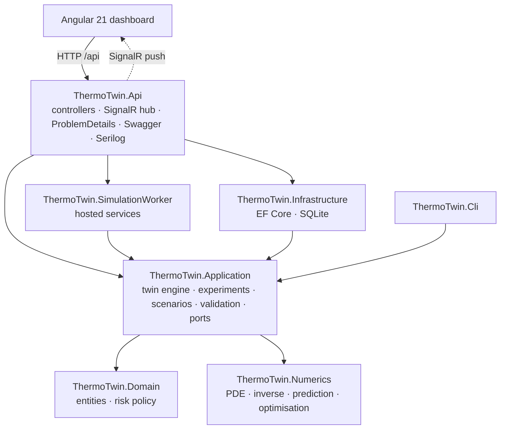
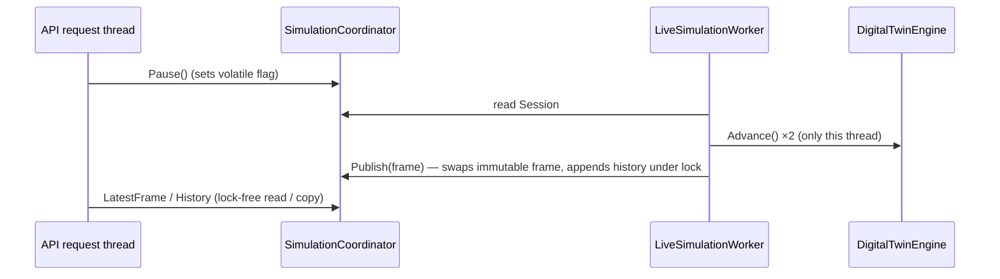

# Architecture

ThermoTwin.NET is a layered .NET 10 solution with an Angular 21 front end. The scientific core is an isolated, dependency-free library. Everything else (hosting, persistence, streaming, UI) depends on the core and never the other way round.

## Projects

### ThermoTwin.Numerics — scientific computing core

No package references. Every algorithm is visible C#.

| Folder | Types |
|---|---|
| `LinearAlgebra` | `SparseMatrix` (CSR + builder, Gershgorin radius, bandwidth), `BandedSymmetricMatrix`, `BandedCholesky`, `DenseMatrix`, `DenseCholesky`, `ConjugateGradient`, `Vector` |
| `Grid` | `Grid2D`: cell-centred grid, x-major/y-fast ordering, restriction, bilinear interpolation |
| `Physics` | `MaterialProperties`, `BoundaryCondition(s)`, `CoolingModel`, `ThermalModel`, `LoadProfile`, `GaussianHotspot`, `HeatSourceModel` |
| `Pde` | `DiscreteLaplacian`, `HeatEquationSolver` (θ-method, cached factorisations), `StabilityAnalyzer` |
| `Sensors` | `Sensor`, `SensorNetwork` (observation operator, layouts), `GaussianNoise` |
| `Inverse` | `SourceBasis` (hat functions, regularisation operators), `InverseHeatSourceEstimator` (recursive normal equations, Tikhonov, GCV, L-curve, discrepancy) |
| `Analysis` | `ErrorMetrics`, `HotspotDetector` |
| `Prediction` | `CoolingPlan`, `ThermalForecast`, `ThermalPredictor` |
| `Optimization` | `CoolingOptimizer` (penalty continuation, projected gradient, feasibility repair, constant-level bisection) |
| `Simulation` | `BatteryPlant`: the synthetic ground truth on a refined grid |
| `Validation` | `ConvergenceStudy`: spatial/temporal refinement, stability probe, energy balance |

### ThermoTwin.Domain

- `SimulationRun`: aggregate with an explicit lifecycle (Pending → Running ⇄ Paused → Completed/Stopped/Failed). Invalid transitions throw `DomainException`, which the API maps to HTTP 409.
- `SimulationSnapshot`: a down-sampled time-series point.
- `ExperimentRecord`: kind, timing, summary and the JSON payload.
- `ThermalRiskPolicy`: classification rules.

### ThermoTwin.Application

- **Scenarios**: `ScenarioDefinition` (immutable records with defaults equal to the demo), `ScenarioCatalog` (four built-in scenarios), `ScenarioFactory` (builds numerical components from a definition) and `ScenarioDefinitionValidator` (FluentValidation). The validator checks physical ranges and **numerical admissibility**: an explicit scheme must satisfy Δt ≤ Δtcrit on the finer plant grid.
- **Twin**: `DigitalTwinEngine` advances plant → assimilation → estimation (every 30 s) → prediction/control (every 60 s), runs a counterfactual plant with baseline cooling, and builds `TwinFrame` DTOs (statistics, six heatmap fields, forecast, cooling plan, sensors, incremental history).
- **Experiments**: `ExperimentRunner` (six reproducible experiments) and `ExperimentService` (run, serialise, persist).
- **Ports**: `ISimulationRunRepository`, `IExperimentRepository` and `ITwinNotifier`, implemented by Infrastructure and the API.

### ThermoTwin.Infrastructure

`ThermoTwinDbContext` on SQLite. `DateTimeOffset` values are stored as UTC ticks so they sort correctly. The database is created at startup (`EnsureCreated`). Repositories implement the Application ports.

| Table | Content |
|---|---|
| `simulation_runs` | run metadata, status, peak / counterfactual peak, energy, final accuracy metrics |
| `simulation_snapshots` | one row per 30 s of simulated time (truth, estimate, forecast, cooling, errors, risk) |
| `experiments` | experiment kind, duration, summary, full JSON result |

### ThermoTwin.SimulationWorker

| Service | Role |
|---|---|
| `SimulationCoordinator` (singleton) | Owns the single live session. API threads only set command flags (pause, resume, stop, mode). The worker is the **only** thread that touches the engine, so the engine needs no locks. The latest frame and history are published as immutable snapshots. |
| `LiveSimulationWorker` | `BackgroundService` loop: advance N steps, build a frame, persist snapshots and run progress, push over `ITwinNotifier`, sleep for the playback interval. Records completion or failure on the `SimulationRun`. |
| `ExperimentQueue` / `ExperimentWorker` | Unbounded `Channel<ExperimentKind>` with per-kind status (Queued/Running/Completed/Failed). Duplicate requests are rejected (HTTP 409). Runs experiments in a DI scope and notifies `experimentCompleted`. |
| `DemoBootstrapper` | On startup, starts the demo scenario and queues every experiment that has no stored result. Both behaviours can be disabled by configuration, as the integration tests do. |

### ThermoTwin.Api

- Controllers: `Scenarios`, `Simulations`, `Twin`, `Experiments`, `Numerics` (see [api.md](api.md)).
- `TwinHub` at `/hubs/twin` plus `SignalRTwinNotifier`.
- `GlobalExceptionHandler` (`IExceptionHandler`) produces RFC 7807 problem details: validation → 400 with `errors`, `DomainException` → 409, `KeyNotFoundException` → 404, numerical failure → 422, anything else → 500 without internal details.
- Serilog request logging and structured logs, health check `/health` (SQLite connectivity), Swagger UI with XML comments, CORS for the dev server.
- All JSON (REST, SignalR, persistence) shares `JsonDefaults`: camelCase, string enums.

### Front end (`src/frontend/thermotwin-web`)

| Piece | Role |
|---|---|
| `TwinStore` | signals for the current frame and history; loads both over REST, then applies incremental SignalR frames; refetches on reconnect or run change |
| `ExperimentStore` | caches the latest result per experiment kind and refreshes on `experimentCompleted` |
| `HeatmapComponent` | Canvas 2D: rasterises the field at native resolution, smooth upscaling, inferno / single-hue / diverging colormaps, colour bar, mm axes, sensor and hotspot overlays, hover read-out |
| `ChartComponent` | thin Chart.js host updated in place; shared theme in `chart-theme.ts` (validated categorical palette, reserved status colours, log axes) |
| Pages | Overview, Simulation Setup, Live Digital Twin, Thermal Analysis, Inverse Problem, Cooling Optimisation, Numerical Validation, Experiment Results |

## Concurrency model

Inside a step, the 91 inverse basis responses and the K + 1 finite-difference forecasts of the optimiser run with `Parallel.For`. Banded Cholesky factors are immutable and cached in a `ConcurrentDictionary`, so the parallel solves can share them.

## Design decisions

| Decision | Reason |
|---|---|
| Hand-written numerics | The project is about the algorithms. Reviewers can read the discretisation, inverse solver and optimiser directly. |
| Banded Cholesky rather than iterative solvers | The matrix is SPD and fixed per cooling level. A direct factor is reused thousands of times, with no tolerance tuning. |
| Recursive normal equations | Inversion cost does not grow with the history. Each sensor sample is a rank-1 update. |
| GCV as the default λ rule | The experiments show it tracks the oracle λ. The discrepancy principle fails under model error and the L-curve over-smooths. |
| Synthetic plant on a finer grid | Avoids the inverse crime, so reported accuracies are honest. |
| Counterfactual plant | The benefit of control is measured on the same cell, not asserted. |
| SQLite + `EnsureCreated` | Zero-setup demo. The EF Core model is provider-agnostic. |
